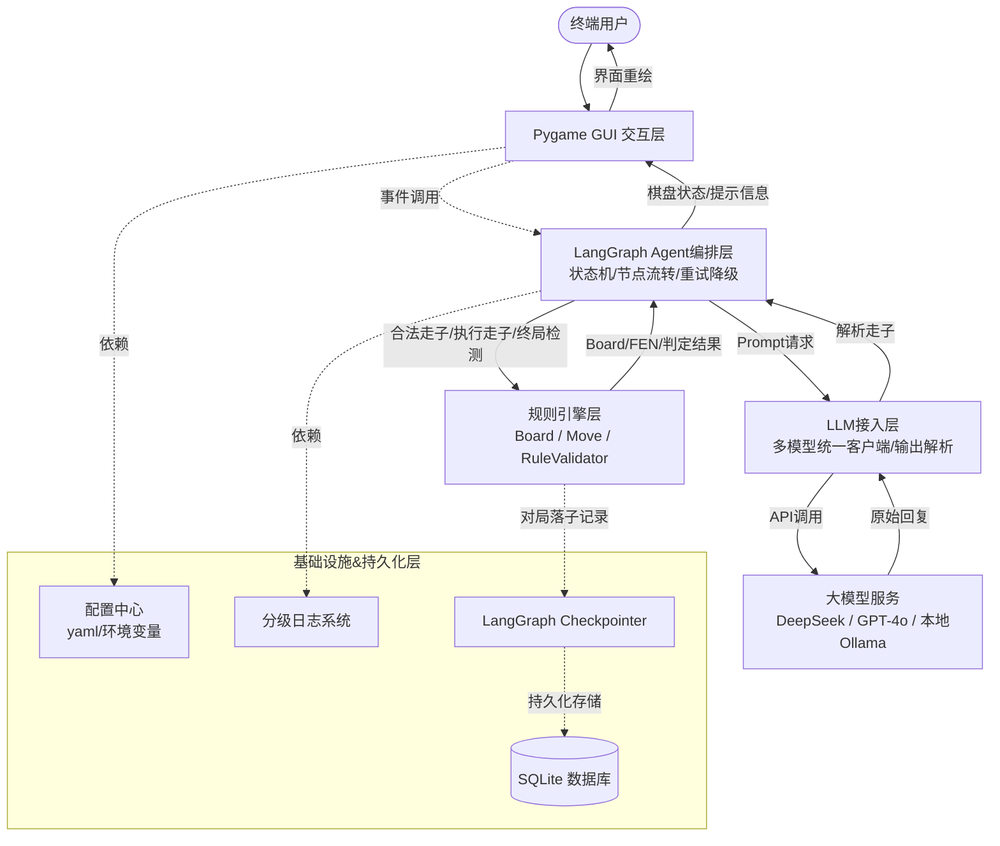

# 中国象棋AI对弈工具 - 技术架构设计文档

## 版本元信息

| 字段 | 内容 |
|------|------|
| 文档版本 | v1.0 |
| 适配技术栈 | Python 3.12 / LangChain 1.2+ / LangGraph 1.0+ / Pygame 2.6 / SQLite 3 / Pydantic 2.x |
| 关联依据 | 产品需求文档 PRD v1.0 |
| 适用角色 | 开发、架构、新贡献者、测试 |

---

## 1. 文档目的与读者对象

### 1.1 文档目的

本文档是**中国象棋AI对弈工具**的技术架构设计基准文档，旨在完整定义系统的分层架构、模块职责与接口边界、核心数据流转逻辑、关键技术决策与权衡、全局异常处理与容错策略、非功能性需求实现方案，以及部署与安全规范。

本文档**不涉及**业务产品细节（如商业化策略、用户运营等），聚焦于技术层面的架构设计与落地约束。

### 1.2 读者对象与收益

| 读者角色 | 阅读收益 |
|----------|----------|
| **开发工程师** | 理解模块依赖关系、接口契约、分层调用规范，可独立开展编码工作 |
| **架构师** | 掌握技术选型理由、设计权衡逻辑、扩展演进方向 |
| **新贡献者** | 快速理解系统全貌、数据流转逻辑、为什么选择 LangGraph 等关键技术 |
| **测试工程师** | 明确异常场景覆盖范围、容错策略、非功能性验收标准 |

### 1.3 与 PRD 的对齐关系

本文档严格对齐 PRD v1.0 中定义的所有**功能性需求**与**非功能性需求**，架构设计中的每一项技术决策均可追溯至 PRD 中的具体需求条目。PRD 作为需求源头，本文档作为技术实现的结构化映射。

---

## 2. 系统概述与设计范围

### 2.1 系统定位

中国象棋AI对弈工具是一款基于 **Python 3.12 + LangChain 1.2+ + LangGraph 1.0+** 构建的**桌面端中国象棋 LLM 人机对弈工具**。系统通过 Pygame 提供图形化棋盘界面，集成大语言模型（LLM）实现智能走子决策，并具备完整的象棋规则校验、非法走子自动重试、对局持久化存储与棋谱复盘能力。

### 2.2 核心能力

| 能力 | 描述 |
|------|------|
| 棋盘 GUI | 基于 Pygame 的图形化棋盘，支持棋子选中高亮、合法走位提示、动画反馈 |
| 完整象棋规则 | 覆盖全部棋子走法、将军/应将/将死/困毙/长将/和棋判定 |
| LLM 智能落子 | 通过 LangGraph Agent 编排，调用大模型生成走子决策 |
| 非法走子重试 | LLM 返回非法走子时自动重试，超限后降级为随机合法走子 |
| 对局持久化 | 基于 SQLite 存储完整对局记录，支持棋谱回放与复盘 |
| 多模型可插拔 | 支持 DeepSeek、GPT-4o、本地 Ollama 等多模型一键切换 |

### 2.3 设计范围

**在范围内（In Scope）：**

- 单机桌面应用，本地运行，无需联网（使用云端 LLM 时除外）
- 回合制人机对弈，人类执红先行
- 本地 SQLite 持久化存储对局历史与配置
- 多 LLM 模型可插拔架构
- 完整象棋规则引擎（含所有特殊规则判定）

**不在范围内（Out of Scope）：**

- 分布式部署与微服务化
- 联网多人对战 / 在线匹配
- 云端服务化（SaaS / API 服务）
- 移动端 APP（iOS / Android）
- 棋谱云端同步与社区分享
- 联赛 / 排行榜系统

---

## 3. 整体分层架构

### 3.1 五层分层架构

系统采用严格的**五层分层架构**，自上而下依次为：

| 层级 | 名称 | 职责 |
|------|------|------|
| L1 | GUI 交互层 | 用户界面渲染、事件捕获、坐标转换 |
| L2 | 规则引擎层 | 棋盘状态管理、走子合法性校验、FEN 生成 |
| L3 | LangGraph Agent 编排层 | 状态机管理、节点流转、重试降级策略 |
| L4 | LLM 接入层 | 多模型统一客户端、Prompt 组装、输出解析 |
| L5 | 基础设施与持久化层 | 配置管理、日志系统、数据库存储、Checkpoint |

**分层调用原则：**

- 上层可调用下层，**禁止下层反向调用上层**
- 同层模块之间**禁止直接依赖**，必须通过公共接口通信
- 跨层调用**禁止跳层**（如 GUI 不得直接调用 LLM 层）

### 3.2 架构图



**图例说明：**

- **实线箭头**：同步方法调用 / 数据流传递
- **虚线箭头**：依赖注入 / 事件回调 / 异步通知

---

## 4. 核心技术栈清单与选型理由

| 技术 | 锁定版本 | 用途 | 选型核心理由 |
|------|----------|------|-------------|
| **Python** | 3.12 | 主开发语言 | 新增 `match` 语法简化分支逻辑；增强类型提示（`TypeAlias`、`ParamSpec`）提升代码可读性；运行性能较 3.11 再提升约 5%；全栈依赖库均无兼容性废弃问题 |
| **LangChain** | 1.2+ | LLM 调用框架 | 新版分包规范（`langchain-openai`、`langchain-community` 独立包），统一 LLM 接口抽象；原生支持结构化输出（`with_structured_output`）；Prompt 模板管理标准化 |
| **LangGraph** | 0.3+ | Agent 状态机编排 | 原生支持**有向图状态机**，天然适配回合循环与条件分支；内置 Checkpointer 实现状态持久化；支持节点级重试与降级路由；替代手写 `while` 循环和简陋的 `Chain` 链式调用 |
| **Pydantic** | 2.x | 数据模型与校验 | 完全适配 Python 3.12 强类型体系；V2 版本性能较 V1 提升 5-50 倍；用于走子模型定义、接口契约校验、配置参数校验 |
| **Pygame** | 2.6 | 桌面 GUI 框架 | 跨平台（Windows / macOS / Linux）原生支持；提供图层高亮、棋子绘制、事件循环等底层能力；相比 Tkinter 在图形渲染性能和自定义绘制方面优势显著 |
| **SQLite 3** | 内置 | 本地持久化存储 | Python 标准库内置，零额外依赖；轻量级文件数据库，无需独立服务进程；原生适配 LangGraph Checkpointer 的 `SqliteSaver`；满足单机对局历史存储需求 |

---

## 5. 系统模块划分、职责与模块间接口边界

### 5.1 模块总览

```
┌─────────────────────────────────────────────────────┐
│                    系统模块关系图                       │
│                                                       │
│  ┌───────────┐    ┌──────────────┐    ┌────────────┐ │
│  │ GUI 模块   │───>│ Agent 模块    │───>│ 规则引擎模块│ │
│  └─────┬─────┘    └──────┬───────┘    └─────┬──────┘ │
│        │                 │                   │        │
│        │          ┌──────┴───────┐    ┌─────┴──────┐ │
│        └─────────>│ 基础设施模块  │<───│ LLM 接入   │ │
│                   └──────────────┘    │   模块      │ │
│                                       └────────────┘ │
└─────────────────────────────────────────────────────┘
```

### 5.2 模块详细设计

#### 模块一：Pygame GUI 模块

| 维度 | 说明 |
|------|------|
| **职责** | 棋盘渲染、棋子绘制与动画、用户交互事件捕获、像素坐标与棋盘坐标双向转换、合法走位高亮提示、对局状态展示（计时器、吃子记录、状态栏） |
| **核心类** | `ChessBoardGUI`（主窗口）、`PieceRenderer`（棋子渲染器）、`CoordinateMapper`（坐标转换器）、`AnimationController`（动画控制器） |
| **对外暴露接口** | `render(board_state) → None`：根据棋盘状态重绘界面；`show_message(msg) → None`：显示提示信息；`highlight_moves(moves) → None`：高亮合法走位；`set_theme(theme) → None`：切换主题并失效渲染缓存 |
| **依赖** | Agent 模块、基础设施模块（配置中心） |
| **被依赖** | 无（顶层模块） |
| **接口边界** | GUI 模块**不直接调用**规则引擎的校验方法，仅通过 Agent 层中转获取合法走位信息；GUI 不感知 LLM 层的存在 |

#### 模块二：棋盘规则引擎模块

| 维度 | 说明 |
|------|------|
| **职责** | 棋盘状态管理（棋子位置、回合标记）、走子合法性校验（含所有棋子走法规则）、将军/应将/将死/困毙判定、长将循环与重复局面检测、FEN 字符串生成与解析 |
| **核心类** | `Board`（棋盘状态）、`Move`（走子模型）、`RuleValidator`（规则校验器）、`FENSerializer`（FEN 序列化/反序列化）、`GameTerminationChecker`（终局检测器） |
| **对外暴露接口** | `validate_move(move, board) → bool`：校验走子合法性；`apply_move(move, board) → Board`：执行走子并返回新棋盘状态；`is_in_check(board, color) → bool`：检测是否被将军；`is_checkmate(board, color) → bool`：检测是否将死；`is_stalemate(board, color) → bool`：检测是否困毙；`to_fen(board) → str`：生成 FEN 字符串；`get_legal_moves(board, color) → list[Move]`：获取指定方所有合法走子 |
| **依赖** | 无外部模块依赖（纯逻辑层） |
| **被依赖** | Agent 模块 |
| **接口边界** | 规则引擎**不感知** GUI 和 LLM 的存在，仅接收 `Board` 和 `Move` 对象作为输入，返回布尔值或新的 `Board` 状态；内部棋盘表示对外不可见 |

#### 模块三：LangGraph Agent 编排模块

| 维度 | 说明 |
|------|------|
| **职责** | 对弈回合状态机管理、节点流转控制（用户走子 → LLM 走子 → 终局检测 → 循环/结束）、LLM 非法走子重试与降级策略、对局状态持久化（通过 Checkpointer） |
| **核心类** | `ChessAgentGraph`（状态机图定义）、`AgentState`（Pydantic 状态模型：含 board_fen、current_turn、move_history、retry_count 等字段）、`UserMoveNode`（用户走子节点）、`LLMMoveNode`（LLM 走子节点）、`TerminationCheckNode`（终局检测节点） |
| **对外暴露接口** | `start_game(config) → None`：初始化并启动对弈状态机；`process_user_move(move) → None`：将用户走子推入状态机；`get_game_state() → AgentState`：获取当前对弈状态；`undo_move() → None`：悔棋操作；`get_piece_legal_targets(position) → list[Position]`：供 GUI 高亮合法目标；`get_check_position(side) → Position | None`：供 GUI 展示将军位置；`restore_board(board) → None`：供撤销/重做/复盘恢复棋盘 |
| **依赖** | 规则引擎模块、LLM 接入模块、基础设施模块（日志、Checkpoint） |
| **被依赖** | GUI 模块 |
| **接口边界** | Agent 模块是系统的**核心调度中枢**，向上对接 GUI、向下编排 LLM 与规则引擎；Agent **不直接操作** GUI 组件，仅通过返回状态数据驱动 GUI 更新 |

#### 模块四：LLM 接入与 Prompt 解析模块

| 维度 | 说明 |
|------|------|
| **职责** | 多 LLM 模型统一客户端封装、Prompt 模板组装（含 FEN 棋盘状态、走子历史、规则约束）、LLM 原始输出解析与结构化提取、走子坐标格式转换（LLM 输出 → 内部 `Move` 对象） |
| **核心类** | `BaseLLMClient`（统一客户端抽象基类，位于 `llm/base.py`）、`LLMClientFactory`（模型客户端工厂，位于 `llm/client.py`）、`DeepSeekClient` / `OpenAIClient` / `OllamaClient`（具体实现）、`PromptBuilder`（Prompt 组装器）、`MoveParser`（走子解析器） |
| **对外暴露接口** | `create_client(model_name, config) → BaseLLMClient`：创建模型客户端；`generate_move(fen, history, legal_moves) → Move`：根据棋盘状态生成走子；`parse_response(raw_output) → Move`：解析 LLM 原始输出 |
| **依赖** | 基础设施模块（配置中心、日志） |
| **被依赖** | Agent 模块 |
| **接口边界** | LLM 模块**不感知**规则引擎和 GUI 的存在，仅接收 FEN 字符串和合法走子列表作为输入，返回解析后的 `Move` 对象；模型切换对上层完全透明 |

#### 模块五：基础设施模块

| 维度 | 说明 |
|------|------|
| **职责** | 全局配置管理（YAML + 环境变量双层优先级）、分级日志系统（INFO / WARNING / ERROR）、SQLite 数据库管理（对局记录 CRUD）、LangGraph Checkpoint 持久化 |
| **核心类** | `ConfigManager`（配置管理器）、`Logger`（日志管理器）、`DatabaseManager`（数据库管理器）、`GameRepository`（对局数据仓库）、`CheckpointManager`（Checkpoint 管理器） |
| **对外暴露接口** | `ConfigManager.get(key, default) → Any`：获取配置项；`Logger.info(msg) / Logger.error(msg)`：日志记录；`GameRepository.save_game(game) → int`：保存对局；`GameRepository.load_game(game_id) → Game`：加载对局；`CheckpointManager.get_checkpointer() → BaseCheckpointSaver`：获取 Checkpointer 实例 |
| **依赖** | 无外部模块依赖（底层基础模块） |
| **被依赖** | 所有其他模块 |
| **接口边界** | 基础设施模块作为**横切关注点**，通过依赖注入方式被各模块使用，不主动调用任何业务模块 |

---

## 6. 核心全流程数据流（单回合闭环）

以下描述一个完整的**用户走子 → LLM 应答 → 界面更新**单回合闭环，标注每一步对应的模块。

```
┌──────────────────────────────────────────────────────────────────────┐
│                        单回合数据流闭环                                │
├──────┬──────────────────────────────────────────┬────────────────────┤
│ 步骤 │ 操作描述                                   │ 所属模块            │
├──────┼──────────────────────────────────────────┼────────────────────┤
│  1   │ 用户在 GUI 棋盘上点击选中己方棋子            │ GUI 模块           │
│  2   │ GUI 高亮该棋子的所有合法走位                 │ GUI 模块           │
│  3   │ 用户点击目标位置，触发走子事件               │ GUI 模块           │
│  4   │ CoordinateMapper 将像素坐标转换为棋盘坐标     │ GUI 模块           │
│  5   │ GUI 将走子请求发送至 Agent 层               │ GUI → Agent        │
│  6   │ Agent 调用 RuleValidator 校验走子合法性      │ Agent → 规则引擎    │
│  7   │ 校验通过：RuleEngine 执行走子，更新 Board    │ 规则引擎模块        │
│  8   │ RuleEngine 检测是否将军/将死/困毙           │ 规则引擎模块        │
│  9   │ FENSerializer 将更新后的 Board 序列化为 FEN   │ 规则引擎模块        │
│ 10   │ Agent 将新 FEN 与走子历史写入 AgentState     │ Agent 模块          │
│ 11   │ Checkpoint 持久化当前 AgentState             │ 基础设施模块        │
│ 12   │ Agent 状态机流转至 LLM 走子节点              │ Agent 模块          │
│ 13   │ PromptBuilder 组装 Prompt（含 FEN、历史、    │ LLM 接入模块        │
│      │ 合法走子列表）                               │                    │
│ 14   │ LLMClient 调用大模型 API                    │ LLM 接入模块        │
│ 15   │ 大模型返回原始文本响应                        │ 外部 LLM 服务       │
│ 16   │ MoveParser 解析 LLM 输出，提取走子坐标        │ LLM 接入模块        │
│ 17   │ Agent 调用 RuleValidator 二次校验 LLM 走子   │ Agent → 规则引擎    │
│ 18a  │ 校验通过：RuleEngine 执行走子，更新 Board     │ 规则引擎模块        │
│ 18b  │ 校验失败：retry_count +1，若 <3 则回到步骤13  │ Agent 模块          │
│ 18c  │ 重试超限：降级为随机合法走子                  │ Agent 模块          │
│ 19   │ RuleEngine 检测将死/困毙/长将/重复局面        │ 规则引擎模块        │
│ 20   │ 终局检测通过：状态机流转至结束节点             │ Agent 模块          │
│ 21   │ Agent 返回更新后的 Board 状态给 GUI          │ Agent → GUI         │
│ 22   │ GUI 根据 Board 状态重绘棋盘                  │ GUI 模块           │
│ 23   │ GUI 更新状态栏（回合信息、计时器、吃子记录）    │ GUI 模块           │
│ 24   │ 等待用户下一回合操作                          │ GUI 模块           │
└──────┴──────────────────────────────────────────┴────────────────────┘
```

**关键数据载体：**

| 数据载体 | 格式 | 生成方 | 消费方 |
|----------|------|--------|--------|
| `Board` | 内部对象（10×9 二维数组） | 规则引擎 | 规则引擎、GUI |
| `Move` | Pydantic 模型（from_pos, to_pos, piece） | GUI / LLM 解析器 | 规则引擎 |
| FEN 字符串 | 标准 FEN 格式（如 `rnbakabnr/... w`） | 规则引擎 | Agent、LLM Prompt |
| `AgentState` | Pydantic 模型（board_fen, history, retry_count...） | Agent | Checkpoint、Agent 节点 |

---

## 7. 关键设计决策与技术权衡

### 决策一：选用 LangGraph 而非原生 LangChain Chain / 手写状态机

| 维度 | 说明 |
|------|------|
| **选择方案** | LangGraph 1.0+ 有向图状态机 |
| **放弃方案** | ① LangChain `LCEL Chain` 链式调用；② 手写 `while` 循环 + 条件分支状态机 |
| **选择理由** | 象棋对弈本质是一个**多轮循环 + 条件分支**的状态机（用户走子 → LLM 走子 → 终局检测 → 循环或结束）。LCEL Chain 适合单次线性调用，无法优雅表达循环和分支；手写状态机代码冗长、难以维护、缺乏状态持久化能力。LangGraph 原生支持：① 有向图定义节点与边的流转关系；② 条件边实现"合法则继续、非法则重试"的分支逻辑；③ 内置 Checkpointer 实现对局状态持久化，支持断点续弈和悔棋；④ 节点级错误处理与重试机制，天然适配 LLM 非法走子重试场景 |

### 决策二：自研象棋规则引擎而非引用第三方开源象棋库

| 维度 | 说明 |
|------|------|
| **选择方案** | 自研完整象棋规则引擎（`Board` / `Move` / `RuleValidator`） |
| **放弃方案** | ① `python-chess`（仅支持国际象棋）；② `fairy-stockfish` Python 绑定（中国象棋支持有限）；③ 其他社区象棋库 |
| **选择理由** | ① `python-chess` 不支持中国象棋规则，无法复用；② 现有中国象棋开源库普遍存在以下问题：维护停滞、Python 版本兼容性差、接口设计不符合本项目需求（如缺少 FEN 与内部状态的灵活转换）；③ 自研引擎可完全掌控规则实现的正确性（尤其将帅照面、长将判定等特殊规则），便于与 LangGraph 状态机深度集成；④ 规则引擎作为纯逻辑层，不涉及外部依赖，开发和测试成本可控 |

### 决策三：对外通信采用 FEN 为主、内部兼容 UCCI 坐标

| 维度 | 说明 |
|------|------|
| **选择方案** | 模块间棋盘状态传递以 **FEN 字符串** 为主；内部走子坐标采用 **UCCI 格式**（如 `h2e2`） |
| **放弃方案** | ① 全程使用自定义 JSON 对象传递棋盘状态；② 全程使用 UCCI 字符串（含完整棋盘描述） |
| **选择理由** | ① FEN 是国际通用的棋盘状态描述标准，可读性强、生态工具支持广泛（棋谱编辑器、在线分析平台）；② FEN 作为 AgentState 的核心字段，天然适配 LangGraph Checkpointer 的序列化需求；③ UCCI 坐标（`b0c2` 格式）是 LLM Prompt 中描述走子的简洁方式，减少 Token 消耗、降低 LLM 解析错误率；④ 内部 `Move` 对象同时支持 UCCI 和笛卡尔坐标表示，通过 `MoveParser` 统一转换，对外接口保持一致 |

### 决策四：初期采用同步调用，预留 asyncio 异步改造空间

| 维度 | 说明 |
|------|------|
| **选择方案** | 初期全链路同步调用（`ChatModel.invoke()`），通过接口抽象预留异步改造能力 |
| **放弃方案** | ① 初期即全链路 asyncio 异步架构；② 混合同步/异步（部分模块异步） |
| **选择理由** | ① Pygame 事件循环基于同步模型，全链路异步需引入额外线程/事件循环桥接，增加初期复杂度；② LangChain 1.2+ 的 `BaseChatModel` 同时提供 `invoke()`（同步）和 `ainvoke()`（异步）接口，切换成本极低；③ 同步架构更易于调试和问题定位，适合项目初期快速迭代；④ 预留改造空间：所有 LLM 调用通过 `BaseLLMClient` 抽象封装，未来切换为 `ainvoke()` 仅需修改客户端实现，上层 Agent 和 GUI 无需改动 |

---

## 8. 全局异常处理与容错策略

### 8.1 异常分类与处理策略总览

| 异常类别 | 异常场景 | 处理策略 | 影响范围 |
|----------|----------|----------|----------|
| LLM 输出异常 | LLM 返回非法走子坐标 | 重试最多 3 次，超限降级为随机合法走子 | 当前回合 |
| LLM 网络异常 | API 调用超时（>10s）或连接失败 | 弹窗提示网络异常，降级为随机合法走子 | 当前回合 |
| 配置异常 | API Key 缺失或配置格式错误 | 启动时自检，弹窗引导用户配置，阻止进入对弈 | 全局 |
| 规则引擎异常 | 传入非法参数（越界坐标、空位走子等） | 内部捕获并记录日志，返回校验失败，不崩溃 | 当前操作 |
| 象棋规则异常 | 将帅照面 / 长将 / 重复局面 / 越界坐标 | 规则引擎拦截，按象棋规则处理（见下文详述） | 当前回合/对局 |

### 8.2 LLM 输出异常处理（详细）

```
LLM 返回走子
    │
    ├── MoveParser 解析成功
    │       │
    │       ├── RuleValidator 校验通过 → 正常执行走子
    │       │
    │       └── RuleValidator 校验失败
    │               │
    │               ├── retry_count < 3 → 重新组装 Prompt（附带错误提示）→ 再次调用 LLM
    │               │
    │               └── retry_count >= 3 → 降级：从 get_legal_moves() 中随机选择一个合法走子
    │
    └── MoveParser 解析失败（格式无法识别）
            │
            └── 同上重试逻辑（retry_count + 1）
```

**降级策略说明：** 随机合法走子作为最后兜底，确保对弈流程不会因 LLM 异常而中断。降级走子会在日志中记录 `WARNING` 级别信息，并在 GUI 状态栏提示"AI 走子降级"。

### 8.3 象棋特有规则异常处理

| 异常场景 | 检测时机 | 处理策略 |
|----------|----------|----------|
| **将帅照面** | 每次走子后校验 | `RuleValidator` 检测到走子后形成将帅同列无子阻隔，判定该走子非法，要求重新走子（人类）或重试（LLM） |
| **长将循环** | 连续将军超过 3 次时检测 | 记录最近 6 个半回合的走子序列，若检测到循环将军模式，判定当前方为负（长将判负规则） |
| **重复局面（三次重复）** | 每次走子后比对 FEN 历史 | 维护 FEN 历史列表，若同一 FEN 出现 3 次，自动判定和棋 |
| **越界坐标** | `MoveParser` 解析阶段 | 坐标超出 0-9（列）或 0-10（行）范围，直接判定解析失败，进入重试流程 |
| **棋子归属非法** | `RuleValidator` 校验阶段 | 尝试移动对方棋子或空位，判定非法，返回校验失败 |
| **送将（未应将）** | 每次走子后校验 | 走子后己方将帅仍处于被将军状态，判定该走子非法，要求重新走子 |

---

## 9. 非功能性需求实现方案

以下逐条对标 PRD v3.0 非功能性需求，给出架构层面的实现手段。

| PRD 需求项 | PRD 要求 | 架构实现手段 |
|------------|----------|-------------|
| **性能响应 - LLM 走子** | LLM 走子响应时间 ≤ 15s（正常网络条件下） | ① LLM 客户端设置 10s 连接超时 + 15s 总超时；② Prompt 精简设计（FEN + 合法走子列表），控制 Token 数 ≤ 800；③ 预留流式输出接口，未来可逐步渲染 LLM 思考过程 |
| **性能响应 - 规则校验** | 走子合法性校验 ≤ 50ms | ① 规则引擎采用纯 Python 实现，无 I/O 操作；② 合法走子预计算缓存（每回合计算一次，缓存至 Board 对象）；③ 校验算法复杂度 O(1)（单步走子校验） |
| **GUI 帧率** | 棋盘渲染帧率 ≥ 30 FPS | ① Pygame 时钟控制 `tick(60)`，目标 60 FPS；② 仅在状态变化时重绘（脏矩形标记），避免全屏每帧重绘；③ 棋子使用预渲染 Surface 缓存 |
| **内存占用** | 运行时内存 ≤ 512MB | ① SQLite 延迟加载对局历史，不一次性载入全部数据；② 棋盘状态使用紧凑数据结构（10×9 数组，非对象矩阵）；③ LLM 响应缓存仅保留最近 3 轮对话 |
| **规则可靠性** | 象棋规则实现 100% 正确 | ① 规则引擎覆盖全部 7 种棋子走法 + 6 种特殊规则（将军/应将/将死/困毙/长将/重复局面）；② 单元测试覆盖率 ≥ 95%，包含边界用例（如将帅照面、困毙无合法走子）；③ 规则引擎与 LLM 完全解耦，规则正确性不依赖 LLM |
| **可扩展性 - 模型切换** | 支持 ≥ 3 种 LLM 模型一键切换 | ① `LLMClientFactory` 工厂模式 + `BaseLLMClient` 抽象基类；② 新增模型仅需实现一个 Client 子类并注册到工厂，无需修改 Agent 层代码；③ 配置文件中 `model.name` 字段控制默认模型 |
| **可扩展性 - 功能扩展** | 支持未来新增功能模块 | ① 五层分层架构 + 模块接口边界清晰，新功能可作为新模块插入对应层级；② LangGraph 有向图支持动态添加节点和边，新增功能（如悔棋、棋谱导出）仅需添加新节点 |
| **可维护性** | 新贡献者可在 2 天内理解核心架构 | ① 本架构文档提供完整分层图、数据流、模块接口定义；② 代码遵循类型提示（Python 3.12 Type Hints）+ Pydantic 模型定义；③ 分层调用约束确保修改某一层不影响其他层 |

---

## 10. 配置、日志与 API 密钥安全设计

### 10.1 配置管理

**双层优先级机制：**

```
环境变量（高优先级） > YAML 配置文件（低优先级）
```

| 配置项 | YAML 键名 | 环境变量名 | 默认值 | 说明 |
|--------|-----------|-----------|--------|------|
| LLM 模型名称 | `model.name` | `CHESS_LLM_MODEL` | `deepseek-chat` | 当前使用的 LLM 模型 |
| API Base URL | `model.base_url` | `CHESS_LLM_BASE_URL` | `https://api.deepseek.com` | LLM API 地址 |
| API Key | `model.api_key` | `CHESS_LLM_API_KEY` | 无 | **禁止写入 YAML** |
| 超时时间 | `model.timeout` | `CHESS_LLM_TIMEOUT` | `15` | LLM 调用超时（秒） |
| 最大重试次数 | `agent.max_retries` | `CHESS_MAX_RETRIES` | `3` | LLM 非法走子最大重试次数 |
| 日志级别 | `logging.level` | `CHESS_LOG_LEVEL` | `INFO` | 日志输出级别 |
| 数据库路径 | `storage.db_path` | `CHESS_DB_PATH` | `./data/chess.db` | SQLite 数据库文件路径 |

**配置文件位置：** 项目根目录 `config.yaml`，支持 `.env` 文件作为环境变量加载源。

### 10.2 日志系统

**分级日志设计：**

| 日志级别 | 记录内容 | 输出目标 |
|----------|----------|----------|
| `INFO` | 对弈开始/结束、走子记录、模型切换、配置加载 | 控制台 + 日志文件 |
| `WARNING` | LLM 非法走子重试、降级走子、网络延迟偏高 | 控制台 + 日志文件 |
| `ERROR` | LLM 调用失败、数据库写入失败、规则引擎异常 | 日志文件 + 弹窗提示 |

**日志文件管理：**

- 存储路径：`./logs/chess_ai.log`
- 轮转策略：单文件最大 10MB，保留最近 5 个文件
- 记录格式：`[时间戳] [级别] [模块名] 消息内容`
- **安全要求：** 日志中记录 FEN 字符串和走子历史，**禁止记录 API Key、Token 等敏感信息**

### 10.3 API 密钥安全设计

| 安全策略 | 实现方式 |
|----------|----------|
| **禁止硬编码** | API Key 不允许出现在源代码任何位置（包括注释和测试代码） |
| **禁止日志打印** | `ConfigManager` 在加载配置后，对 `api_key` 字段做脱敏处理（日志中仅显示 `****` 后 4 位） |
| **优先环境变量** | 推荐通过 `.env` 文件或系统环境变量 `CHESS_LLM_API_KEY` 注入 |
| **本地密钥存储** | 未来可扩展支持系统密钥环（keyring），避免明文存储在配置文件中 |
| **启动自检** | 应用启动时检测 API Key 是否配置，未配置则弹窗引导用户完成配置后才能进入对弈 |
| **Git 忽略** | `.env` 文件和 `config.yaml`（含敏感信息时）已加入 `.gitignore`，防止意外提交 |

---

## 11. 部署架构与运行模式

### 11.1 部署架构

```
┌─────────────────────────────────────────────┐
│              用户本地计算机                     │
│                                               │
│  ┌───────────────────────────────────────┐   │
│  │         Python 3.12 运行环境            │   │
│  │                                        │   │
│  │  ┌─────────┐  ┌──────┐  ┌──────────┐ │   │
│  │  │ Pygame  │  │Agent │  │ 规则引擎  │ │   │
│  │  │  GUI    │  │      │  │          │ │   │
│  │  └────┬────┘  └──┬───┘  └──────────┘ │   │
│  │       │          │                     │   │
│  │  ┌────┴──────────┴──────────────────┐  │   │
│  │  │        SQLite (本地文件)          │  │   │
│  │  └──────────────────────────────────┘  │   │
│  └───────────────────────────────────────┘   │
│                     │                         │
│                     │ HTTPS API 调用           │
│                     ▼                         │
│  ┌──────────────────────────────────────┐    │
│  │   云端 LLM 服务（可选）                │    │
│  │   DeepSeek / GPT-4o / 其他兼容 API   │    │
│  └──────────────────────────────────────┘    │
│                                               │
│  ┌──────────────────────────────────────┐    │
│  │   本地 Ollama（可选，离线模式）         │    │
│  └──────────────────────────────────────┘    │
└─────────────────────────────────────────────┘
```

**架构特点：**

- **单体桌面应用**：所有业务逻辑运行在单一 Python 进程中，无中间件依赖（无需 Redis、RabbitMQ、Nginx 等）
- **无服务端组件**：除 LLM API 调用外，不依赖任何远程服务
- **数据本地化**：所有对局数据、配置信息均存储在用户本地文件系统中

### 11.2 运行模式

| 运行方式 | 说明 | 适用场景 |
|----------|------|----------|
| **本地 Python 环境** | `pip install -r requirements.txt && python main.py` | 开发调试阶段 |
| **虚拟环境** | `python -m venv venv && source venv/bin/activate` | 隔离依赖，推荐日常使用 |
| **打包 EXE（未来）** | 通过 PyInstaller 打包为单文件可执行程序 | 非技术用户分发 |

### 11.3 模型配置切换

用户可通过修改 `config.yaml` 中的 `model.name` 字段一键切换 LLM 模型：

| 模型 | 配置值 | 网络要求 | 说明 |
|------|--------|----------|------|
| DeepSeek | `deepseek-chat` | 需联网 | 默认模型，性价比高 |
| GPT-4o | `gpt-4o` | 需联网 | OpenAI 旗舰模型 |
| 本地 Ollama | `ollama://qwen2.5:7b` | 无需联网 | 需本地安装 Ollama 并拉取模型 |

切换模型仅需修改配置文件并重启应用，无需改动任何代码。

---

## 12. 未来可演进扩展方向

### 12.1 多模型对弈（红黑方分别使用不同 LLM）

**描述：** 支持红方和黑方分别配置不同的 LLM 模型，实现"AI vs AI"自动对弈模式。

**实现路径：** Agent 状态机中为红黑方分别维护独立的 `LLMClient` 实例，在 `LLMMoveNode` 中根据 `current_turn` 选择对应的客户端调用。

### 12.2 LLM 思维链可视化展示

**描述：** 在 GUI 中展示 LLM 的走子推理过程（如"我选择进车是因为可以压制对方的马"），帮助用户理解 AI 的决策逻辑。

**实现路径：** 在 Prompt 中要求 LLM 返回结构化输出（走子坐标 + 推理说明），`MoveParser` 解析后保留推理文本，GUI 新增"思考过程"面板展示。

### 12.3 接入 AI 网关做多模型负载均衡

**描述：** 通过 AI 网关（如 LiteLLM、OneAPI）统一管理多个 LLM 模型，实现自动故障转移、负载均衡和成本优化。

**实现路径：** 将 `model.base_url` 指向本地或远程 AI 网关地址，网关负责模型路由和限流，应用层无需感知后端模型变化。

### 12.4 异步化改造，解耦 LLM 调用与 UI 阻塞

**描述：** 将 LLM 调用改为异步执行，避免长时间等待 LLM 响应时 GUI 界面冻结。

**实现路径：**
1. 将 `BaseLLMClient.invoke()` 切换为 `ainvoke()`
2. Pygame 事件循环中引入 `asyncio` 事件循环桥接（或使用独立线程池执行 LLM 调用）
3. LLM 调用期间 GUI 显示"AI 思考中..."动画，保持界面响应

---

## 13. 架构约束与不在本架构范围内事项

### 13.1 架构硬性约束

以下约束为系统开发的**强制性规范**，所有代码提交必须遵守：

| 约束编号 | 约束内容 | 违反后果 |
|----------|----------|----------|
| **AC-01** | 必须遵循五层分层调用，**禁止跨层直接依赖**（如 GUI 不得直接调用 LLM 层） | Code Review 不通过 |
| **AC-02** | 所有 LLM 交互**必须经过 Agent 层**编排，禁止 GUI 或规则引擎直接调用 LLM | Code Review 不通过 |
| **AC-03** | 规则引擎**不允许被 GUI 直接修改状态**，GUI 仅能通过 Agent 层间接更新棋盘 | 运行时拦截 |
| **AC-04** | 模块间通信**仅通过公共接口**，禁止直接访问其他模块的内部属性或私有方法 | Code Review 不通过 |
| **AC-05** | 所有对外接口的输入输出**必须使用 Pydantic 模型**定义，禁止裸字典/元组传递 | 类型检查不通过 |
| **AC-06** | API Key **禁止硬编码、禁止写入日志**，必须通过环境变量或安全存储注入 | 安全扫描不通过 |

### 13.2 不在本架构范围内事项

以下事项**明确不在**本架构设计文档的覆盖范围内，后续如需纳入需单独评估：

| 事项 | 原因 |
|------|------|
| 分布式部署与微服务化 | 本项目定位为单机桌面应用 |
| 云端服务化（SaaS / API 服务） | 不在 PRD 范围内 |
| 多人联机对战 / 在线匹配 | 不在 PRD 范围内 |
| 移动端 APP（iOS / Android） | 不在 PRD 范围内 |
| 棋谱云端同步与社区分享 | 不在 PRD 范围内 |
| 联赛 / 排行榜 / ELO 积分系统 | 不在 PRD 范围内 |
| 商业化策略与用户运营 | 属于产品层面，非技术架构 |
| 具体算法优化（如 Alpha-Beta 剪枝搜索） | 本项目走 LLM 路线，不涉及传统搜索算法 |

---

## 附录：文档自检清单

| 序号 | 检查项 | 状态 |
|------|--------|------|
| 1 | 全程严格锁定 Python 3.12 / LangChain 1.2+ 版本 | ✅ 通过 |
| 2 | 包含五层分层架构图 + 清晰数据流 | ✅ 通过 |
| 3 | 解释清楚为什么必须用 LangGraph（决策七） | ✅ 通过 |
| 4 | 补充了模块间接口边界，无模糊依赖 | ✅ 通过 |
| 5 | 包含长将/重复局面等象棋特有异常处理 | ✅ 通过 |
| 6 | 技术选型理由全部落地，不空洞 | ✅ 通过 |
| 7 | 非功能性需求逐条对标 PRD | ✅ 通过 |
| 8 | 明确安全策略：API Key 不硬编码、不落地日志 | ✅ 通过 |
