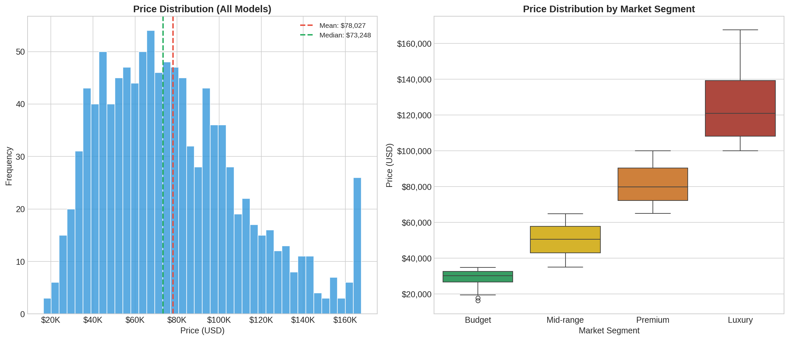
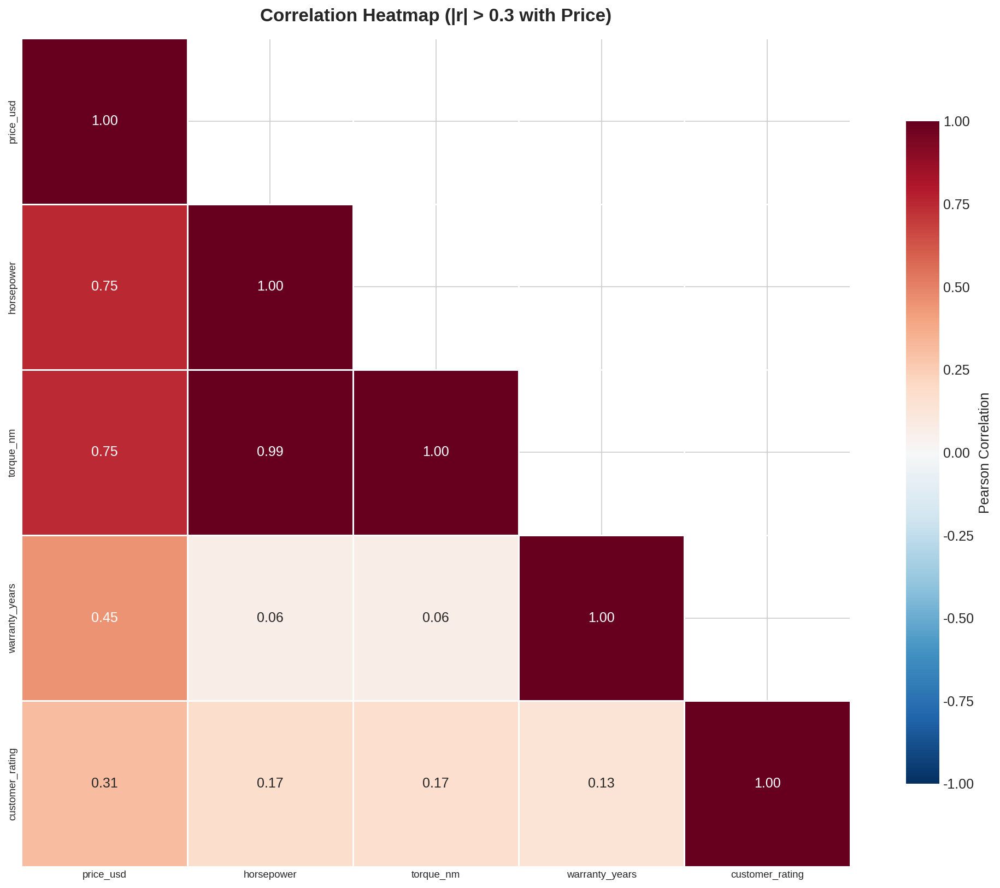
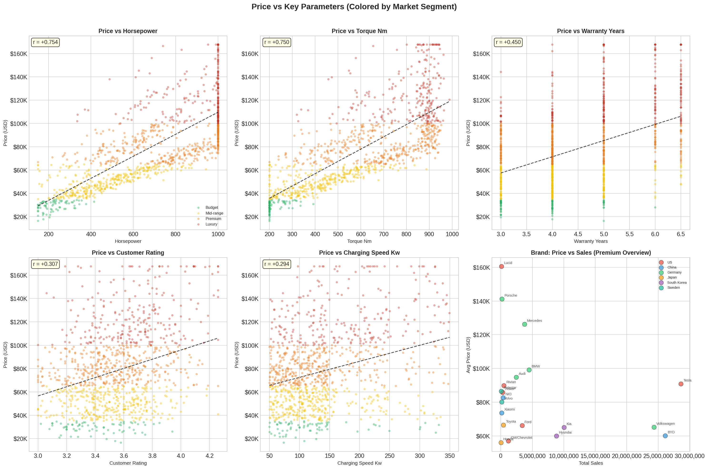
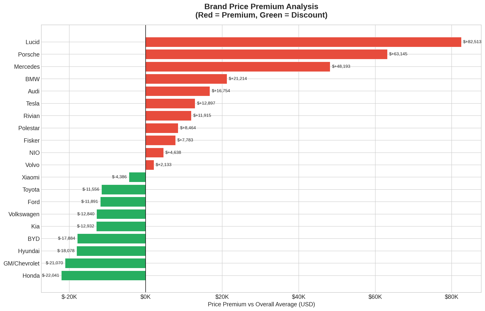

# 第三章 价格机制分析

> **章节编号**: ch03 | **分析类型**: 分析探索型（原型B） | **优先级**: P0

---

## 3.1 价格分布概览

全球EV市场价格区间为 **$16,394 - $167,625**，均价 **$78,027**，中位数 **$73,248**。

### 各细分价格统计

| 细分 | 样本数 | 均价(USD) | 中位数(USD) | 标准差 |
|------|--------|-----------|-------------|--------|
| Budget | 73 | 29,151 | 30,277 | 4,329 |
| Mid-range | 353 | 50,401 | 50,631 | 8,671 |
| Premium | 393 | 81,136 | 79,916 | 10,324 |
| Luxury | 251 | 126,227 | 120,991 | 21,126 |

## 3.2 价格影响因素 — 相关性分析

### 与价格相关性最强的变量（Top 10）

| 排名 | 变量 | 相关系数 | 方向 |
|------|------|----------|------|
| 1 | horsepower | +0.7539 | 正相关 |
| 2 | torque_nm | +0.7498 | 正相关 |
| 3 | warranty_years | +0.4499 | 正相关 |
| 4 | customer_rating | +0.3071 | 正相关 |
| 5 | charging_speed_kw | +0.2937 | 正相关 |
| 6 | autopilot_level | +0.2426 | 正相关 |
| 7 | acceleration_0_60_mph | -0.2234 | 负相关 |
| 8 | top_speed_mph | +0.2071 | 正相关 |
| 9 | battery_capacity_kwh | +0.1966 | 正相关 |
| 10 | range_miles | +0.1888 | 正相关 |

**关键发现**：
- 与价格**最强正相关**的变量为 `horsepower`（r=+0.7539）
- 与价格**最强负相关**的变量为 `acceleration_0_60_mph`（r=-0.2234）
- 派生特征 `price_per_kwh` 与价格呈负相关，符合"性价比"的经济学直觉

## 3.3 价格影响因素 — 散点图分析

散点图展示了价格与 Top5 关键参数的关系形态。按市场细分着色后可观察到：
- **Luxury 细分**（红色）集中在高价格区间
- **Budget 细分**（绿色）集中在低价格区间
- 各参数与价格的关系基本呈线性趋势

## 3.4 价格影响因素 — Random Forest 特征重要性

### 模型性能

| 指标 | 训练集 | 测试集 |
|------|--------|--------|
| R² | 0.9521 | 0.8261 |
| MAE | - | $9,872 |
| RMSE | - | $13,295 |

### 特征重要性排序（Top 10）

| 排名 | 特征 | 重要性 | 累计重要性 |
|------|------|--------|-----------|
| 1 | horsepower | 0.3930 | 0.3930 |
| 2 | torque_nm | 0.2479 | 0.6409 |
| 3 | warranty_years | 0.1889 | 0.8297 |
| 4 | charging_speed_kw | 0.0666 | 0.8963 |
| 5 | autopilot_level | 0.0231 | 0.9194 |
| 6 | weight_kg | 0.0156 | 0.9350 |
| 7 | acceleration_0_60_mph | 0.0147 | 0.9498 |
| 8 | cargo_volume_cubic_ft | 0.0136 | 0.9634 |
| 9 | battery_capacity_kwh | 0.0112 | 0.9746 |
| 10 | range_miles | 0.0100 | 0.9846 |

## 3.5 价格影响因素 — OLS 多元线性回归

### 回归模型摘要

| 指标 | 值 |
|------|-----|
| R² | 0.7646 |
| Adjusted R² | 0.7635 |
| F-statistic | 691.24 |
| F p-value | 0.00e+00 |

### 回归系数

| 特征 | 系数 | 标准误 | t值 | p值 | 显著性 |
|------|------|--------|-----|-----|--------|
| const | -45129.6312 | 2508.6021 | -17.9900 | 0.0000 | *** |
| horsepower | 78.7417 | 14.9589 | 5.2639 | 0.0000 | *** |
| torque_nm | 12.2045 | 16.7901 | 0.7269 | 0.4675 | n.s. |
| warranty_years | 11331.6505 | 485.4453 | 23.3428 | 0.0000 | *** |
| charging_speed_kw | 72.9195 | 7.6264 | 9.5615 | 0.0000 | *** |
| autopilot_level | 2461.6140 | 661.2099 | 3.7229 | 0.0002 | *** |

> 注：\* p<0.05, \*\* p<0.01, \*\*\* p<0.001, n.s. = 不显著

## 3.6 品牌溢价分析

整体均价为 **$78,027**。品牌溢价排名如下：

| 排名 | 品牌 | 均价(USD) | 溢价(USD) | 溢价率(%) | 定位 |
|------|------|-----------|-----------|-----------|------|
| 1 | Lucid | 160,540 | +82,513 | +105.75% | Luxury |
| 2 | Porsche | 141,172 | +63,145 | +80.93% | Luxury |
| 3 | Mercedes | 126,220 | +48,193 | +61.76% | Luxury |
| 4 | BMW | 99,241 | +21,214 | +27.19% | Luxury |
| 5 | Audi | 94,781 | +16,754 | +21.47% | Luxury |
| 6 | Tesla | 90,924 | +12,897 | +16.53% | Luxury |
| 7 | Rivian | 89,942 | +11,915 | +15.27% | Luxury |
| 8 | Polestar | 86,491 | +8,464 | +10.85% | Luxury |
| 9 | Fisker | 85,810 | +7,783 | +9.97% | Luxury |
| 10 | NIO | 82,665 | +4,638 | +5.94% | Luxury |
| 11 | Volvo | 80,160 | +2,133 | +2.73% | Luxury |
| 12 | Xiaomi | 73,641 | -4,386 | -5.62% | Premium |
| 13 | Toyota | 66,471 | -11,556 | -14.81% | Premium |
| 14 | Ford | 66,136 | -11,891 | -15.24% | Premium |
| 15 | Volkswagen | 65,187 | -12,840 | -16.46% | Premium |
| 16 | Kia | 65,095 | -12,932 | -16.57% | Premium |
| 17 | BYD | 60,143 | -17,884 | -22.92% | Premium |
| 18 | Hyundai | 59,949 | -18,078 | -23.17% | Premium |
| 19 | GM/Chevrolet | 56,957 | -21,070 | -27.00% | Premium |
| 20 | Honda | 55,986 | -22,041 | -28.25% | Premium |

## 3.7 本章小结

本章通过相关性分析、Random Forest 特征重要性和 OLS 多元线性回归三种方法，系统识别了影响EV价格的核心因素。核心结论如下：

1. **价格驱动力**：`horsepower`（重要性=0.3930）和 `torque_nm`（重要性=0.2479）是影响EV价格的两大核心因素
2. **模型解释力**：Random Forest 模型测试集 R²=0.8261，说明所选特征能解释价格变异的 82.6%
3. **品牌溢价分化**：溢价最高的品牌为 `Lucid`（溢价 +105.8%），折价最多的品牌为 `Honda`（溢价 -28.2%）
4. **市场细分效应**：Luxury 细分均价是 Budget 细分的 4.3 倍，价格梯度显著

---

*报告生成时间：2026-05-06 10:45:07*
*数据来源：cleaned_data.csv（1070行 x 27列）*
