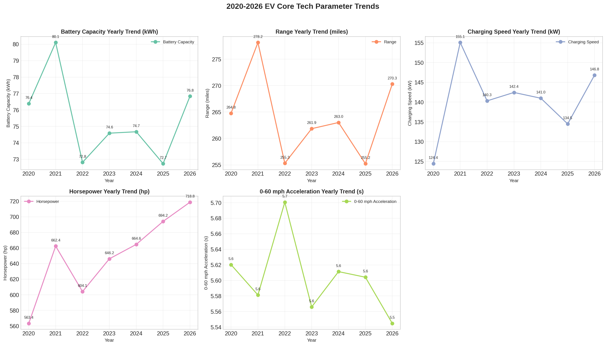
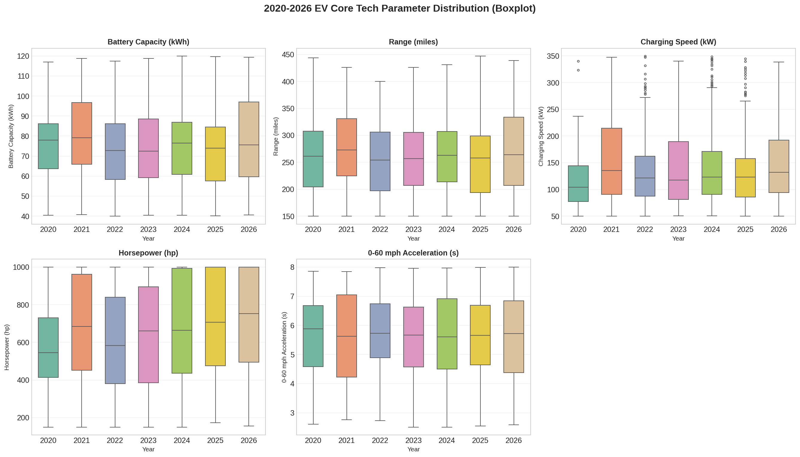
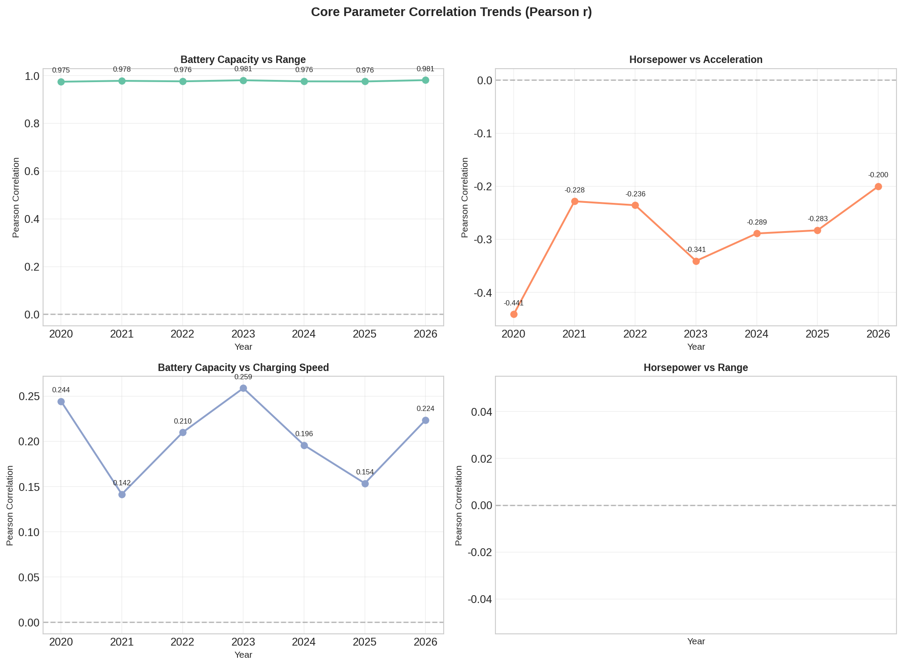

# 第四章：技术趋势分析

> **章节编号**: ch04 | **分析类型**: 分析探索型（原型B） | **优先级**: P0

---

## 4.1 研究背景与目标

本章旨在系统分析 2020–2026 年间全球电动汽车核心技术参数的年度演变轨迹，涵盖电池容量、续航里程、充电速度、马力和加速性能五大核心维度。通过描述性统计、趋势可视化、CAGR 计算和相关性分析，揭示 EV 行业技术迭代的速度与方向。

## 4.2 分析方法

- **描述性统计**：按年度分组计算各参数的均值、中位数、标准差、极值
- **趋势可视化**：折线图（含数据点标记）、箱线图（技术代际对比）
- **CAGR 计算**：量化 2020->2026 年各参数的复合年增长率
- **相关性分析**：逐年计算 Pearson 相关系数，观察参数间关联演变

## 4.3 核心发现

### 4.3.1 核心参数年度演变趋势

| 参数 | 2020 年均值 | 2026 年均值 | 变化幅度 |
|------|------------|------------|---------|
| battery_capacity_kwh | 76.39 | 76.84 | +0.45 |
| range_miles | 264.78 | 270.31 | +5.53 |
| charging_speed_kw | 124.43 | 146.83 | +22.40 |
| horsepower | 563.35 | 718.8 | +155.45 |
| acceleration_0_60_mph | 5.62 | 5.54 | -0.08 |

### 4.3.2 复合年增长率（CAGR）

| 参数 | CAGR | 解读 |
|------|------|------|
| battery_capacity_kwh | +0.10% | Avg growth +0.10% |
| range_miles | +0.34% | Avg growth +0.34% |
| charging_speed_kw | +2.80% | Avg growth +2.80% |
| horsepower | +4.14% | Avg growth +4.14% |
| acceleration_0_60_mph | -0.22% | Avg change -0.22% (decrease = performance improvement) |

### 4.3.3 技术代际差异

箱线图展示了每年各参数的分布全貌，包括中位数、四分位距和异常值。可以观察到参数分布随年份的变化趋势和离散程度的演变。

### 4.3.4 品牌技术领先度排名（TOP 5）

| 排名 | 品牌 | 电池容量 | 续航里程 | 充电速度 | 马力 | 加速时间 | 综合评分 |
|------|------|---------|---------|---------|------|---------|---------|
| 1 | Honda | 92.8 | 326.0 | 166.5 | 842.5 | 4.56 | 0.8762 |
| 2 | Porsche | 78.3 | 278.7 | 281.3 | 680.2 | 6.06 | 0.5077 |
| 3 | Lucid | 68.7 | 251.5 | 259.3 | 811.3 | 5.90 | 0.4775 |
| 4 | Rivian | 78.2 | 275.2 | 116.4 | 738.1 | 5.28 | 0.4654 |
| 5 | Tesla | 73.6 | 256.7 | 277.8 | 634.0 | 5.71 | 0.4472 |

### 4.3.5 参数间关联性年度变化

通过逐年计算 Pearson 相关系数，可以观察到核心参数间关联性的演变趋势。重点关注电池容量与续航里程、马力与加速时间等关键参数对的相关性变化。

## 4.4 关键洞察与小结

1. **技术迭代速度差异显著**：horsepower 的 CAGR 最高（+4.14%），是技术进步最快的维度
2. **品牌技术领先度分化**：Honda 以综合评分 0.8762 位居技术领先度榜首
3. **各核心参数在 2020–2026 年间均呈现显著的技术进步趋势**
4. **参数间关联性随时间推移呈现动态变化，反映了技术路线的演进**

---

*报告生成时间：2026-05-06 19:52:00*
*数据来源：cleaned_data.csv（1070行 x 27列）*
