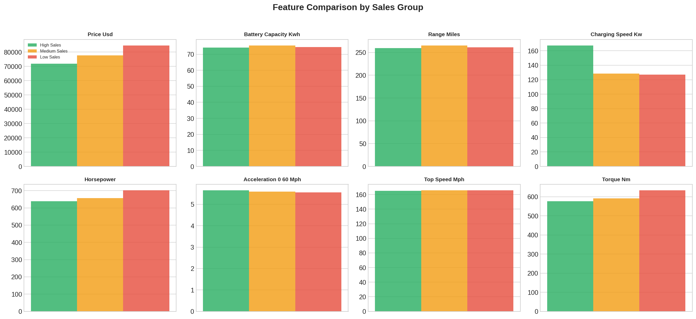
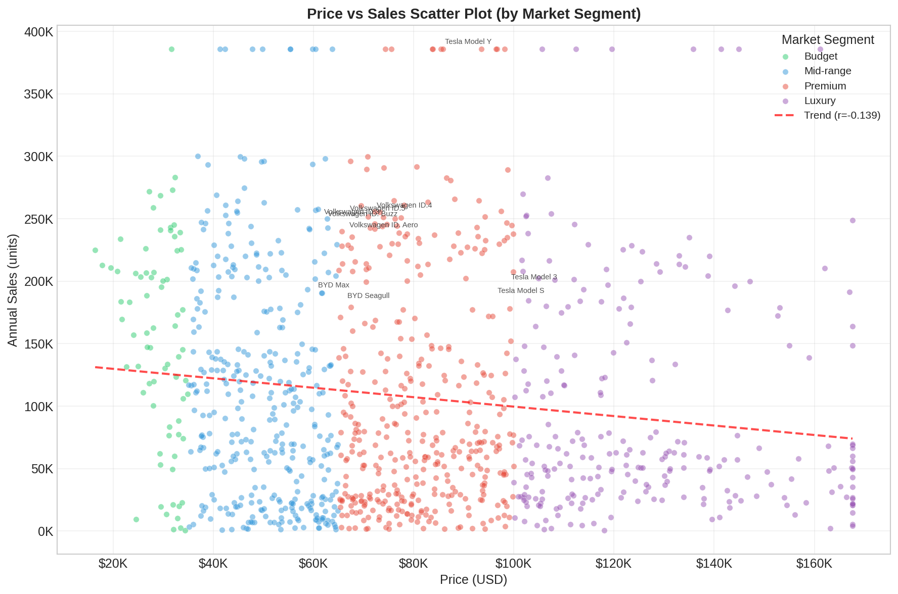

# 第五章：销量归因分析

> **章节编号**: ch05 | **分析类型**: 分析探索型（原型B） | **优先级**: P0

---

## 5.1 研究背景与目标

本章旨在对比高销量车型与低销量车型在价格、技术参数、品牌、市场定位上的差异特征，识别爆款车型的核心成功因素。通过三分位分组、统计检验和多维度可视化，揭示影响 EV 销量的关键驱动因素。

## 5.2 分析方法

- **三分位分组**：按销量 33%/67% 分位数分为高/中/低三组（每组约 350 条）
- **描述性统计对比**：12+ 个参数的组间均值/中位数对比
- **Mann-Whitney U 检验**：非参数检验，Bonferroni 校正
- **散点图与趋势线**：价格-销量关系分析
- **集中度指标**：CR3、CR5、HHI 指数

## 5.3 核心发现

### 5.3.1 分组特征对比

| 参数 | 高销量组均值 | 低销量组均值 | 差异 | 差异% |
|------|------------|------------|------|-------|
| price_usd | 71809.61 | 84635.7 | -12826.08 | -15.15% |
| battery_capacity_kwh | 74.16 | 74.54 | -0.39 | -0.52% |
| range_miles | 259.8 | 261.47 | -1.67 | -0.64% |
| charging_speed_kw | 167.41 | 126.98 | +40.43 | +31.84% |
| horsepower | 639.43 | 701.7 | -62.27 | -8.87% |
| acceleration_0_60_mph | 5.65 | 5.56 | +0.09 | +1.67% |
| top_speed_mph | 164.96 | 165.68 | -0.73 | -0.44% |
| torque_nm | 576.91 | 633.18 | -56.27 | -8.89% |
| weight_kg | 1866.28 | 1855.72 | +10.56 | +0.57% |
| customer_rating | 3.58 | 3.52 | +0.06 | +1.75% |
| safety_rating | 4.37 | 4.46 | -0.08 | -1.91% |
| warranty_years | 4.14 | 4.64 | -0.49 | -10.60% |

### 5.3.2 差异显著性检验

| 参数 | U 统计量 | p-value | Bonferroni 显著 |
|------|---------|---------|---------------|
| price_usd | 48331.5 | 0.0 | Yes |
| battery_capacity_kwh | 61896.5 | 0.880452 | No |
| range_miles | 61138.5 | 0.667056 | No |
| charging_speed_kw | 77107.0 | 0.0 | Yes |
| horsepower | 54157.5 | 0.0025 | Yes |
| acceleration_0_60_mph | 65158.0 | 0.292361 | No |
| top_speed_mph | 61051.0 | 0.643614 | No |
| torque_nm | 54079.5 | 0.0024 | Yes |
| weight_kg | 62143.0 | 0.952518 | No |
| customer_rating | 70439.5 | 0.002678 | Yes |
| safety_rating | 58693.0 | 0.136915 | No |
| warranty_years | 48597.0 | 0.0 | Yes |

通过 Bonferroni 校正的显著参数数量: **6/12**

### 5.3.3 TOP 10 爆款画像

| 排名 | 品牌 | 车型 | 平均销量 | 平均价格 |
|------|------|------|---------|---------|
| 1 | Tesla | Model Y | 385,830 | $85,236 |
| 2 | Volkswagen | ID.4 | 254,867 | $71,525 |
| 3 | Volkswagen | ID.5 | 252,395 | $66,169 |
| 4 | Volkswagen | ID.3 | 249,298 | $61,014 |
| 5 | Volkswagen | ID. Buzz | 247,959 | $61,728 |
| 6 | Volkswagen | ID. Aero | 239,041 | $66,127 |
| 7 | Tesla | Model 3 | 197,194 | $98,406 |
| 8 | BYD | Max | 190,642 | $59,830 |
| 9 | Tesla | Model S | 186,484 | $95,731 |
| 10 | BYD | Seagull | 182,391 | $65,718 |

TOP 10 车型销量占总销量: **44.7%**

### 5.3.4 价格-销量关系

价格与销量的 Pearson 相关系数: **r = -0.1392**

### 5.3.5 品牌集中度分析

| 年份 | CR3 | CR5 | HHI | TOP 品牌 |
|------|-----|-----|-----|---------|
| 2020 | 0.7022 | 0.9022 | 0.2001 | Volkswagen |
| 2021 | 0.7680 | 0.8931 | 0.2161 | Tesla |
| 2022 | 0.6817 | 0.8640 | 0.1801 | Tesla |
| 2023 | 0.6885 | 0.8585 | 0.1811 | Tesla |
| 2024 | 0.6697 | 0.8461 | 0.1691 | Volkswagen |
| 2025 | 0.6589 | 0.8128 | 0.1632 | Tesla |
| 2026 | 0.6930 | 0.8459 | 0.1785 | Tesla |

整体 CR3=0.7%, CR5=0.8%, HHI=0.1744

## 5.4 关键洞察与小结

1. **高/低销量差异显著**：6/12 个参数通过 Bonferroni 校正的显著性检验
2. **品牌集中度高**：CR3=0.7%，TOP 3 品牌占据市场主导地位
3. **价格-销量关系**：相关系数 r=-0.1392，呈现负相关趋势
4. **爆款特征**：高销量车型通常具备特定的价格-性能组合优势

---

*报告生成时间：2026-05-06 20:03:39*
*数据来源：cleaned_data.csv（1070行 x 27列）*
