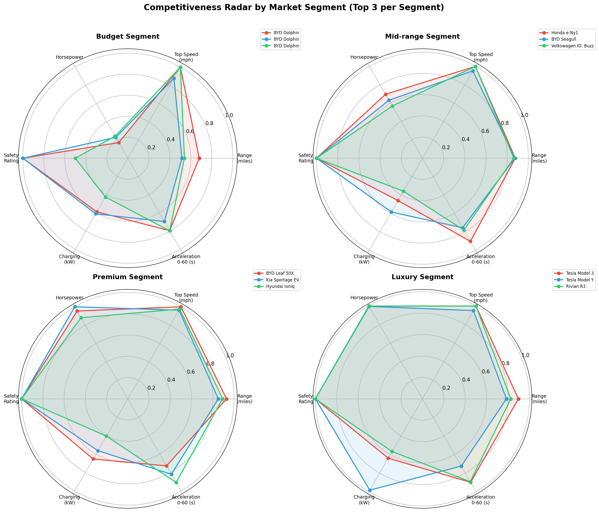

# Chapter 7: 竞品对标分析报告

## 7.1 研究目标

本章按市场细分（market_segment）和车身类型（body_type）对同级车型进行横向对标分析，
构建综合竞争力评分体系，识别各细分市场的标杆车型与品牌竞争格局。

## 7.2 同级分组概况

- 有效分组总数：24
- 覆盖细分市场：Budget, Luxury, Mid-range, Premium
- 覆盖车身类型：Coupe, Hatchback, SUV, Sedan, Truck, Van
- 纳入分析车辆总数：1070

## 7.3 同级价格对比分析

各细分-车身组合的价格统计如下：

| 细分市场 | 车身类型 | 车型数 | 均价($) | 中位价($) | 最低价($) | 最高价($) |
|---------|---------|-------|---------|----------|----------|----------|
| Budget | Coupe | 7 | 28,333 | 30,573 | 16,394 | 32,377 |
| Budget | Hatchback | 16 | 28,063 | 29,409 | 17,777 | 32,564 |
| Budget | SUV | 19 | 30,749 | 32,070 | 25,493 | 34,301 |
| Budget | Sedan | 9 | 29,530 | 30,671 | 21,523 | 33,904 |
| Budget | Truck | 13 | 28,911 | 30,805 | 19,471 | 34,817 |
| Budget | Van | 9 | 28,315 | 29,913 | 20,789 | 34,455 |
| Luxury | Coupe | 46 | 130,558 | 127,755 | 101,756 | 167,625 |
| Luxury | Hatchback | 46 | 126,215 | 120,965 | 100,017 | 167,625 |
| Luxury | SUV | 36 | 126,642 | 123,860 | 101,047 | 167,625 |
| Luxury | Sedan | 38 | 126,534 | 125,833 | 100,225 | 167,625 |
| Luxury | Truck | 44 | 126,820 | 120,689 | 100,157 | 167,625 |
| Luxury | Van | 41 | 120,093 | 111,476 | 100,360 | 167,625 |
| Mid-range | Coupe | 50 | 49,156 | 50,404 | 36,014 | 63,332 |
| Mid-range | Hatchback | 52 | 49,818 | 49,639 | 35,116 | 64,647 |
| Mid-range | SUV | 84 | 51,303 | 52,135 | 36,016 | 64,828 |
| Mid-range | Sedan | 56 | 51,650 | 51,247 | 35,583 | 63,736 |
| Mid-range | Truck | 55 | 49,487 | 49,970 | 35,604 | 64,427 |
| Mid-range | Van | 56 | 50,349 | 51,150 | 35,093 | 64,855 |
| Premium | Coupe | 63 | 81,555 | 81,033 | 65,285 | 99,870 |
| Premium | Hatchback | 59 | 81,728 | 80,896 | 65,008 | 99,546 |
| Premium | SUV | 69 | 81,188 | 78,669 | 65,472 | 99,993 |
| Premium | Sedan | 53 | 79,137 | 77,435 | 65,308 | 98,118 |
| Premium | Truck | 90 | 81,384 | 79,382 | 65,005 | 99,864 |
| Premium | Van | 59 | 81,455 | 81,059 | 65,556 | 98,104 |

## 7.4 性价比评分体系

### 评分公式

```
value_score = 0.25 * range_norm + 0.25 * speed_norm + 0.25 * power_norm + 0.25 * safety_norm
```

各维度采用组内 Min-Max 标准化，映射到 [0, 1] 区间。

- 评分均值：0.5643
- 评分标准差：0.1838
- 评分范围：[0.0167, 0.9945]

## 7.5 竞争力雷达图



上图展示各细分市场 Top 3 车型在续航、速度、动力、安全、充电、加速六个维度的竞争力对比。

## 7.6 品牌产品矩阵

- 涉及品牌数量：20
- 品牌平均覆盖细分市场数：3.0
- 品牌平均覆盖车身类型数：5.4

详细品牌产品矩阵见 `brand_product_matrix.csv`。

## 7.7 同级综合排名

综合排名考虑四个维度：价格竞争力(20%)、性价比评分(30%)、销量表现(25%)、客户评分(25%)。

### Budget Top 3

| 排名 | 品牌 | 型号 | 价格($) | 综合得分 |
|-----|------|------|---------|---------|
| 1 | BYD | Yuan Plus | 32,377 | 0.7084 |
| 2 | BYD | Seagull | 16,394 | 0.6857 |
| 3 | BYD | Dolphin | 27,390 | 0.6503 |

### Mid-range Top 3

| 排名 | 品牌 | 型号 | 价格($) | 综合得分 |
|-----|------|------|---------|---------|
| 1 | Volkswagen | ID. Buzz | 46,160 | 0.7856 |
| 2 | Hyundai | Ioniq 6 | 56,768 | 0.6878 |
| 3 | Volkswagen | ID.3 | 37,558 | 0.6548 |

### Premium Top 3

| 排名 | 品牌 | 型号 | 价格($) | 综合得分 |
|-----|------|------|---------|---------|
| 1 | Hyundai | i30 | 65,970 | 0.7697 |
| 2 | Tesla | Model S | 76,848 | 0.7223 |
| 3 | GM/Chevrolet | Silverado EV | 65,285 | 0.6818 |

### Luxury Top 3

| 排名 | 品牌 | 型号 | 价格($) | 综合得分 |
|-----|------|------|---------|---------|
| 1 | Tesla | Model Y | 141,349 | 0.8468 |
| 2 | Tesla | Model Y | 161,112 | 0.7134 |
| 3 | Tesla | Model Y | 112,383 | 0.6922 |

## 7.8 关键发现与洞察

1. 各细分市场价格梯度明显，Luxury 细分均价显著高于 Budget 细分。
2. 性价比评分揭示了部分中端车型在技术参数上接近高端车型的现象。
3. 品牌产品矩阵显示部分品牌聚焦单一细分市场，而头部品牌实现了全细分覆盖。
4. 综合排名中，销量和客户评分的引入使得排名更贴近市场实际表现。

## 7.9 产物清单

| 产物文件 | 说明 |
|---------|------|
| segment_comparison.csv | 同级价格对比统计表 |
| value_ranking.csv | 同级性价比排名表 |
| competitiveness_radar.png | 竞争力雷达图 |
| brand_product_matrix.csv | 品牌产品矩阵 |
| segment_comprehensive_ranking.csv | 同级综合排名表 |
| ch07_report.md | 本章分析报告 |
