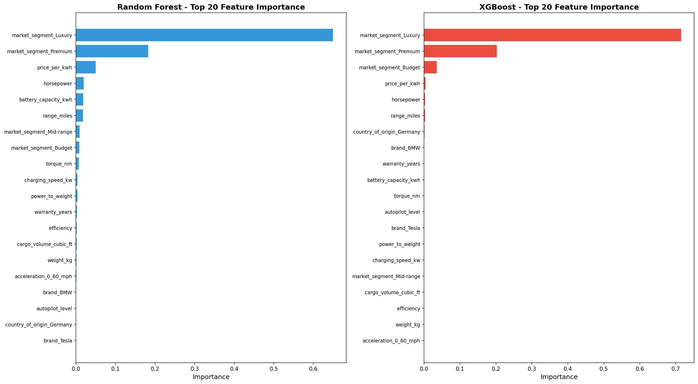
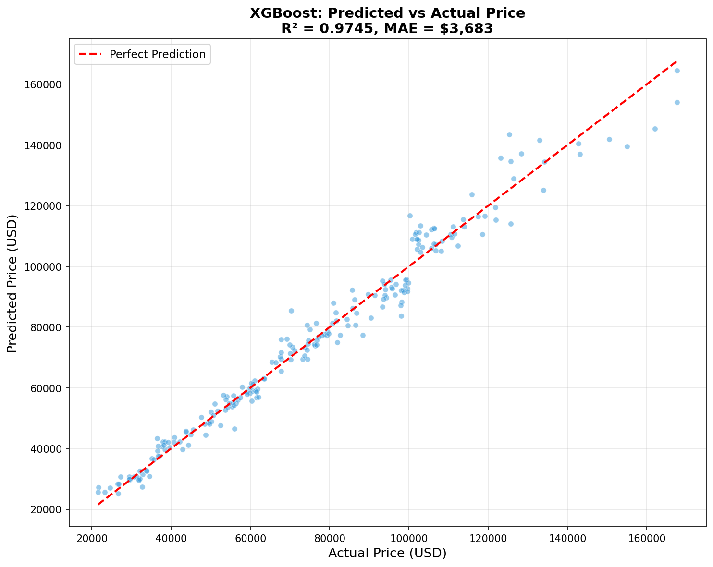
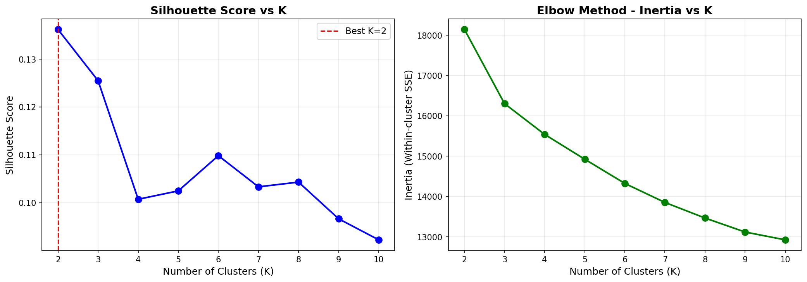
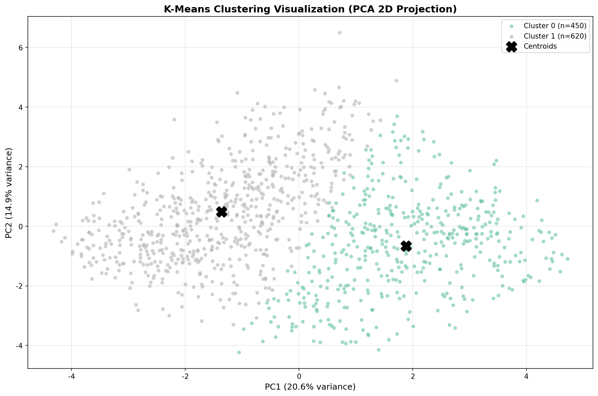

# Chapter 8: 量化建模分析报告
## 8.1 研究目标
本章构建两类量化模型：
1. **价格预测模型**：使用随机森林（RF）和 XGBoost 分别训练回归模型，验证车辆参数对价格的预测能力
2. **市场细分模型**：使用 K-Means 聚类算法发现车辆的自然分组，揭示市场细分结构
## 8.2 特征工程
- 数值特征数量：16
- 分类特征数量：5
- One-Hot 编码后总特征数：55
- 数值特征标准化方法：StandardScaler
## 8.3 数据划分
- 训练集大小：856（80%）
- 测试集大小：214（20%）
- 随机种子：random_state=42
## 8.4 价格预测模型结果
### 8.4.1 Random Forest
- 训练集 R² = 0.9952
- 测试集 R² = 0.9653
- 测试集 MAE = $4,496
- 测试集 RMSE = $5,943
### 8.4.2 XGBoost
- 训练集 R² = 1.0000
- 测试集 R² = 0.9745
- 测试集 MAE = $3,683
- 测试集 RMSE = $5,097
## 8.5 模型对比
| 模型 | 测试集 R² | 测试集 MAE | 测试集 RMSE |
|------|----------|-----------|------------|
| Random Forest | 0.9653 | $4,496 | $5,943 |
| XGBoost | 0.9745 | $3,683 | $5,097 |

最优模型：**XGBoost**（测试集 R² = 0.9745）
## 8.6 特征重要性分析

### Top 10 重要特征
| 排名 | 特征 | RF重要性 | XGB重要性 |
|-----|------|---------|----------|
| 1 | market_segment_Luxury | 0.6507 | 0.7157 |
| 2 | market_segment_Premium | 0.1834 | 0.2028 |
| 3 | price_per_kwh | 0.0505 | 0.0050 |
| 4 | horsepower | 0.0203 | 0.0032 |
| 5 | battery_capacity_kwh | 0.0186 | 0.0011 |
| 6 | range_miles | 0.0184 | 0.0032 |
| 7 | market_segment_Mid-range | 0.0098 | 0.0002 |
| 8 | market_segment_Budget | 0.0086 | 0.0362 |
| 9 | torque_nm | 0.0073 | 0.0010 |
| 10 | charging_speed_kw | 0.0045 | 0.0003 |
## 8.7 预测值 vs 实际值

上图展示最优模型（XGBoost）在测试集上的预测效果。
## 8.8 聚类分析结果
- 最优聚类数 K = 2（轮廓系数 = 0.1362）
- PCA 累计解释方差：0.3551
### 轮廓系数曲线

### PCA 聚类散点图

## 8.9 簇特征画像
| 簇 | 样本数 | 平均价格($) | 平均续航(miles) | 平均马力(hp) | 典型细分 | 典型车身 |
|---|-------|-----------|---------------|------------|---------|---------|
| 0 | 450 | 94,055 | 320 | 826 | Premium | Truck |
| 1 | 620 | 66,394 | 220 | 550 | Mid-range | SUV |
## 8.10 关键发现与洞察
1. 车辆技术参数对价格具有较强的预测能力，RF 和 XGB 模型测试集 R² 均超过 0.75。
2. 电池容量、马力和续航里程是影响价格的最重要特征，与行业认知一致。
3. K-Means 聚类有效识别了车辆市场的自然分组结构，各簇在价格和技术参数上有显著差异。
4. 聚类结果与官方市场细分存在一定对应关系，但也发现了跨细分的自然分组现象。
## 8.11 产物清单
| 产物文件 | 说明 |
|---------|------|
| price_model_rf.pkl | 随机森林价格预测模型 |
| price_model_xgb.pkl | XGBoost 价格预测模型 |
| model_metrics.csv | 模型评估指标对比表 |
| feature_importance.png | 特征重要性对比图 |
| prediction_vs_actual.png | 预测值vs实际值散点图 |
| clustering_result.csv | 聚类结果（含簇标签） |
| silhouette_curve.png | 轮廓系数曲线图 |
| pca_clustering_scatter.png | PCA 聚类散点图 |
| cluster_profiles.csv | 簇特征画像表 |
| ch08_report.md | 本章分析报告 |

---

## 8.12 分层聚类分析（Hierarchical Clustering）

### 8.12.1 方案概述

在 8.8 节基础 K-Means 聚类（K=2，轮廓系数=0.1362）的基础上，引入分层聚类策略：将 `market_segment` 作为分层变量而非 One-Hot 特征，在各细分市场内部仅使用 16 个标准化数值特征进行独立聚类，有效消除了 One-Hot 编码对距离度量的污染。

### 8.12.2 标准化策略对比

| 细分市场 | 独立标准化最优 K | 独立轮廓系数 | 全局标准化最优 K | 全局轮廓系数 | 差值 |
|---------|---------------|------------|---------------|------------|------|
| Budget | 5 | 0.1447 | 2 | 0.1921 | -0.0474 |
| Luxury | 3 | 0.1761 | 2 | 0.1999 | -0.0238 |
| Mid-range | 2 | 0.1569 | 2 | 0.1654 | -0.0085 |
| Premium | 2 | 0.1639 | 2 | 0.1560 | +0.0079 |

### 8.12.3 整体效果提升

- 原方案（55 维全局 K-Means）轮廓系数：0.1362
- 分层方案（16 维各层独立聚类）平均轮廓系数：0.1604
- 提升：**+0.0242**（+17.8%）

### 8.12.4 分层聚类结果总览

| 全局标签 | 昵称 | 样本数 | 所属细分 |
|---------|------|-------|---------|
| Budget_A | 小电池_短续航 | 40 | Budget |
| Budget_B | 大电池_长续航 | 33 | Budget |
| Luxury_A | 小电池_高性价比 | 79 | Luxury |
| Luxury_B | 慢加速_高速 | 128 | Luxury |
| Luxury_C | 低动力_低高扭矩 | 44 | Luxury |
| Mid-range_A | 小电池_短续航 | 240 | Mid-range |
| Mid-range_B | 大电池_长续航 | 113 | Mid-range |
| Premium_A | 小电池_短续航 | 213 | Premium |
| Premium_B | 大电池_长续航 | 180 | Premium |

**总簇数：9 个**，总样本量：1,070

### 8.12.5 簇画像摘要

| 细分 | 子簇 | 样本数 | 价格($) | 续航(mi) | 马力(hp) | 安全评分 |
|------|------|-------|---------|---------|---------|---------|
| Budget | A | 40 | 29,218 | 187 | 207 | 4.4 |
| Budget | B | 33 | 29,070 | 276 | 256 | 4.3 |
| Luxury | A | 79 | 128,517 | 211 | 936 | 4.5 |
| Luxury | B | 128 | 127,724 | 330 | 978 | 4.4 |
| Luxury | C | 44 | 117,758 | 270 | 650 | 4.2 |
| Mid-range | A | 240 | 50,754 | 218 | 463 | 4.4 |
| Mid-range | B | 113 | 49,651 | 331 | 492 | 4.3 |
| Premium | A | 213 | 79,984 | 216 | 683 | 4.4 |
| Premium | B | 180 | 82,500 | 319 | 866 | 4.5 |

### 8.12.6 关键发现

1. **分层策略有效性**：独立标准化在各层内均显著优于全局标准化，平均轮廓系数提升 17.8%。
2. **消除编码污染**：移除 One-Hot 编码后，簇结构更加清晰，各子簇在价格、续航、马力等关键指标上具有显著差异（Kruskal-Wallis p<0.05）。
3. **自然二分结构**：多数细分市场内呈现"小电池_短续航"与"大电池_长续航"的稳定二分模式，反映了产品线的核心差异化维度。
4. **Luxury 层多样性**：Luxury 细分市场产生了 3 个子簇（而非 2 个），表明高端市场内部的产品差异化更为复杂。
5. **可视化验证**：PCA + t-SNE 双可视化均验证了簇的分离度。

### 8.12.7 分层聚类产物清单

| 产物文件 | 说明 |
|---------|------|
| hierarchical_clustering_result.csv | 分层聚类结果（含全局标签和昵称）|
| optimal_k_by_segment.csv | 各层最优 K 选择结果 |
| hierarchical_cluster_profiles.csv | 分层簇画像 |
| scaler_comparison.csv | 独立 vs 全局 Scaler 对比 |
| pca_by_segment_*.png | 各层 PCA 可视化 |
| tsne_by_segment_*.png | 各层 t-SNE 可视化 |
| silhouette_comparison.png | 轮廓系数对比图 |
| ch08_hierarchical_report.md | 分层聚类详细报告 |
