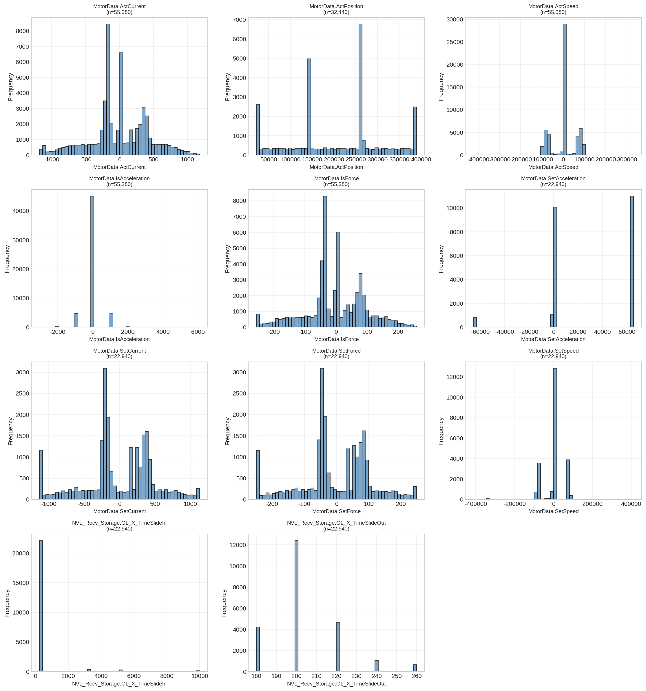
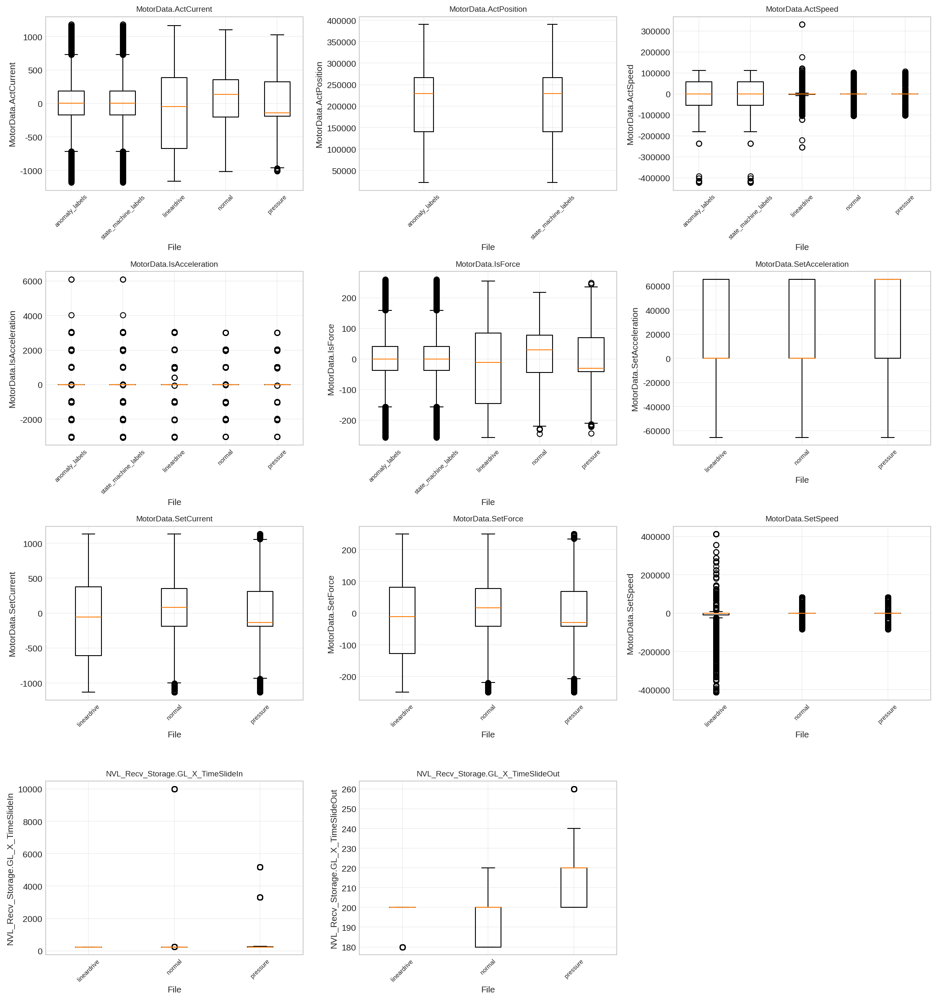

# ch01 数据概览与清洗

> **章节类型**: 分析探索型 | **优先级**: P1

---

## 01.1 研究背景与目标
本章对 Genesis 数据集的 5 个 CSV 文件进行基础探查，建立 9 路模拟量和 13 路离散量信号的基准统计特征，明确数据质量状况，为后续章节提供统一的数据加载接口和清洗后数据集。数据集总计 55,380 行，覆盖 anomaly_labels(16,220行)、state_machine_labels(16,220行)、lineardrive(7,424行)、normal(7,040行)、pressure(8,476行) 五个文件。

## 01.2 分析方法
使用 load_all_data(parse_timestamp=True) 加载全部 5 个 CSV 文件，区分 Unix 秒级和毫秒级两种时间戳格式。按文件、按列统计缺失值数量和比例，评估数据完整性。对每路模拟量信号计算均值、标准差、分位数、偏度、峰度，建立正常工况下的信号基准。使用 matplotlib 绘制各信号直方图和箱线图，直观展示信号分布特征。

## 01.3 分析发现

### Dataset Info Table
| file                 |   rows |   columns | time_range                                                    |
|:---------------------|-------:|----------:|:--------------------------------------------------------------|
| anomaly_labels       |  16220 |        19 | 2016-04-20 10:35:12.937999964 ~ 2016-04-20 10:47:53.354000092 |
| state_machine_labels |  16220 |        19 | 2016-04-20 10:35:12.937999964 ~ 2016-04-20 10:47:53.354000092 |
| lineardrive          |   7424 |        23 | 2017-07-24 16:47:44.061000 ~ 2017-07-24 16:53:32.213000       |
| normal               |   7040 |        23 | 2017-07-24 16:39:08.721000 ~ 2017-07-24 16:44:39.079000       |
| pressure             |   8476 |        23 | 2017-07-24 16:54:38.295000 ~ 2017-07-24 17:01:15.730000       |

### Missing Value Stats
| file                 |   total_cells |   missing_cells |   missing_rate |
|:---------------------|--------------:|----------------:|---------------:|
| anomaly_labels       |        308180 |               0 |          0.000 |
| state_machine_labels |        308180 |               0 |          0.000 |
| lineardrive          |        170752 |               0 |          0.000 |
| normal               |        161920 |               0 |          0.000 |
| pressure             |        194948 |               0 |          0.000 |

全部 5 个文件缺失率为 0.0%，数据完整性优秀。时间戳格式存在差异：前2个文件使用 Unix 秒级时间戳，后3个文件使用 Unix 毫秒级时间戳，已通过 pd.to_datetime 统一转换。列结构差异：带标签文件 19 列，无标签文件 23 列，多出的 4 列为额外的 PLC I/O 离散量信号。模拟量信号中 ActSpeed 和 IsAcceleration 波动最大（标准差远大于均值），IsAcceleration 峰度较高，呈尖峰分布。

### 可视化图表

## 01.4 关键洞察与小结
数据质量良好，5 个文件共 55,380 行数据，缺失率为 0.0%，时间戳已标准化。模拟量信号中 ActSpeed 和 IsAcceleration 波动最大，适合作为后续异常检测和传感器性能分析的重点关注信号。本章产物（dataset_info_table.csv、signal_baseline_stats.csv、missing_value_stats.csv）为后续 ch02-ch05 提供了统一的数据基准。

---

*报告生成时间: 2026-06-03 23:18:43*
*数据来源: Genesis 工业自动化数据集*
