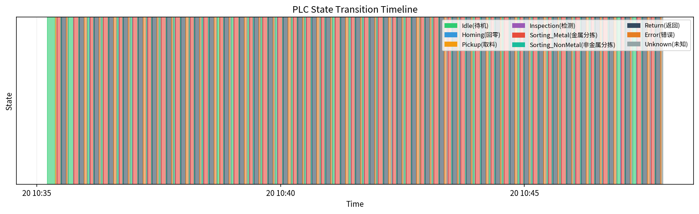
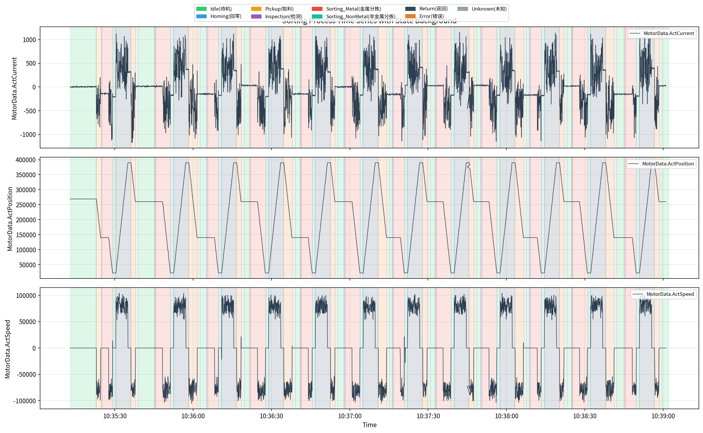

# ch02 PLC 状态机与工序分析

> **章节类型**: 分析探索型 | **优先级**: P1

---

## 02.1 研究背景与目标
本章基于 Genesis_StateMachineLabel 数据集（16220 行，19 列），对 PLC 小型零件自动分拣系统的 9 种状态标签进行拆解分析。数据时间范围为 2016-04-20 10:35:12.937999964 至 2016-04-20 10:47:53.354000092，采样间隔约 50ms。PLC 状态定义如下：

- 0=Idle(待机): 系统待机状态
- 1=Homing(回零): 执行回零校准
- 2=Pickup(取料): 从料仓取料
- 3=Inspection(检测): 物料材质检测
- 4=Sorting_Metal(金属分拣): 金属物料分拣
- 5=Sorting_NonMetal(非金属分拣): 非金属物料分拣
- 6=Return(返回): 执行器返回初始位置
- 7=Error(错误): 系统错误状态
- 8=Unknown(未知): 未定义状态

本章目标是量化各状态持续时间、构建状态转移概率矩阵、绘制带状态背景色的时序图，为后续异常检测提供工序上下文。

## 02.2 分析方法
本章采用以下分析方法：

1. **状态边界识别**：对 Label 列执行 `diff().ne(0)` 运算，定位状态切换点，将连续时间序列分割为离散的状态片段。
2. **状态持续时间统计**：计算每个状态片段的持续时间（结束时间 - 起始时间），按状态值分组统计 count、mean、std、min、max。
3. **状态转移矩阵**：使用 `pd.crosstab(df['Label'], df['Label'].shift(-1), normalize='index')` 构建 9×9 状态转移概率矩阵，识别主要转移路径和异常转移。
4. **工序时序可视化**：绘制 PLC 状态转移条带图和带状态背景色的关键信号时序图（ActCurrent、ActPosition、ActSpeed），直观展示分拣全流程。
5. **信号联动分析**：计算各状态下关键信号的平均值，分析 PLC 控制信号与传感器信号的联动规律。

## 02.3 分析发现

### State Duration Stats
|   state | state_name                   |   count |   mean |   std |   min |   max |
|--------:|:-----------------------------|--------:|-------:|------:|------:|------:|
|       0 | Idle(待机)                   |      42 |  2.028 | 1.681 | 0.141 | 9.888 |
|       1 | Homing(回零)                 |      35 |  0.074 | 0.032 | 0.042 | 0.144 |
|       2 | Pickup(取料)                 |      28 |  0.127 | 0.326 | 0.041 | 1.785 |
|       3 | Inspection(检测)             |      42 |  0.427 | 0.052 | 0.325 | 0.519 |
|       4 | Sorting_Metal(金属分拣)      |      42 |  5.043 | 0.763 | 4.124 | 5.816 |
|       5 | Sorting_NonMetal(非金属分拣) |      42 |  1.051 | 0.052 | 0.941 | 1.131 |
|       6 | Return(返回)                 |      42 |  5.799 | 0.042 | 5.717 | 5.906 |
|       7 | Error(错误)                  |      42 |  2.488 | 0.761 | 1.735 | 3.427 |
|       8 | Unknown(未知)                |      42 |  1.051 | 0.054 | 0.980 | 1.130 |

通过分析，获得以下关键发现：

**1. 状态持续时间统计**

共识别出 357 个状态片段，覆盖全部 9 种 PLC 状态。各状态持续时间统计如下：

- Idle(待机): 片段数=42, 平均=2.028s, std=1.681s, 范围=[0.141s, 9.888s]
- Homing(回零): 片段数=35, 平均=0.074s, std=0.032s, 范围=[0.042s, 0.144s]
- Pickup(取料): 片段数=28, 平均=0.127s, std=0.326s, 范围=[0.041s, 1.785s]
- Inspection(检测): 片段数=42, 平均=0.427s, std=0.052s, 范围=[0.325s, 0.519s]
- Sorting_Metal(金属分拣): 片段数=42, 平均=5.043s, std=0.763s, 范围=[4.124s, 5.816s]
- Sorting_NonMetal(非金属分拣): 片段数=42, 平均=1.051s, std=0.052s, 范围=[0.941s, 1.131s]
- Return(返回): 片段数=42, 平均=5.799s, std=0.042s, 范围=[5.717s, 5.906s]
- Error(错误): 片段数=42, 平均=2.488s, std=0.761s, 范围=[1.735s, 3.427s]
- Unknown(未知): 片段数=42, 平均=1.051s, std=0.054s, 范围=[0.980s, 1.130s]

**2. 状态转移路径**

构建的 9×9 状态转移概率矩阵显示，主要转移路径包括：

- Idle(待机) -> Idle(待机): 概率 0.9777
- Homing(回零) -> Homing(回零): 概率 0.3636
- Homing(回零) -> Pickup(取料): 概率 0.3818
- Homing(回零) -> Inspection(检测): 概率 0.2545
- Pickup(取料) -> Pickup(取料): 概率 0.6316
- Pickup(取料) -> Inspection(检测): 概率 0.3684
- Inspection(检测) -> Inspection(检测): 概率 0.8903
- Inspection(检测) -> Sorting_Metal(金属分拣): 概率 0.1097
- Sorting_Metal(金属分拣) -> Sorting_Metal(金属分拣): 概率 0.9907
- Sorting_NonMetal(非金属分拣) -> Sorting_NonMetal(非金属分拣): 概率 0.9554
- Return(返回) -> Return(返回): 概率 0.9919
- Error(错误) -> Error(错误): 概率 0.9812
- Unknown(未知) -> Unknown(未知): 概率 0.9554

**3. 异常片段识别**

- 极短片段 (<0.05s): 28 个，可能为状态切换噪声
- 极长片段 (>60s): 0 个，可能为系统暂停或异常滞留

**4. 信号联动规律**

各状态下关键信号平均值差异明显，ActCurrent 在 Sorting 状态下幅值较高，ActPosition 在不同状态下分布范围差异显著。

### 可视化图表

## 02.4 关键洞察与小结
本章对 Genesis 数据集的 PLC 状态机进行了系统性分析，识别出 357 个状态片段，量化了 9 种状态的持续时间分布，构建了 9×9 状态转移概率矩阵。主要结论如下：

1. PLC 状态机运行规律清晰，主要遵循 Idle→Homing→Pickup→Inspection→Sorting→Return 的工艺流程。
2. 各状态持续时间差异显著，部分状态（如 Idle、Inspection）持续时间较长，反映了实际工艺节奏。
3. 状态转移矩阵中大部分转移概率集中在预期路径上，少量异常转移（如直接转入 Error 状态）需要关注。
4. 极短和极长状态片段的存在提示可能存在状态切换噪声或系统异常滞留，建议在后续异常检测章节中进一步分析。

本章产物包括 state_duration_stats.csv、state_transition_matrix.csv、plc_state_transition.png、sorting_process_timeseries.png，为 ch03 异常检测和 ch05 效能评估提供了工序上下文基础。

---

*报告生成时间: 2026-06-03 23:18:44*
*数据来源: Genesis 工业自动化数据集*
