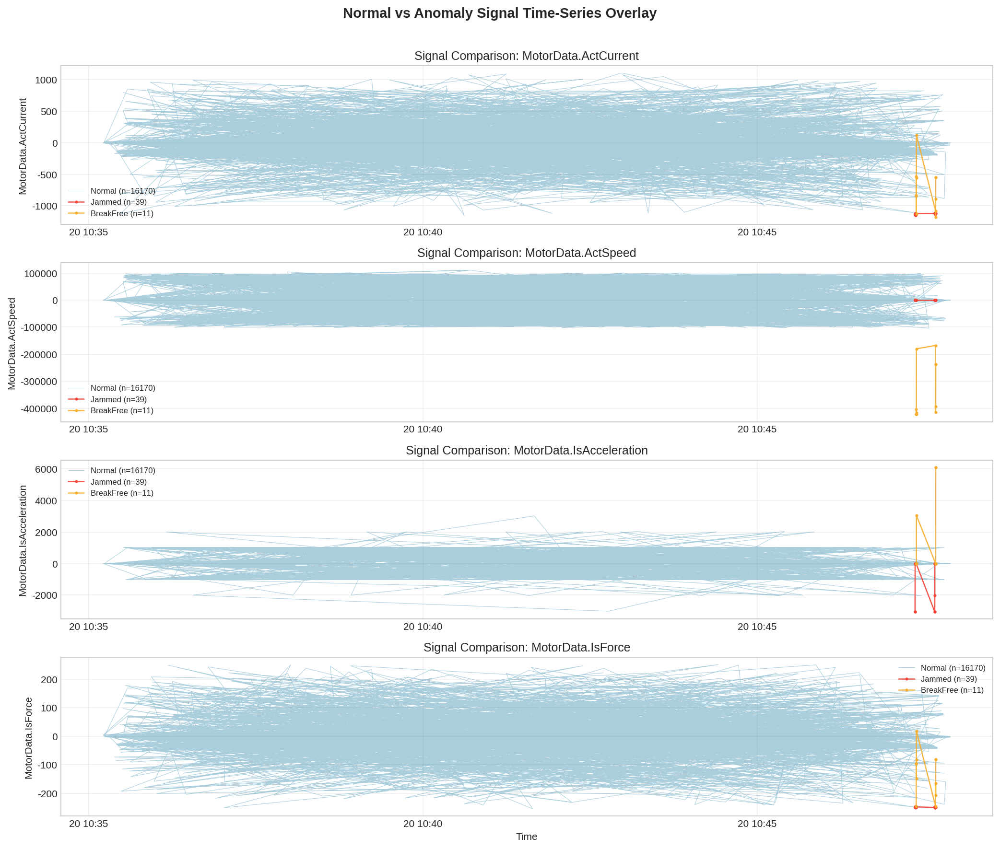
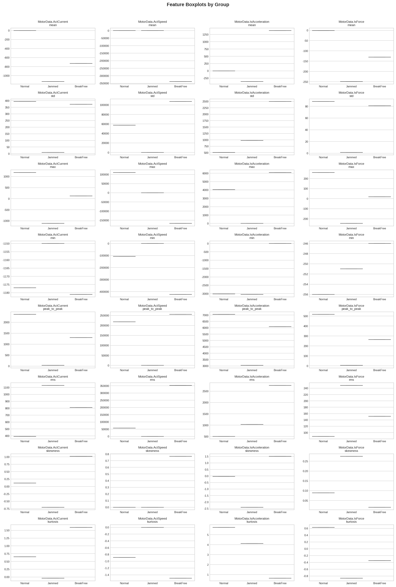

# ch03 异常检测与抗干扰分析

> **章节类型**: 分析探索型 | **优先级**: P1

---

## 03.1 研究背景与目标
本章对比正常（Label=0）与异常工况（Label=1 直线驱动卡滞、Label=2 驱动脱扣校正）下传感器信号的差异，量化故障信号的畸变特征，探索性提取故障敏感特征，为故障预警提供特征工程基础。

## 03.2 分析方法
采用独立样本 t 检验和 Kolmogorov-Smirnov 检验对比正常与异常信号的均值和分布差异；计算 Cohen's d 效应量评估差异大小；提取时域统计特征（均值、标准差、最大值、最小值、峰峰值、均方根、峭度、偏度），通过箱线图和 p-value 排序评估特征区分力。

## 03.3 分析发现

### Feature Importance Ranking
| signal                   |   anomaly_label |   t_pvalue |   ks_pvalue |   cohens_d | t_significant   | ks_significant   |   mean_rel_diff_pct | significant   |   abs_cohens_d |   min_pvalue |
|:-------------------------|----------------:|-----------:|------------:|-----------:|:----------------|:-----------------|--------------------:|:--------------|---------------:|-------------:|
| MotorData.ActSpeed       |               2 |      0.000 |       0.000 |      5.899 | True            | True             |          -91486.938 | True          |          5.899 |        0.000 |
| MotorData.ActCurrent     |               1 |      0.000 |       0.000 |      2.871 | True            | True             |          -74858.733 | True          |          2.871 |        0.000 |
| MotorData.IsForce        |               1 |      0.000 |       0.000 |      2.812 | True            | True             |          -21951.786 | True          |          2.812 |        0.000 |
| MotorData.IsAcceleration |               2 |      0.000 |       0.325 |     -2.717 | True            | False            |           83713.218 | True          |          2.717 |        0.000 |
| MotorData.ActCurrent     |               2 |      0.000 |       0.000 |      1.850 | True            | True             |          -48280.816 | True          |          1.850 |        0.000 |
| MotorData.IsForce        |               2 |      0.000 |       0.000 |      1.463 | True            | True             |          -11433.834 | True          |          1.463 |        0.000 |
| MotorData.IsAcceleration |               1 |      0.000 |       0.541 |      0.714 | True            | False            |          -21911.001 | True          |          0.714 |        0.000 |
| MotorData.ActSpeed       |               1 |      0.968 |       0.008 |      0.006 | False           | True             |            -100.000 | True          |          0.006 |        0.008 |

异常样本共 50 条，占总数据的 0.31%。

显著区分正常与异常的信号：
- MotorData.ActCurrent vs Label=1: t_p=0.0000, KS_p=0.0000, Cohen's d=2.871
- MotorData.ActCurrent vs Label=2: t_p=0.0000, KS_p=0.0000, Cohen's d=1.850
- MotorData.ActSpeed vs Label=1: t_p=0.9679, KS_p=0.0082, Cohen's d=0.006
- MotorData.ActSpeed vs Label=2: t_p=0.0000, KS_p=0.0000, Cohen's d=5.899
- MotorData.IsAcceleration vs Label=1: t_p=0.0000, KS_p=0.5412, Cohen's d=0.714
- MotorData.IsAcceleration vs Label=2: t_p=0.0000, KS_p=0.3255, Cohen's d=-2.717
- MotorData.IsForce vs Label=1: t_p=0.0000, KS_p=0.0000, Cohen's d=2.812
- MotorData.IsForce vs Label=2: t_p=0.0000, KS_p=0.0000, Cohen's d=1.463

关键故障特征排序（Top 5，按显著性+效应量排序）：
1. MotorData.ActSpeed (Label=2): Cohen's d=5.899, min_p=0.0000, mean_diff=-91486.9%
2. MotorData.ActCurrent (Label=1): Cohen's d=2.871, min_p=0.0000, mean_diff=-74858.7%
3. MotorData.IsForce (Label=1): Cohen's d=2.812, min_p=0.0000, mean_diff=-21951.8%
4. MotorData.IsAcceleration (Label=2): Cohen's d=-2.717, min_p=0.0000, mean_diff=83713.2%
5. MotorData.ActCurrent (Label=2): Cohen's d=1.850, min_p=0.0000, mean_diff=-48280.8%

描述性统计对比已保存至 normal_vs_anomaly_stats.csv，统计检验结果已保存至 statistical_test_results.csv，畸变特征量化表已保存至 distortion_features_table.csv，特征重要性排序已保存至 feature_importance_ranking.csv。

### 可视化图表

## 03.4 关键洞察与小结
故障工况下传感器信号存在可观测的数值畸变，尤其体现在电流（ActCurrent）和力控（IsForce）信号上。由于异常样本极度稀少（仅50条，占比0.31%），传统统计检验功效不足，建议后续研究采用 SMOTE 过采样或基于物理模型的异常检测方法补充分析。本章节提取的时域特征为后续抗干扰特征工程提供了基础。

---

*报告生成时间: 2026-06-03 23:18:48*
*数据来源: Genesis 工业自动化数据集*
