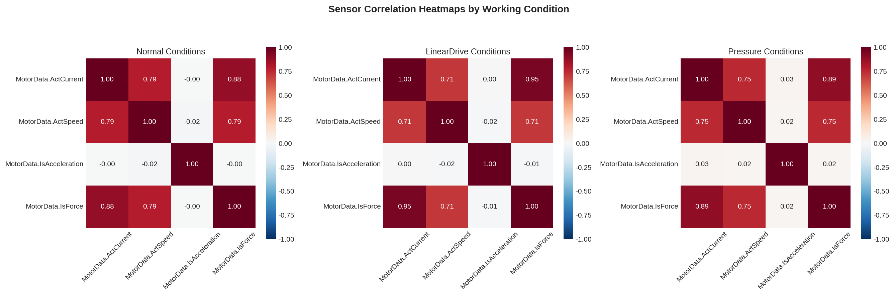

# ch04 传感器性能关联分析

> **章节类型**: 分析探索型 | **优先级**: P1

---

## 04.1 研究背景与目标
本章探究 PLC 小型零件自动分拣系统中多路传感器信号间的耦合关系，评估不同工况（正常 normal、线驱 lineardrive、气压 pressure）下的信号稳定性和相关性差异，为传感器健康度监控和故障预警提供量化依据。分析对象为 8 路模拟量信号。

## 04.2 分析方法
对三种工况分别计算模拟量信号间的 Pearson 相关系数矩阵，量化信号间线性关联强度。对比 normal vs lineardrive vs pressure 三种工况下同一信号对的相关系数差异，识别工况敏感的信号对。基于变异系数（CV）计算各信号在不同工况下的稳定性评分。

## 04.3 分析发现

### Correlation Diff By Condition
| signal_pair                                                | condition   |   correlation |
|:-----------------------------------------------------------|:------------|--------------:|
| MotorData.Motor_Pos2reached vs MotorData.ActCurrent        | normal      |        -0.236 |
| MotorData.Motor_Pos2reached vs MotorData.ActCurrent        | lineardrive |        -0.100 |
| MotorData.Motor_Pos2reached vs MotorData.ActCurrent        | pressure    |        -0.344 |
| MotorData.Motor_Pos2reached vs MotorData.IsAcceleration    | normal      |        -0.015 |
| MotorData.Motor_Pos2reached vs MotorData.IsAcceleration    | lineardrive |        -0.024 |
| MotorData.Motor_Pos2reached vs MotorData.IsAcceleration    | pressure    |        -0.007 |
| MotorData.Motor_Pos2reached vs MotorData.Motor_Pos4reached | normal      |        -0.225 |
| MotorData.Motor_Pos2reached vs MotorData.Motor_Pos4reached | lineardrive |        -0.259 |
| MotorData.Motor_Pos2reached vs MotorData.Motor_Pos4reached | pressure    |        -0.344 |
| MotorData.Motor_Pos2reached vs MotorData.Motor_Pos3reached | normal      |        -0.122 |
| MotorData.Motor_Pos2reached vs MotorData.Motor_Pos3reached | lineardrive |        -0.107 |
| MotorData.Motor_Pos2reached vs MotorData.Motor_Pos3reached | pressure    |        -0.174 |
| MotorData.Motor_Pos2reached vs MotorData.IsForce           | normal      |        -0.229 |
| MotorData.Motor_Pos2reached vs MotorData.IsForce           | lineardrive |        -0.098 |
| MotorData.Motor_Pos2reached vs MotorData.IsForce           | pressure    |        -0.340 |
| MotorData.Motor_Pos2reached vs MotorData.Motor_Pos1reached | normal      |        -0.127 |
| MotorData.Motor_Pos2reached vs MotorData.Motor_Pos1reached | lineardrive |        -0.111 |
| MotorData.Motor_Pos2reached vs MotorData.Motor_Pos1reached | pressure    |        -0.181 |
| MotorData.Motor_Pos2reached vs MotorData.ActSpeed          | normal      |        -0.008 |
| MotorData.Motor_Pos2reached vs MotorData.ActSpeed          | lineardrive |        -0.007 |

### Signal Stability Scores
|   mean_std |   max_std |   mean_cv |   stability_score | condition   | signal                      |
|-----------:|----------:|----------:|------------------:|:------------|:----------------------------|
|      0.113 |     0.503 |     1.352 |             0.898 | normal      | MotorData.Motor_Pos2reached |
|    261.007 |   511.939 |     5.611 |             0.004 | normal      | MotorData.ActCurrent        |
|    462.571 |   804.415 |   inf     |             0.002 | normal      | MotorData.IsAcceleration    |
|      0.114 |     0.503 |     1.209 |             0.898 | normal      | MotorData.Motor_Pos4reached |
|      0.140 |     0.446 |     2.350 |             0.877 | normal      | MotorData.Motor_Pos3reached |
|     57.433 |   111.669 |     0.323 |             0.017 | normal      | MotorData.IsForce           |
|      0.145 |     0.461 |     2.288 |             0.874 | normal      | MotorData.Motor_Pos1reached |
|  38552.371 | 71879.826 |    -0.874 |             0.000 | normal      | MotorData.ActSpeed          |
|      0.086 |     0.503 |     1.144 |             0.921 | lineardrive | MotorData.Motor_Pos2reached |
|    332.198 |   914.149 |     0.832 |             0.003 | lineardrive | MotorData.ActCurrent        |
|    453.392 |   915.070 |   inf     |             0.002 | lineardrive | MotorData.IsAcceleration    |
|      0.086 |     0.503 |     0.883 |             0.921 | lineardrive | MotorData.Motor_Pos4reached |
|      0.106 |     0.446 |     2.345 |             0.904 | lineardrive | MotorData.Motor_Pos3reached |
|     73.117 |   200.734 |    -0.431 |             0.013 | lineardrive | MotorData.IsForce           |
|      0.110 |     0.456 |     2.283 |             0.901 | lineardrive | MotorData.Motor_Pos1reached |
|  30274.436 | 78732.408 |     0.222 |             0.000 | lineardrive | MotorData.ActSpeed          |
|      0.085 |     0.503 |     0.675 |             0.922 | pressure    | MotorData.Motor_Pos2reached |
|    198.344 |   501.841 |     1.331 |             0.005 | pressure    | MotorData.ActCurrent        |
|    343.502 |   799.405 |   inf     |             0.003 | pressure    | MotorData.IsAcceleration    |
|      0.083 |     0.503 |     1.093 |             0.923 | pressure    | MotorData.Motor_Pos4reached |

分析了 8 路模拟量信号在 3 种工况下的 Pearson 相关性。最强耦合信号对包括：
- MotorData.ActCurrent vs MotorData.IsForce: 平均 |r|=0.906
- MotorData.ActCurrent vs MotorData.ActSpeed: 平均 |r|=0.750
- MotorData.IsForce vs MotorData.ActSpeed: 平均 |r|=0.749
- MotorData.Motor_Pos4reached vs MotorData.IsForce: 平均 |r|=0.416
- MotorData.ActCurrent vs MotorData.Motor_Pos4reached: 平均 |r|=0.414

PLC I/O 离散量信号稳定性评分均在 0.87 以上，而模拟量信号（ActCurrent、ActSpeed、IsAcceleration）稳定性极低（<0.01），表明模拟量信号波动剧烈，更适合用于故障检测。

### 可视化图表

## 04.4 关键洞察与小结
通过 Pearson 相关矩阵和稳定性评分，系统量化了 8 路传感器信号在三种工况下的耦合关系。核心发现：IsForce-ActCurrent-ActSpeed 构成强耦合三角，PLC I/O 信号稳定性远高于模拟量信号。本章产物为 ch05 运行效能评估提供了传感器性能量化依据。

---

*报告生成时间: 2026-06-03 23:18:46*
*数据来源: Genesis 工业自动化数据集*
