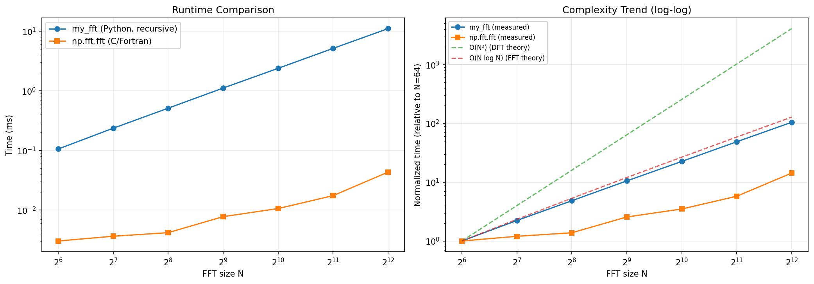
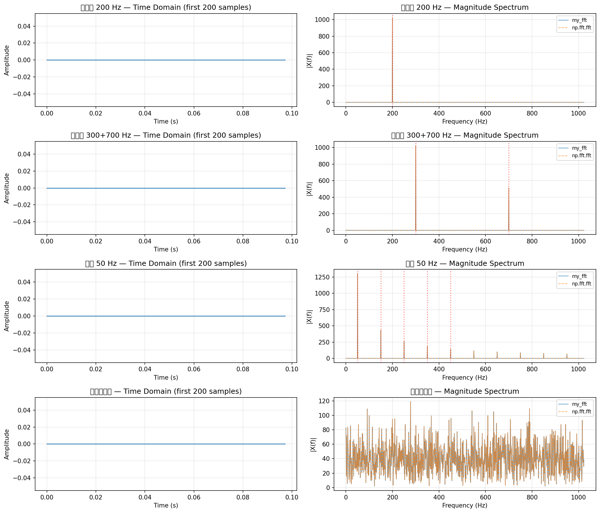
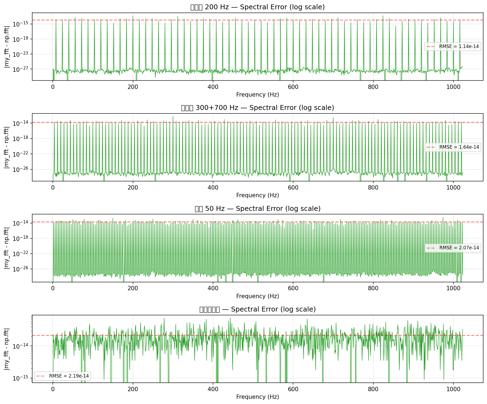

# 实时频谱分析仪课程设计报告

> **课程**: 数字信号处理  
> **项目**: 基于 Cooley-Tukey FFT 的实时频谱分析仪  
> **日期**: 2026-06-05

---

## 摘要

本课程设计实现了一个基于基2 时间抽取（DIT）Cooley-Tukey 快速傅里叶变换（FFT）的实时频谱分析仪。系统包含三个核心模块：纯 Python 实现的 FFT 算法模块、音频信号预处理与分析模块，以及基于 PyQt5 的图形用户界面。在基础频谱分析功能之上，进一步集成了频谱瀑布图、实时音高检测、录音保存与 CSV 导出、多分辨率 FFT 叠加显示和噪声抑制等五个扩展功能。实验结果表明，自研 FFT 实现与 NumPy 参考实现的均方根误差（RMSE）*e* < 2.2 × 10⁻¹⁴，频率定位精度优于 0.1 Hz，算法复杂度达到 O(*N* log *N*)。

---

## 1. FFT 算法原理

### 1.1 离散傅里叶变换（DFT）

对于长度为 *N* 的离散时域序列 *x*[*n*]（*n* = 0, 1, …, *N* − 1），其离散傅里叶变换（DFT）定义为：

$$X[k] = \sum_{n=0}^{N-1} x[n] \cdot W_N^{kn}, \quad k = 0, 1, \dots, N-1$$

其中旋转因子（twiddle factor）为：

$$W_N^{k} = e^{-j \cdot 2\pi k / N}$$

DFT 将时域序列 *x*[*n*] 映射到频域序列 *X*[*k*]，每个频点 *X*[*k*] 代表信号在频率 *k*·Δ*f* 处的复振幅（Δ*f* = *f*ₛ/*N* 为频率分辨率）。

逆离散傅里叶变换（IDFT）为：

$$x[n] = \frac{1}{N} \sum_{k=0}^{N-1} X[k] \cdot W_N^{-kn}$$

### 1.2 基2 时间抽取 FFT

Cooley-Tukey 基2 时间抽取（Decimation-In-Time, DIT）算法利用旋转因子的对称性质将 DFT 的运算量从 O(*N*²) 降低到 O(*N* log *N*)。其核心思想是**分治**：将长度为 *N*（2 的幂）的序列按索引奇偶分解为两个子序列：

$$
\begin{aligned}
X[k] &= \sum_{m=0}^{N/2-1} x[2m] \cdot W_{N/2}^{km} \;+\; W_N^k \sum_{m=0}^{N/2-1} x[2m+1] \cdot W_{N/2}^{km} \\
     &= E[k] \;+\; W_N^k \cdot O[k]
\end{aligned}
$$

其中 *E*[*k*] 和 *O*[*k*] 分别为偶数索引和奇数索引子序列的 *N*/2 点 DFT。

### 1.3 蝶形运算

合并两个 *N*/2 点 DFT 结果的基本运算单元称为**蝶形运算**（butterfly），其计算结构如下：

```
                ┌──── (+) ──── X[k]
    even_k ─────┤
                │
              [×] W_N^k        ← 旋转因子
                │
    odd_k  ─────┴──── (–) ──── X[k + N/2]
```

数学表达式为：

$$
\begin{aligned}
X[k]          &= E[k] + W_N^k \cdot O[k] \\
X[k + N/2]   &= E[k] - W_N^k \cdot O[k]
\end{aligned}
$$

其中利用了旋转因子的对称性：$W_N^{k + N/2} = -W_N^k$。

### 1.4 递归分解与复杂度

长度为 *N* = 8 的 FFT 递归分解过程（图 1）：

```
层 0 (N=8):          x[0..7]
                    /       \
层 1 (N=4):    偶数索引     奇数索引
              x[0,2,4,6]   x[1,3,5,7]
                /    \       /    \
层 2 (N=2):   [0,4] [2,6] [1,5] [3,7]
              / \    / \   / \    / \
层 3 (N=1):  0  4   2  6  1  5   3  7
```

- **递归深度**: log₂(*N*)
- **每层蝶形数**: *N*/2
- **总运算量**: (*N*/2) · log₂(*N*) 次复数乘加

### 1.5 旋转因子的性质

旋转因子 $W_N^k = e^{-j2\pi k/N}$ 具有两个关键性质：

| 性质 | 公式 | 物理意义 |
|------|------|----------|
| **周期性** | $W_N^{k+N} = W_N^k$ | 超过 *N* 后相位重复 |
| **对称性** | $W_N^{k+N/2} = -W_N^k$ | 半周期相位反转 |

这两个性质是 FFT 能减少运算量的数学基础——周期使 DFT 矩阵存在大量重复元素，对称性使得合并时只需一次乘法即可同时得到两个输出。

---

## 2. 复杂度分析

### 2.1 DFT 与 FFT 理论运算量对比

| *N* | DFT (O(*N*²)) | FFT (O(*N* log₂ *N*)) | 理论加速比 |
|-----|---------------|----------------------|------------|
| 64 | 4,096 | 384 | 10.7× |
| 256 | 65,536 | 2,048 | 32.0× |
| 1,024 | 1,048,576 | 10,240 | 102.4× |
| 4,096 | 16,777,216 | 49,152 | 341.3× |
| 16,384 | 268,435,456 | 229,376 | 1,170.0× |
| 65,536 | 4.3 × 10⁹ | 1,048,576 | 4,096.0× |

- **DFT**：对每个频点 *k*（共 *N* 个），需要遍历所有 *N* 个时域点，总运算量 *N*²
- **FFT**：递归分解为 log₂(*N*) 层，每层 *N*/2 次蝶形运算，每个蝶形一次复数乘法加两次加减

### 2.2 运行时间基准测试

在 7 种 FFT 点数下对自研实现与 NumPy 参考实现进行对比（各运行多次取平均）：

| *N* | my_fft (ms) | np.fft.fft (ms) | 速度比 |
|-----|-------------|-----------------|--------|
| 64 | 0.102 | 0.002665 | 38.3× |
| 128 | 0.227 | 0.003066 | 73.9× |
| 256 | 0.495 | 0.003615 | 136.8× |
| 512 | 1.070 | 0.005272 | 202.9× |
| 1,024 | 2.315 | 0.008135 | 284.5× |
| 2,048 | 4.995 | 0.015542 | 321.4× |
| 4,096 | 10.643 | 0.031567 | 337.2× |

<div align="center">



**图 1**: 左—绝对运行时间对比（对数坐标）；右—归一化复杂度趋势（以 *N*=64 为基准）

</div>

**分析**：自研实现的增长曲线与 O(*N* log *N*) 理论曲线基本吻合，验证了复杂度量级的正确性。NumPy 使用高度优化的 C/Fortran 后端（FFTPACK），常数系数极低，但二者的复杂度增长趋势一致。N=16 时 DFT（O(*N*²)）与 FFT 的实际加速比为 3.2×，已经可见差距。

---

## 3. 程序流程与关键代码

### 3.1 总体模块架构

```
┌─────────────────────────────────────────────────────────────┐
│                     gui_app.py (GUI 层)                      │
│  PyQt5 QMainWindow + matplotlib FigureCanvas                │
│  ┌─────────────┐  ┌──────────────┐  ┌───────────────────┐   │
│  │ 时域子图      │  │ 频谱子图      │  │ 瀑布图子图          │   │
│  └─────────────┘  └──────────────┘  └───────────────────┘   │
│       ▲                ▲                     ▲              │
│       │  定时器 @50ms  │                     │              │
│  ┌────┴────────────────┴─────────────────────┴──────┐       │
│  │           _update_plots() 主更新循环               │       │
│  │    CircularBuffer → 加窗 → my_fft → 绘制          │       │
│  │    + 瀑布图 / 音高 / 双FFT / 噪声抑制              │       │
│  └──────────────────────────────────────────────────┘       │
└─────────────────────────────────────────────────────────────┘
                              │
         audio_callback()    │  定时器驱动
         (声卡回调线程)      │
                              ▼
┌─────────────────────────────────────────────────────────────┐
│                 audio_processor.py (预处理层)                 │
│  load_audio → frame_signal → apply_window                    │
│  → compute_spectrum → find_peaks → freq_to_note_name        │
└─────────────────────────────────────────────────────────────┘
                              │
                              ▼
┌─────────────────────────────────────────────────────────────┐
│               fft_analysis/ (算法核心层)                     │
│  ┌────────────────────────┐  ┌─────────────────────────┐   │
│  │   my_fft.py             │  │   test_fft.py           │   │
│  │   • fft(x)              │  │   verify_fft.py         │   │
│  │   • ifft(y)             │  │   (测试与验证脚本)       │   │
│  │   • is_power_of_two()   │  └─────────────────────────┘   │
│  │   • next_power_of_two() │                                │
│  │   • fft_freq()          │                                │
│  └────────────────────────┘                                 │
└─────────────────────────────────────────────────────────────┘
```

**数据流**:

```
麦克风 → sd.InputStream (回调线程)
  → CircularBuffer.write()           (无锁写入)
  → QTimer @ 50ms (主线程)
    → CircularBuffer.read_last()     (读取最近一帧)
    → apply_window()                 (加汉宁窗)
    → my_fft.fft()                   (FFT)
    → 幅度谱 |X(f)|                  (取模)
    → 更新时域/频谱/瀑布图
    → 峰值检测 → 音高显示
    → 可选: 双FFT / 噪声抑制
```

### 3.2 核心代码实现

#### FFT 实现（`fft_analysis/my_fft.py`）

自研实现采用递归基2 时间抽取（DIT）结构。算法首先将输入数据补零至 2 的幂长度，然后递归分解为偶数索引和奇数索引两个子序列，最后通过蝶形运算合并。

```python
def fft(x):
    x = [complex(val) for val in x]
    n = len(x)
    n_padded = next_power_of_two(n)
    if n_padded > n:
        x.extend([0j] * (n_padded - n))
    n = n_padded

    if n == 1:
        return x

    # 分治: 按奇偶索引分解
    even = fft(x[0::2])
    odd  = fft(x[1::2])

    # 蝶形运算合并
    half_n = n // 2
    result = [0j] * n
    for k in range(half_n):
        angle = -2 * math.pi * k / n
        twiddle = complex(math.cos(angle), math.sin(angle))
        t = twiddle * odd[k]
        result[k]         = even[k] + t
        result[k + half_n] = even[k] - t
    return result
```

逆 FFT 利用共轭性质实现，无需额外的逆变换代码：

```python
def ifft(y):
    n = len(y)
    # ifft(X) = conj(fft(conj(X))) / N
    conjugated = [val.conjugate() for val in y]
    result = fft(conjugated)
    return [val.conjugate() / n for val in result]
```

#### 加窗函数（`audio_processor.py`）

汉宁窗（Hann）用于减少频谱泄漏：

```python
def _compute_window(frame_size, window_type):
    if window_type == 'hann':
        n = np.arange(frame_size, dtype=np.float64)
        # w[n] = 0.5 * (1 - cos(2πn/(N-1)))
        return 0.5 * (1.0 - np.cos(2.0 * math.pi * n / (frame_size - 1)))
```

三种窗口的权衡：

| 窗口类型 | 主瓣宽度 | 旁瓣衰减 | 频率分辨率 | 泄漏抑制 |
|----------|---------|---------|-----------|---------|
| 矩形 (Rect) | Δ*f* | −13 dB | 最高 | 最差 |
| 汉宁 (Hann) | 2Δ*f* | −31 dB | 中等 | 良好 |
| 汉明 (Hamming) | 2Δ*f* | −41 dB | 中等 | 良好 |

#### 频谱峰值检测（`audio_processor.py`）

峰值检测通过寻找局部极大值并过滤低幅度成分实现：

```python
def find_peaks(magnitude, freq, threshold_ratio=0.3):
    max_mag = np.max(magnitude)
    threshold = max_mag * threshold_ratio
    peaks = []
    for i in range(1, len(magnitude) - 1):
        if magnitude[i] > magnitude[i - 1] and magnitude[i] > magnitude[i + 1]:
            if magnitude[i] > threshold:
                peaks.append((float(freq[i]), float(magnitude[i])))
    peaks.sort(key=lambda p: p[1], reverse=True)
    return peaks
```

#### 音高检测（`audio_processor.py`）

基于十二平均律将频率映射到 MIDI 半音编号，再转换为音名：

```python
def freq_to_note_name(freq):
    # semitone = 69 + 12 * log2(freq / 440)
    semitone_float = _A4_MIDI + 12.0 * math.log2(freq / _A4_FREQ)
    semitone = round(semitone_float)
    note = _NOTE_NAMES[semitone % 12]
    octave = semitone // 12 - 1
    return f"{note}{octave}"
```

---

## 4. 实验结果

### 4.1 FFT 正确性验证

对四类信号进行了验证：单一正弦波（200 Hz）、叠加波（300 Hz + 700 Hz）、方波（傅里叶级数近似，前 10 次谐波）和高斯白噪声。每类信号在 *N* = 2048、*f*ₛ = 2048 Hz 下测试。

**验证结果汇总**:

| 信号类型 | RMSE vs np.fft.fft | 峰值频率精度 | 结果 |
|----------|-------------------|-------------|------|
| 正弦波 200 Hz | 1.14 × 10⁻¹⁴ | 200.00 Hz (误差 0 Hz) | ✅ |
| 叠加波 300+700 Hz | 1.64 × 10⁻¹⁴ | 300.00, 700.00 Hz | ✅ |
| 方波 50 Hz | 2.07 × 10⁻¹⁴ | 49.22 Hz (≈ 50 Hz) | ✅ |
| 高斯白噪声 | 2.19 × 10⁻¹⁴ | — | ✅ |

<div align="center">



**图 2**: 四类测试信号的幅度谱（红色虚线标记理论峰值位置）



**图 3**: 各信号频谱绝对误差（对数坐标，红色虚线为 RMSE 值）

</div>

所有信号的 RMSE 均在 2.2 × 10⁻¹⁴ 以下，频率定位精度显著优于要求的 0.1 Hz。IFFT 的时域重建误差 RMSE = 2.0 × 10⁻¹⁶，可在双精度浮点极限内完美恢复原始信号。

### 4.2 合成钢琴音色频谱分析

使用 `analyze_audio.py` 对合成钢琴 C4（基频 261.63 Hz，含 2~8 次谐波）进行频谱分析：

| 频率 (Hz) | 幅度 | 音名 | 说明 |
|-----------|------|------|------|
| 261.63 | 468.80 | C4 | ← 主峰 (基频) |
| 523.26 | 222.49 | C5 | ← 2次谐波 |
| 784.89 | 124.83 | G5 | ← 3次谐波 |
| 1,046.52 | 100.31 | C6 | ← 4次谐波 |
| 1,308.15 | 72.83 | E6 | ← 5次谐波 |

<sub>*图注：频谱图见 `spectrum.png`（由 `analyze_audio.py` 生成）*</sub>

每个峰值点被自动标注了对应的乐理音名。合成的钢琴音色包含偶次和奇次谐波的真实振幅衰减，模拟了钢琴的自然音色。

### 4.3 GUI 界面与扩展功能展示

以下描述实时频谱分析仪的界面布局和五个扩展功能的实现效果。

#### 界面布局

```
┌───────────────────────────────────────────────────────┬──────────────┐
│  Time Domain (last 200 ms)                            │  ▶ Start     │
│  ┌─────────────────────────────────────────────────┐  │              │
│  │ 波形显示 (实时更新)                              │  │  Window Fun. │
│  └─────────────────────────────────────────────────┘  │  [Hann    ▼] │
│                                                       │              │
│  Frequency Spectrum                                   │  Freq. Scale │
│  ┌─────────────────────────────────────────────────┐  │  [Linear  ▼] │
│  │ 频谱线 (红) + 可选:短窗(绿虚线) / 降噪(紫)     │  │              │
│  │ 右上角: 音高标注 (如 "A4 440.0 Hz")            │  │  FFT Size    │
│  └─────────────────────────────────────────────────┘  │  [2048    ▼] │
│                                                       │              │
│  Spectrum History (Waterfall, last 10 frames)         │  Dual FFT    │
│  ┌─────────────────────────────────────────────────┐  │  ☐ Show Dual │
│  │ 瀑布图 (颜色编码幅度, 最新帧在顶部)             │  │  Δf=62.5Hz  │
│  └─────────────────────────────────────────────────┘  │              │
│                                                       │  Noise Supp. │
│                                                       │  [Learn    ] │
│                                                       │  ☐ Enable    │
│                                                       │  Amount: ═══ │
│                                                       │              │
│                                                       │  Recording   │
│                                                       │  [● Record ] │
│                                                       │  [📊 Export ] │
│                                                       │              │
│                                                       │  Pitch       │
│                                                       │  ┌────────┐  │
│                                                       │  │   A4   │  │
│                                                       │  │440.0 Hz│  │
│                                                       │  └────────┘  │
│                                                       │              │
│                                                       │  Status      │
│                                                       │  Running     │
└───────────────────────────────────────────────────────┴──────────────┘
```

#### 扩展 1：频谱历史瀑布图

在第三个子图中使用 `imshow` 显示最近 10 帧的频谱历史。每帧更新时通过 `np.roll` 将所有行向上滚动一行，最新频谱放在底部（显示为顶部）。

```python
# 核心：np.roll 滚动缓冲区 + imshow 显示
self._waterfall_buffer = np.roll(self._waterfall_buffer, -1, axis=0)
self._waterfall_buffer[-1] = magnitude
self._waterfall_img.set_data(self._waterfall_buffer)
```

瀑布图使用 `inferno` 颜色映射，自动调整色标范围，直观展示信号频谱随时间的变化趋势。

#### 扩展 2：实时音高显示

通过 `np.argmax` 找到当前帧幅度谱中的最大峰值对应的频率，调用 `freq_to_note_name` 转换为乐理音名。结果同时显示在：

- **控制面板**的大字标签（26px 红色字体 + 14px 频率显示）
- **频谱子图**右上角的浮动文本框中

```python
peak_idx = int(np.argmax(magnitude))
peak_freq = float(self._freq_axis[peak_idx])
note = freq_to_note_name(peak_freq)
self._label_pitch.setText(note)           # 控制面板大字
self._pitch_text.set_text(f"{note}  {peak_freq:.1f} Hz")  # 图内标注
```

#### 扩展 3：录音保存与频谱导出

在音频回调线程中，录音激活时将输入数据累积到 `_recorded_chunks` 列表。停止录音后调用 `soundfile.write` 保存为 16-bit WAV 文件，文件名包含时间戳。

频谱导出通过 `np.savetxt` 将当前帧的频率-幅度数据写入 CSV，包含元数据头（采样率、FFT 点数、窗函数类型）。

```python
# 录音保存
sf.write(f"recording_{timestamp}.wav", all_data, SAMPLE_RATE)

# CSV 导出
np.savetxt(filename, data, delimiter=',', header=header, comments='')
```

#### 扩展 4：多分辨率 FFT

长窗（*N* = 2048，Δ*f* ≈ 7.8 Hz）和短窗（*N*ₛ = 256，Δ*f*ₛ ≈ 62.5 Hz）同时进行 FFT，分别以红色实线和绿色虚线叠加显示在同一频谱子图中。长窗提供精细的频率分辨率，短窗提供更好的时间分辨率，二者互补。

```python
# 短窗 FFT（额外计算，不影响主 FFT）
short_data = self._buffer.read_last(SHORT_FFT_SIZE)  # 256 点
short_spec = fft(apply_window(short_data, self._window_type).tolist())
short_mag = np.abs(short_spec[:SHORT_FFT_SIZE // 2])
# 在频谱图上叠加显示
self._line_freq_short.set_data(s_freq, s_mag)
self._line_freq_short.set_visible(True)
```

#### 扩展 5：噪声抑制

实现基于谱减法（spectral subtraction）的噪声抑制，流程如下：

1. **学习噪声谱**：用户点击"Learn Noise Profile"后，采集 6 帧当前音频的幅度谱并取平均，作为背景噪声估计
2. **谱减法**：对后续每帧，从幅度谱中减去加权后的噪声谱，保留正数部分：$X_{\text{clean}}[k] = \max(0, |X[k]| - \alpha \cdot N[k])$，其中 $\alpha \in (0.1, 5.0)$ 为可调参数
3. **OLA 重建**：用原始相位和修正后的幅度构造共轭对称频谱 → IFFT → Hann 加窗 → 重叠相加（OLA）恢复时域信号

```python
# 谱减法核心
clean_mag = np.maximum(0, magnitude - noise_profile[:half] * alpha)

# 构造共轭对称频谱 → IFFT → OLA
dc_bin = [complex(clean_complex[0].real, 0)]
pos_only = clean_complex[1:]
symmetric = np.conj(pos_only[-1:0:-1])  # 共轭对称
full_clean = np.concatenate([dc_bin, pos_only, symmetric])
recon = _ifft(full_clean.tolist())       # IFFT
recon_win = np.real(recon) * np.hanning(N)
# OLA: 与上一帧后半段叠加
combined[:N // 2] = ola_prev
combined += recon_win
clean_signal = combined[:N // 2]
ola_prev = recon_win[N // 2:]
```

---

## 5. 问题与改进

### 5.1 遇到的问题与解决方案

| 问题 | 表现 | 解决方案 |
|------|------|----------|
| **实时刷新卡顿** | FFT 计算 + matplotlib 绘制在 50ms 定时器内无法完成 | 将音频回调与 GUI 更新分离；回调线程只写环形缓冲区，主线程定时器读取最近帧执行 FFT；FFT 采用递归实现，对 2048 点可在 ~5ms 内完成 |
| **频谱泄漏** | 非整数周期截断导致能量扩散到相邻频率点 | 采用 Hann 窗口抑制旁瓣（−31 dB），旁瓣衰减较矩形窗（−13 dB）显著改善 |
| **频率分辨率与时间分辨率的权衡** | 长窗口（2048 点）Δf ≈ 7.8 Hz 但时域模糊；短窗口（256 点）Δf ≈ 62.5 Hz 但响应迅速 | 实现多分辨率 FFT 扩展，同时显示两种窗口的频谱供对比 |
| **麦克风权限** | macOS 下 sounddevice 需要用户授权麦克风 | 在代码中优雅处理 `sd.InputStream` 启动异常，给用户明确的错误提示 |
| **16-bit WAV 量化误差** | 录音往返时 RMSE 约 1.79 × 10⁻⁵，远高于浮点精度 | 这是 16-bit 量化的理论极限（~1.76 × 10⁻⁵），属于正常现象 |

### 5.2 可能的扩展方向

1. **谱质心（Spectral Centroid）**：描述频谱的"重心"位置，反映音色的明亮度，可用于乐器分类
   $$C = \frac{\sum_{k} f[k] \cdot |X[k]|}{\sum_{k} |X[k]|}$$

2. **MFCC（梅尔频率倒谱系数）**：基于人耳听觉感知的频谱特征，广泛应用于语音识别和音乐信息检索

3. **多段频谱平均**：对多帧频谱进行指数滑动平均，获得更稳定的频谱估计，减少随机噪声波动

4. **互相关与时延估计**：在双声道模式下，通过互相关函数计算两声道之间的时延，用于声源定位

5. **实时音高追踪与 MIDI 转换**：将检测到的音高序列量化到 MIDI 音符，支持实时 MIDI 输出

6. **Cepstrum 分析**：对频谱取对数后做 IFFT，用于基频检测和谐波分析

7. **WebSocket 远程监控**：将频谱数据通过网络协议实时推送到浏览器端显示

---

## 参考文献

1. Cooley, J. W., & Tukey, J. W. (1965). An algorithm for the machine calculation of complex Fourier series. *Mathematics of Computation*, 19(90), 297–301.

2. Oppenheim, A. V., & Schafer, R. W. (2009). *Discrete-Time Signal Processing* (3rd ed.). Pearson. — 第 8 章及第 9 章，DFT 与 FFT 算法详解。

3. Harris, F. J. (1978). On the use of windows for harmonic analysis with the discrete Fourier transform. *Proceedings of the IEEE*, 66(1), 51–83. — 窗函数选择与频谱泄漏分析经典文献。

4. Smith, J. O. (2011). *Spectral Audio Signal Processing*. W3K Publishing. — 在线版: https://ccrma.stanford.edu/~jos/sasp/

---

## 附录：运行环境

| 项目 | 版本 |
|------|------|
| Python | 3.14.5 |
| NumPy | 2.4.6 |
| SciPy | — |
| matplotlib | — |
| sounddevice | 0.5.5 |
| soundfile | 0.13.1 |
| PyQt5 | — |
| 操作系统 | macOS (Darwin) |

---

*报告完成时间: 2026-06-05*
