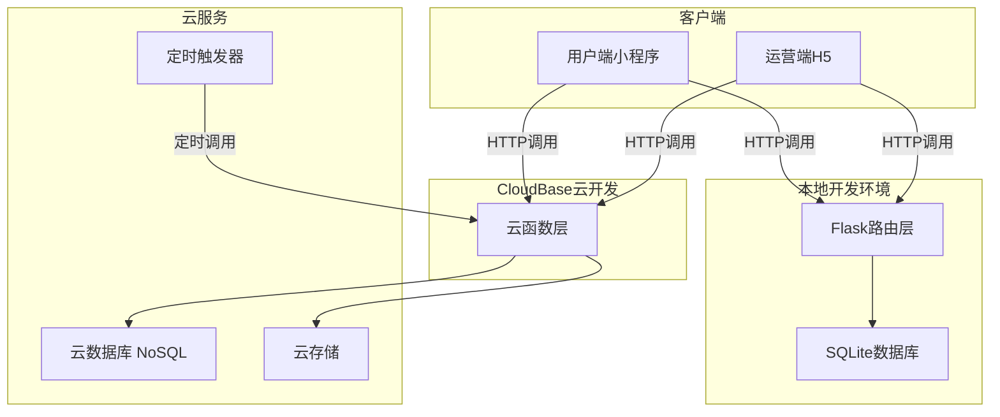
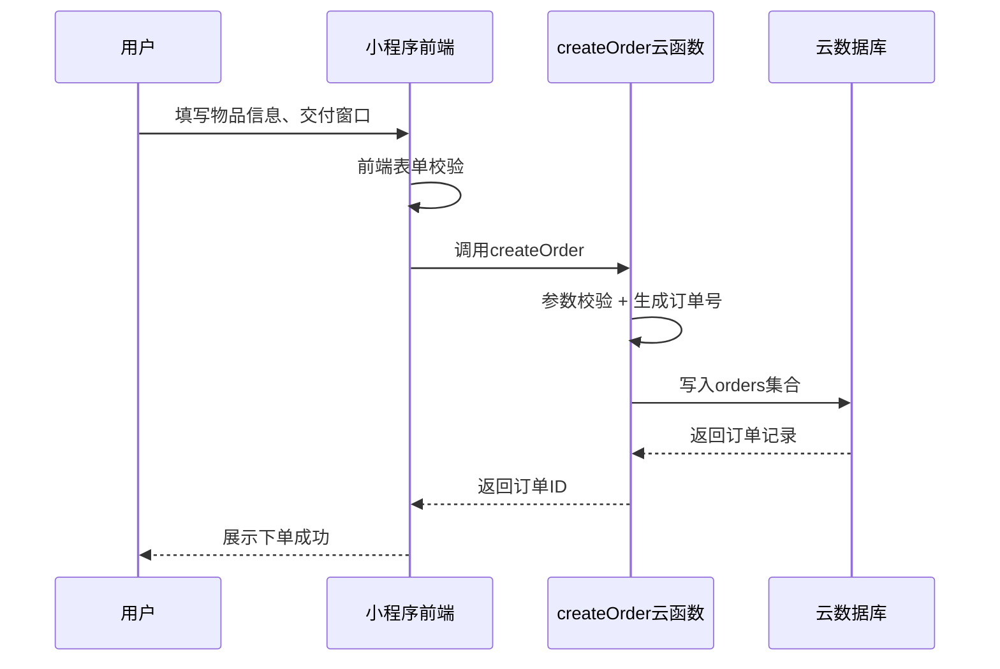
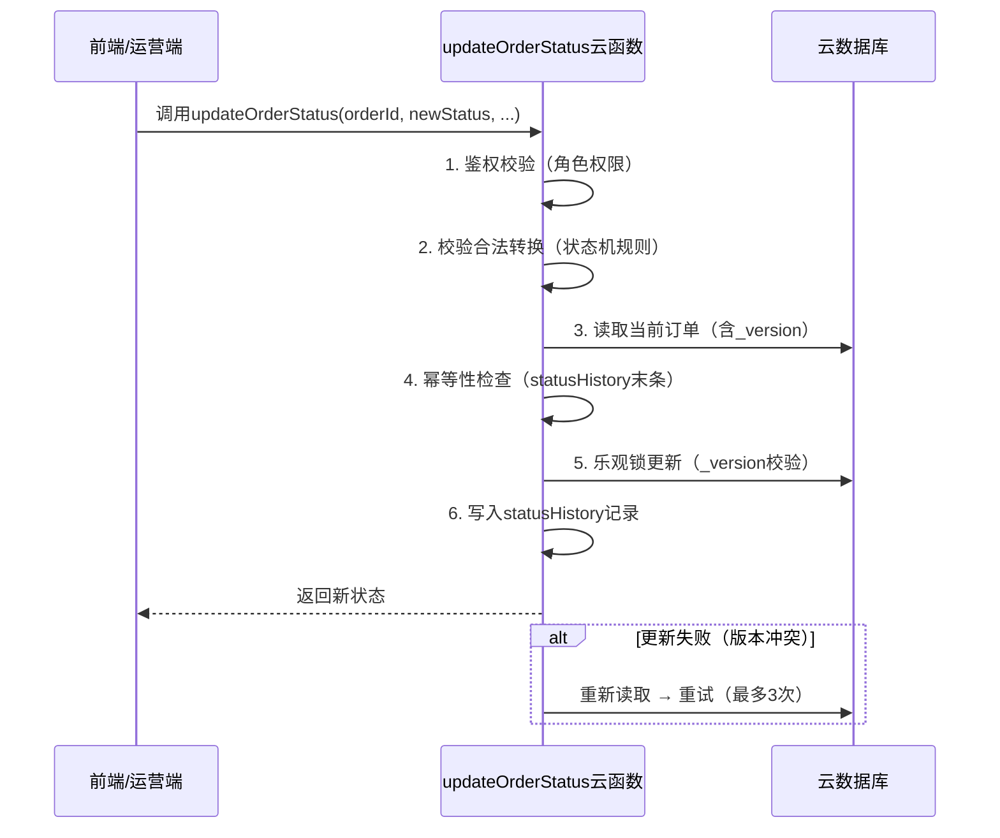
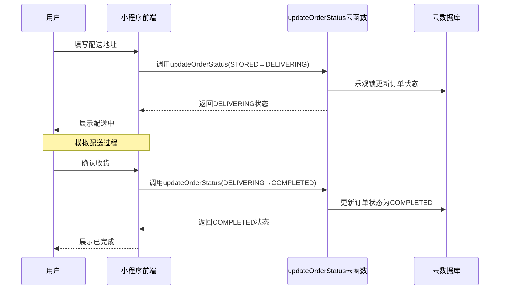

# 校园物品暂存平台 · 系统设计说明书 (SDD)

> 版本：v2.0
> 创建日期：2026-05-10
> 最后更新：2026-05-10
> 状态：待审查

---

## 一、文档概述

### 1.1 文档目的

定义校园物品暂存平台的系统架构、模块设计、核心机制，为开发实施提供技术指导。

### 1.2 系统范围

- 用户端：微信小程序（毕业生/学生使用）
- 运营端：Web H5（运营人员使用）
- 后端：CloudBase云函数 + 云数据库 + 云存储
- 开发环境：本地Flask + SQLite（开发测试）→ CloudBase云开发（生产部署）

### 1.3 设计约束

- Demo阶段：单城市运营、模拟支付、预置仓库数据
- 技术约束：CloudBase免费额度限制、无独立服务器
- 团队约束：1人开发，AI辅助
- **本地开发优先**：所有功能先在本地Python环境（Flask + SQLite）完成开发和测试，验证通过后再部署至CloudBase云开发环境。本地环境与生产环境通过 `db_adapter.py` 抽象层实现无缝切换，确保业务逻辑代码在两种环境下一致运行。

---

## 二、系统架构

### 2.1 整体架构图



**架构说明：**

```
┌─────────────┐     ┌─────────────┐
│  用户端小程序  │     │  运营端H5    │
└──────┬──────┘     └──────┬──────┘
       │                   │
       └───────┬───────────┘
               │
       ┌───────▼───────┐
       │  本地开发环境    │
       │  Flask + SQLite │  ← 开发/测试
       └───────┬───────┘
               │  验证通过后部署
       ┌───────▼───────┐
       │  CloudBase     │
       │  云函数层       │  ← 生产环境
       └───────┬───────┘
               │
    ┌──────────┼──────────┐
    │          │          │
┌───▼───┐ ┌───▼───┐ ┌───▼───┐
│云数据库│ │云存储  │ │定时触发│
└───────┘ └───────┘ └───────┘
```

**双环境架构说明：**

```
本地开发环境（Flask + SQLite）→ CloudBase云开发（生产）
```

- **本地开发环境**：使用Flask提供HTTP服务，SQLite作为本地数据库，支持快速迭代和调试
- **CloudBase云开发**：生产环境部署，使用云函数和云数据库，Serverless免运维
- **统一切换**：通过 `db_adapter.py` 抽象层实现数据库访问的统一接口，环境切换无需修改业务逻辑

### 2.2 技术栈选型

| 层级 | 技术选型 | 选型理由 |
|------|---------|---------|
| 前端 | 微信小程序原生 | 目标用户在微信生态，无需下载安装 |
| 后端 | 本地Flask + SQLite（开发）→ CloudBase云函数（生产） | 本地Flask支持快速开发调试；生产环境CloudBase Serverless免运维，适合Demo/个人项目 |
| 数据库 | SQLite（本地开发）→ CloudBase NoSQL（生产） | SQLite零配置本地开发；CloudBase NoSQL与云函数天然集成，免运维 |
| 数据访问层 | db_adapter.py 抽象层 | 统一SQLite与CloudBase NoSQL的访问接口，业务逻辑代码无需感知底层差异 |
| 存储 | CloudBase云存储 | 存储入库照片等文件 |
| 支付 | 微信支付（Demo阶段模拟） | 微信生态内支付体验最佳 |

**选型取舍说明：**

- **为什么选择Python而非Node.js？** 团队更熟悉Python、Python在数据处理和自动化方面生态更优、类型提示（Type Hints）提升代码可维护性。
- **为什么采用"本地Flask + 云函数"双模式？** 本地Flask环境支持断点调试、热重载和快速迭代，大幅提升开发效率；CloudBase云函数作为生产环境免运维、按调用计费。两者通过db_adapter抽象层统一，避免维护两套业务逻辑。
- **为什么不用MySQL？** CloudBase云数据库是文档型NoSQL，与云函数天然集成，免运维。Demo阶段数据量小，NoSQL的灵活Schema更适合快速迭代。本地开发使用SQLite模拟，通过db_adapter抹平差异。
- **为什么不用Flutter/RN？** 目标用户在微信生态，小程序开发成本最低，无需考虑跨平台适配，且微信登录、支付等能力原生支持。

### 2.3 部署架构

**本地开发 → 统一部署模式：**

```
┌──────────────────────────────────────────────────────────┐
│                    开发阶段                                │
│                                                          │
│  本地Flask服务（localhost:5000）                           │
│    ├── Flask路由 ←→ 业务逻辑 ←→ db_adapter ←→ SQLite     │
│    ├── 热重载、断点调试、单元测试                            │
│    └── 所有功能在此完成开发和验证                             │
│                                                          │
├──────────────────────────────────────────────────────────┤
│                    部署阶段                                │
│                                                          │
│  1. 业务逻辑代码（已通过本地测试）                            │
│  2. 切换环境变量 ENV=production                           │
│  3. db_adapter 自动切换至 CloudBase NoSQL                  │
│  4. 云函数部署至 CloudBase                                 │
│  5. 小程序上传代码 → 提交审核 → 发布                        │
│                                                          │
└──────────────────────────────────────────────────────────┘
```

- **开发环境**：本地Flask + SQLite，支持快速迭代、断点调试、热重载
- **部署流程**：本地验证通过 → 切换环境变量 → 部署云函数 → 小程序发布
- **环境切换**：通过 `ENV` 环境变量控制，`db_adapter.py` 根据环境自动选择SQLite或CloudBase NoSQL
- **统一部署**：所有云函数统一部署至CloudBase一套环境（Demo阶段开发/生产共用）

---

## 三、模块设计

### 3.1 用户端模块

| 模块 | 功能 | 页面 |
|------|------|------|
| 首页模块 | 展示进行中订单、快捷入口 | 首页 |
| 下单模块 | 物品寄存下单流程 | 下单页 |
| 订单模块 | 订单列表、订单详情、状态追踪 | 订单列表页、订单详情页 |
| 配送模块 | 发起配送、目的地调整 | 配送发起页、目的地调整页 |
| 用户模块 | 个人信息、投诉入口 | 个人中心页 |

### 3.2 运营端模块

| 模块 | 功能 | 页面 |
|------|------|------|
| 订单管理 | 订单列表、搜索筛选、状态操作 | 订单管理页 |
| 入库管理 | 扫码入库、拍照上传 | 入库操作页 |
| 异常管理 | 标记异常、处理方案 | 异常处理页 |

### 3.3 云函数模块

> **本地开发说明**：以下云函数在本地开发环境中以Flask路由形式实现，路由路径与云函数名对应。例如 `createOrder` 云函数对应本地路由 `POST /api/createOrder`。业务逻辑代码在两种环境下完全一致，仅入口层不同。

| 云函数 | 本地Flask路由 | 职责 | 触发方式 |
|--------|-------------|------|---------|
| login | `POST /api/login` | 用户登录认证 | HTTP |
| createOrder | `POST /api/createOrder` | 创建订单 | HTTP |
| updateOrderStatus | `POST /api/updateOrderStatus` | **核心**：订单状态变更 | HTTP |
| getOrderList | `GET /api/getOrderList` | 获取订单列表 | HTTP |
| getOrderDetail | `GET /api/getOrderDetail` | 获取订单详情 | HTTP |
| createTicket | `POST /api/createTicket` | 创建投诉工单 | HTTP |
| pendingTimeoutChecker | Flask定时任务/APScheduler | PENDING超时取消 | 定时触发 |
| deliveringTimeoutChecker | Flask定时任务/APScheduler | DELIVERING超时完结 | 定时触发 |

**云函数示例（Python风格伪代码）：**

```python
# cloudbaserc.json 中配置入口
# {"functions": {"createOrder": {"handler": "main.main", "runtime": "Python 3.12"}}}

def main(event: dict) -> dict:
    """createOrder 云函数入口"""
    # 1. 参数校验
    user_id: str = event.get("userInfo", {}).get("openId", "")
    item_name: str = event.get("itemName", "")
    delivery_window: dict = event.get("deliveryWindow", {})

    if not item_name:
        return {"code": 400, "msg": "物品名称不能为空"}

    # 2. 生成订单号
    order_id: str = f"ORD{datetime.now().strftime('%Y%m%d%H%M%S')}{uuid4().hex[:6]}"

    # 3. 写入数据库（通过db_adapter抽象层）
    order_record = {
        "orderId": order_id,
        "userId": user_id,
        "itemName": item_name,
        "status": "PENDING",
        "isPaid": False,
        "createTime": datetime.now().isoformat(),
        "statusHistory": [{"fromStatus": None, "toStatus": "PENDING", "time": datetime.now().isoformat()}],
    }
    db_adapter.collection("orders").add(order_record)

    return {"code": 0, "data": {"orderId": order_id}}
```

### 3.4 定时任务模块

| 任务 | 触发频率 | 职责 |
|------|---------|------|
| pendingTimeoutChecker | 每30分钟 | 扫描超时PENDING订单自动取消 |
| deliveringTimeoutChecker | 每30分钟 | 扫描超时DELIVERING订单自动完结 |

> **本地开发说明**：定时任务在本地开发环境中通过APScheduler实现，部署至CloudBase后切换为云函数定时触发器。

---

## 四、核心机制设计

### 4.1 订单状态机

> 引用自《订单状态机设计文档.md》v2.0

```mermaid
stateDiagram-v2
    direction LR
    [*] --> PENDING : 创建订单（支付由isPaid字段管理）

    %% 正向主流程
    PENDING --> COLLECTED : 运营确认取件/用户自送
    COLLECTED --> TRANSIT : 运营手动发运（24h未操作提醒）
    TRANSIT --> STORED : 到仓拍照入库
    STORED --> DELIVERING : 用户发起配送
    DELIVERING --> COMPLETED : 手动确认 / 7天超时自动完结（以DELIVERING创建时间计）

    %% 取消流程（仅PENDING可主动取消）
    PENDING --> CANCELLED : 主动取消 / 7天超时（计时：订单创建+交付窗口期结束）
    note over PENDING,CANCELLED : 未支付直接取消；已支付取消并自动退款

    %% 异常：所有状态可标记（管理员专属）
    PENDING --> EXCEPTION : 管理员标记异常
    COLLECTED --> EXCEPTION : 管理员标记异常
    TRANSIT --> EXCEPTION : 管理员标记异常
    STORED --> EXCEPTION : 管理员标记异常
    DELIVERING --> EXCEPTION : 管理员标记异常（含配送失败退回）

    %% 异常闭环（仅管理员操作）
    EXCEPTION --> COMPLETED : 人工结案（如：破损赔偿后完结）
    EXCEPTION --> CANCELLED : 人工作废（如：配送失败→取消+退款+重下单）

    %% 终态约束
    COMPLETED : 【终态】不可逆｜投诉走独立工单
    CANCELLED : 【终态】不可逆
    EXCEPTION : 【仅管理员】必填原因+操作日志
```

**摘要说明：**

- **8种状态**：PENDING → COLLECTED → TRANSIT → STORED → DELIVERING → COMPLETED，另有 CANCELLED 和 EXCEPTION
- **核心设计原则**：
  - 状态机与支付解耦（支付由 `isPaid` 字段独立管理）
  - 异常必有闭环（EXCEPTION 必须走向 COMPLETED 或 CANCELLED）
  - 终态不可逆（COMPLETED 和 CANCELLED 不可再变更）
  - 状态机与工单解耦（投诉走独立工单系统，不修改订单状态）
- 详细设计见《订单状态机设计文档.md》

### 4.2 乐观锁并发控制

- **实现方式**：通过 `db_adapter` 抽象层实现，本地SQLite使用版本号字段 `_version` 手动管理，CloudBase使用内置 `_version` 字段自动递增
- **重试策略**：函数内重试最多3次，每次重新读取最新版本再尝试更新
- **幂等性保障**：重试前检查 `statusHistory` 末条记录的 `toStatus`，若已为目标状态则直接返回成功，避免同一次变更写入多条日志
- **ABA问题**：状态无逆向回流，当前设计无ABA风险（已评估并记录）

**乐观锁更新示例（通过db_adapter通用写法）：**

```python
from db_adapter import db  # 统一数据库访问接口

def update_order_with_optimistic_lock(order_id: str, new_status: str, operator: str) -> dict:
    """乐观锁更新订单状态，含重试和幂等性保障（通用写法，兼容SQLite和CloudBase）"""
    MAX_RETRIES: int = 3

    for attempt in range(MAX_RETRIES):
        # 1. 读取当前订单（含_version）
        order: dict = db.collection("orders").document(order_id).get()

        # 2. 幂等性检查：statusHistory末条是否已为目标状态
        history: list = order.get("statusHistory", [])
        if history and history[-1]["toStatus"] == new_status:
            return {"code": 0, "msg": "幂等：状态已是目标值", "data": order}

        # 3. 校验合法转换（状态机规则）
        if new_status not in VALID_TRANSITIONS.get(order["status"], []):
            return {"code": 400, "msg": f"非法状态转换：{order['status']} → {new_status}"}

        # 4. 乐观锁更新（通过db_adapter统一接口，_version校验）
        current_version: int = order["_version"]
        update_result = db.collection("orders").document(order_id).update(
            query={"_version": current_version},
            data={
                "status": new_status,
                "_version": current_version + 1,
                "statusHistory": db.cmd.push({
                    "fromStatus": order["status"],
                    "toStatus": new_status,
                    "operator": operator,
                    "time": datetime.now().isoformat(),
                }),
            },
        )

        if update_result.get("updated") > 0:
            return {"code": 0, "data": {"status": new_status}}
        # 版本冲突 → 重试

    return {"code": 409, "msg": "乐观锁冲突，重试耗尽"}

### 4.3 超时自动处理机制

| 规则 | 触发条件 | 执行动作 |
|------|---------|---------|
| PENDING超时取消 | 订单创建时间 + 交付窗口期结束 + 7天 | 自动转CANCELLED，区分isPaid决定是否退款 |
| DELIVERING超时完结 | DELIVERING状态创建时间 + 7天 | 自动转COMPLETED |
| COLLECTED发运提醒 | COLLECTED状态超过24h | 系统提醒运营人员 |

### 4.4 消息通知机制

- **微信小程序订阅消息**：状态变更时向用户推送通知（需用户授权）
- **Demo阶段简化方案**：可先实现页面内消息提示，后续接入微信订阅消息能力

---

## 五、数据流设计

### 5.1 订单创建流程



**流程说明**：用户填写信息 → 前端校验 → 调用createOrder云函数 → 写入orders集合 → 返回订单ID

**createOrder 伪代码（Python风格）：**

```python
def create_order(event: dict) -> dict:
    """订单创建云函数"""
    user_id: str = event["userInfo"]["openId"]
    payload: dict = event.get("data", {})

    # 参数校验
    required_fields: list[str] = ["itemName", "deliveryWindow"]
    for field in required_fields:
        if field not in payload or not payload[field]:
            return {"code": 400, "msg": f"缺少必填字段：{field}"}

    # 生成订单号并写入（通过db_adapter）
    order_id: str = generate_order_id()
    order_record: dict = {
        "orderId": order_id,
        "userId": user_id,
        "itemName": payload["itemName"],
        "deliveryWindow": payload["deliveryWindow"],
        "status": "PENDING",
        "isPaid": False,
        "createTime": datetime.now().isoformat(),
        "statusHistory": [{"fromStatus": None, "toStatus": "PENDING", "time": datetime.now().isoformat()}],
    }
    db_adapter.collection("orders").add(order_record)
    return {"code": 0, "data": {"orderId": order_id}}
```

### 5.2 状态变更流程



**流程说明**：前端/运营端发起 → 调用updateOrderStatus云函数 → 校验合法转换 → 乐观锁更新 → 写入statusHistory → 返回新状态

**updateOrderStatus 伪代码（Python风格）：**

```python
def update_order_status(event: dict) -> dict:
    """订单状态变更云函数（核心）"""
    order_id: str = event.get("orderId", "")
    new_status: str = event.get("newStatus", "")
    operator: str = event.get("operator", "")
    role: str = event.get("role", "USER")

    # 1. 鉴权校验（角色权限）
    if not check_permission(role, new_status):
        return {"code": 403, "msg": "权限不足"}

    # 2. 校验合法转换（状态机规则）
    order: dict = db_adapter.collection("orders").document(order_id).get()
    if new_status not in VALID_TRANSITIONS.get(order["status"], []):
        return {"code": 400, "msg": f"非法状态转换：{order['status']} → {new_status}"}

    # 3. 乐观锁更新 + 写入statusHistory
    return update_order_with_optimistic_lock(order_id, new_status, operator)
```

### 5.3 配送调度流程



**流程说明**：用户填写地址 → 调用updateOrderStatus(STORED→DELIVERING) → 生成配送单 → 模拟配送 → 确认收货

**配送调度伪代码（Python风格）：**

```python
def start_delivery(event: dict) -> dict:
    """用户发起配送"""
    order_id: str = event["orderId"]
    address: str = event.get("deliveryAddress", "")

    if not address:
        return {"code": 400, "msg": "配送地址不能为空"}

    # 状态变更：STORED → DELIVERING
    result: dict = update_order_status({
        "orderId": order_id,
        "newStatus": "DELIVERING",
        "operator": event["userInfo"]["openId"],
        "role": "USER",
    })

    if result["code"] == 0:
        # 记录配送信息
        db_adapter.collection("orders").document(order_id).update(
            data={"deliveryAddress": address, "deliveryStartTime": datetime.now().isoformat()}
        )

    return result


def confirm_delivery(event: dict) -> dict:
    """用户确认收货"""
    return update_order_status({
        "orderId": event["orderId"],
        "newStatus": "COMPLETED",
        "operator": event["userInfo"]["openId"],
        "role": "USER",
    })
```

---

## 六、安全设计

### 6.1 身份认证

- 微信登录获取openid → 云函数校验登录态
- 管理员通过预置openid白名单识别
- 本地开发环境支持Mock登录（跳过微信登录校验）

### 6.2 权限控制

| 角色 | 可执行操作 |
|------|-----------|
| USER | 创建订单、取消订单（仅PENDING）、发起配送、确认收货 |
| ADMIN | 确认取件、发运、入库、标记异常、结案、作废 |
| SYSTEM | 超时取消、超时完结（定时任务） |

### 6.3 数据安全

- **传输加密**：HTTPS传输加密（微信小程序默认强制HTTPS）
- **敏感字段**：手机号脱敏存储（中间4位替换为 `*`）
- **数据库权限**：前端不可直接写 `status` 字段，必须通过云函数；数据库安全规则限制前端读写范围

---

## 七、性能设计

### 7.1 性能目标

| 指标 | 目标值 |
|------|--------|
| 页面加载 | < 2s |
| API响应 | < 500ms |
| 订单列表查询 | < 1s（100条以内） |

### 7.2 缓存策略

- **小程序本地缓存**：用户信息（wx.setStorage）、最近订单列表
- **CloudBase无Redis**：依赖小程序端缓存，无服务端缓存层

### 7.3 数据库索引策略

- orders集合：`userId + status` 复合索引（用户查询自己的某状态订单）
- orders集合：`status + createTime` 复合索引（运营端按状态筛选、定时任务扫描）

---

## 八、扩展性设计

### 8.1 多城市扩展

- warehouses集合按 `city` 字段筛选
- 新增城市只需添加仓库数据，无需修改代码
- 用户下单时选择城市，自动关联对应仓库

### 8.2 多配送渠道扩展

- 预留 `deliveryChannel` 字段（枚举：SELF_PICKUP / EXPRESS / SAME_DAY）
- 配送调度引擎可扩展为策略模式，根据渠道选择不同的配送逻辑

---

## 九、已知限制（技术债）

| 限制 | 说明 | 生产环境改进方案 |
|------|------|----------------|
| NoSQL聚合弱 | 无法直接做复杂统计查询 | 引入数据仓库或定时聚合 |
| 无CI/CD | 手动部署云函数和小程序代码 | 接入GitHub Actions自动化部署 |
| 无灰度发布 | 全量发布，回滚成本高 | 接入微信灰度发布能力 |
| 单环境 | 开发生产共用一套CloudBase环境 | 创建多套CloudBase环境隔离 |
| 无自动化测试 | 手工测试为主 | 补充pytest单元测试 + 小程序自动化测试 |
| statusHistory无限增长 | 数组随状态变更不断增长 | 生产环境考虑归档历史记录 |
| SQLite与CloudBase NoSQL差异 | 本地SQLite为关系型数据库，CloudBase为文档型NoSQL，两者在嵌套文档查询、数组操作、事务支持等方面存在差异。db_adapter已覆盖核心操作，但复杂查询（如嵌套字段筛选、聚合统计）在两种环境下行为可能不一致 | 生产环境统一使用CloudBase NoSQL；复杂查询通过db_adapter做兼容适配或限制本地环境的查询复杂度 |

---

## 十、待决策项

- [ ] 管理员权限是用预置openid白名单还是独立登录系统？
- [ ] 是否需要消息通知（微信订阅消息需要用户授权）？

---

## 十一、本地开发架构

### 11.1 目录结构

```
project/
├── backend/
│   ├── app.py                  # Flask应用入口（本地开发）
│   ├── config.py               # 环境配置（ENV变量控制）
│   ├── db_adapter.py           # 数据库抽象层（双模式核心）
│   ├── routes/                 # Flask路由（对应云函数）
│   │   ├── login.py
│   │   ├── create_order.py
│   │   ├── update_order_status.py
│   │   ├── get_order_list.py
│   │   ├── get_order_detail.py
│   │   └── create_ticket.py
│   ├── services/               # 业务逻辑层（环境无关）
│   │   ├── order_service.py
│   │   ├── status_machine.py
│   │   └── delivery_service.py
│   ├── models/                 # 数据模型定义
│   │   └── order.py
│   ├── scheduler/              # 定时任务（APScheduler）
│   │   └── timeout_checker.py
│   └── tests/                  # 单元测试
│       ├── test_order_service.py
│       └── test_status_machine.py
├── cloudbaserc.json            # CloudBase部署配置
├── functions/                  # 云函数入口（生产部署）
│   ├── login/
│   │   └── main.py
│   ├── createOrder/
│   │   └── main.py
│   └── ...
├── data/                       # 本地SQLite数据库文件
│   └── dev.db
└── requirements.txt            # Python依赖
```

### 11.2 db_adapter双模式设计

`db_adapter.py` 是本地开发与生产环境之间的核心桥梁，提供统一的数据库访问接口。

**设计原则：**

- 业务逻辑代码（services层）只依赖 `db_adapter` 的接口，不直接操作SQLite或CloudBase
- 环境切换通过配置文件或环境变量控制，无需修改业务代码
- 两个后端实现相同的CRUD接口，确保行为一致

**接口定义：**

```python
# db_adapter.py

import os

ENV = os.getenv("ENV", "development")  # development | production

class Collection:
    """统一集合操作接口"""

    def add(self, data: dict) -> dict:
        """插入一条记录，返回含_id的记录"""
        ...

    def document(self, doc_id: str) -> Document:
        """获取文档引用"""
        ...

    def where(self, field: str, op: str, value: any) -> Query:
        """条件查询"""
        ...

    def get(self) -> list[dict]:
        """获取查询结果"""
        ...


class Document:
    """统一文档操作接口"""

    def get(self) -> dict:
        """获取文档内容"""
        ...

    def update(self, data: dict, query: dict = None) -> dict:
        """更新文档，query参数用于乐观锁条件"""
        ...

    def delete(self) -> dict:
        """删除文档"""
        ...


class Database:
    """统一数据库入口"""

    def collection(self, name: str) -> Collection:
        """获取集合引用"""
        ...

    @staticmethod
    def cmd() -> Command:
        """获取数据库命令对象（如push、inc等操作符）"""
        ...


# 根据环境选择实现
if ENV == "production":
    from db_cloudbase import CloudBaseDatabase as DatabaseImpl
else:
    from db_sqlite import SQLiteDatabase as DatabaseImpl

db = DatabaseImpl()
```

**SQLite后端实现要点：**

- 使用JSON字段存储嵌套文档（如 `statusHistory` 数组）
- `_version` 字段手动管理，通过 `UPDATE ... WHERE _version = ?` 实现乐观锁
- `push` 操作通过JSON解析+追加+序列化实现
- 自动建表：首次连接时根据集合名自动创建表

**CloudBase后端实现要点：**

- 直接调用CloudBase SDK
- `_version` 字段由CloudBase自动管理
- `push` 操作使用CloudBase原生 `db.command.push`

### 11.3 Flask路由映射

Flask路由与CloudBase云函数保持一一对应关系，确保本地开发和生产部署的行为一致。

**路由注册示例：**

```python
# app.py
from flask import Flask
from routes import create_order, update_order_status, get_order_list

app = Flask(__name__)

# 路由映射：Flask路径 → 云函数名
@app.route("/api/createOrder", methods=["POST"])
def handle_create_order():
    return create_order.main(request.get_json())

@app.route("/api/updateOrderStatus", methods=["POST"])
def handle_update_order_status():
    return update_order_status.main(request.get_json())

@app.route("/api/getOrderList", methods=["GET"])
def handle_get_order_list():
    return get_order_list.main(request.args.to_dict())

# ... 其他路由
```

**云函数入口适配：**

```python
# functions/createOrder/main.py（生产环境入口）
import sys
sys.path.append("../../backend")  # 引入共享业务逻辑
from routes.create_order import main

def main_handler(event, context):
    """CloudBase云函数入口，调用共享的Flask路由处理函数"""
    return main(event)
```

**路由对照表：**

| Flask路由 | HTTP方法 | 对应云函数 | 说明 |
|-----------|---------|-----------|------|
| `/api/login` | POST | login | 用户登录 |
| `/api/createOrder` | POST | createOrder | 创建订单 |
| `/api/updateOrderStatus` | POST | updateOrderStatus | 订单状态变更 |
| `/api/getOrderList` | GET | getOrderList | 获取订单列表 |
| `/api/getOrderDetail` | GET | getOrderDetail | 获取订单详情 |
| `/api/createTicket` | POST | createTicket | 创建投诉工单 |

### 11.4 环境切换机制

**切换方式：**

通过环境变量 `ENV` 控制数据库后端选择：

```bash
# 本地开发（默认）
export ENV=development
python backend/app.py          # 启动Flask服务，使用SQLite

# 生产部署
export ENV=production
# CloudBase云函数部署时自动使用CloudBase NoSQL
```

**配置文件（config.py）：**

```python
# config.py
import os

class Config:
    ENV = os.getenv("ENV", "development")

    # SQLite配置（本地开发）
    SQLITE_DB_PATH = os.getenv("SQLITE_DB_PATH", "data/dev.db")

    # CloudBase配置（生产环境）
    CLOUDBASE_ENV_ID = os.getenv("CLOUDBASE_ENV_ID", "")
    CLOUDBASE_SECRET_ID = os.getenv("CLOUDBASE_SECRET_ID", "")
    CLOUDBASE_SECRET_KEY = os.getenv("CLOUDBASE_SECRET_KEY", "")

    # Flask配置
    DEBUG = ENV == "development"
    PORT = int(os.getenv("PORT", 5000))
```

**切换流程图：**

```
┌─────────────────────────────────────────────┐
│              ENV=development                 │
│                                             │
│  app.py → db_adapter → SQLiteDatabase       │
│  ├── Flask localhost:5000                   │
│  ├── SQLite data/dev.db                     │
│  ├── APScheduler 定时任务                    │
│  └── 断点调试 + 热重载                       │
└─────────────────────────────────────────────┘
                    │
                    │ export ENV=production
                    ▼
┌─────────────────────────────────────────────┐
│              ENV=production                  │
│                                             │
│  云函数入口 → db_adapter → CloudBaseDatabase │
│  ├── CloudBase云函数                         │
│  ├── CloudBase NoSQL                        │
│  ├── CloudBase定时触发器                      │
│  └── Serverless免运维                        │
└─────────────────────────────────────────────┘
```

**注意事项：**

1. **首次本地运行**：自动创建SQLite数据库文件和表结构，无需手动初始化
2. **数据迁移**：本地SQLite数据不可直接迁移至CloudBase，需通过导出/导入脚本转换格式
3. **Mock登录**：本地开发环境下，登录接口返回预置的测试用户信息，跳过微信登录校验
4. **定时任务**：本地使用APScheduler，部署时需确保CloudBase定时触发器配置与本地一致

---

*本文档为系统设计说明书v2.0待审查版，采用"本地Python开发 → 统一部署"模式，技术栈已统一为Python 3.12+，随开发实施持续更新。*
