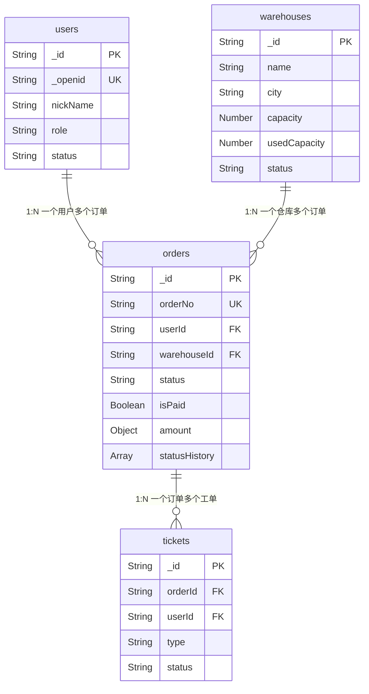

# 校园物品暂存平台 · 数据库设计文档

> 版本：v2.0
> 创建日期：2026-05-10
> 最后更新：2026-05-10
> 状态：待审查

---

## 一、文档概述

### 1.1 数据库选型

本项目采用 **"本地开发 SQLite + 生产 CloudBase NoSQL"** 双模式架构，通过 `db_adapter.py` 抽象层屏蔽底层数据库差异，业务代码无需感知具体存储实现。

| 阶段 | 数据库 | 说明 |
|------|--------|------|
| 本地开发 | SQLite | 轻量、零配置、Python 内置 `sqlite3` 模块支持，无需安装额外依赖 |
| 生产部署 | CloudBase NoSQL | 与云函数天然集成，免运维，文档型存储灵活 |

**选型理由（生产环境 CloudBase NoSQL）**：
- 与CloudBase云函数天然集成，无需额外配置连接
- 文档型存储灵活，适合订单这种结构可能演变的场景
- 免运维，自动扩容
- 免费额度足够Demo使用

**选型理由（本地开发 SQLite）**：
- Python 标准库内置 `sqlite3` 模块，零依赖安装
- 单文件数据库，便于版本管理和团队协作
- 支持完整的 SQL 语法，适合本地调试和单元测试
- JSON 扩展可模拟 NoSQL 的嵌套对象存储

**抽象层设计**：

通过 `db_adapter.py` 统一数据访问接口，核心方法包括：

```python
class DBAdapter:
    def insert(collection: str, doc: dict) -> str: ...
    def find_one(collection: str, query: dict) -> dict | None: ...
    def find_many(collection: str, query: dict, sort: list, limit: int, skip: int) -> list: ...
    def update_one(collection: str, query: dict, update: dict) -> bool: ...
    def count(collection: str, query: dict) -> int: ...
```

业务代码仅依赖上述接口，切换环境时只需替换适配器实现。

**局限性**：
- CloudBase NoSQL 不支持复杂聚合查询（GROUP BY、JOIN）
- CloudBase NoSQL 不支持多文档事务（仅单文档事务）
- 聚合分析能力弱
- SQLite 不支持并发写入（本地开发单线程场景无影响）

### 1.2 设计原则

1. **单集合设计**：相关数据放在同一个集合，用字段区分类型
2. **冗余换性能**：适当冗余减少关联查询
3. **索引优先**：为高频查询建立复合索引
4. **时间字段统一**：所有时间字段使用ISO 8601格式

### 1.3 命名规范

| 类型 | 规范 | 示例 |
|------|------|------|
| 集合名 | 小驼峰 | orders, users |
| 字段名 | 小驼峰 | userId, createTime |
| 枚举值 | 大写下划线 | PENDING, USER_CANCEL |
| 时间字段 | xxxAt | paidAt, completedAt |
| 布尔字段 | isXxx | isPaid, isDeleted |

---

## 二、本地 SQLite 表结构

> 本节定义本地开发阶段使用的 SQLite 建表语句。NoSQL 中的嵌套对象（如 `amount`）在 SQLite 中使用 JSON 字段存储，通过 `json_extract()` 函数查询。

### 2.1 users 表

```sql
CREATE TABLE IF NOT EXISTS users (
    id            TEXT PRIMARY KEY,          -- 对应 _id
    openid        TEXT NOT NULL UNIQUE,       -- 对应 _openid
    version       INTEGER NOT NULL DEFAULT 1, -- 对应 _version（乐观锁）
    nick_name     TEXT NOT NULL DEFAULT '',   -- 对应 nickName
    avatar_url    TEXT NOT NULL DEFAULT '',   -- 对应 avatarUrl
    phone         TEXT NOT NULL DEFAULT '',   -- 脱敏存储
    role          TEXT NOT NULL DEFAULT 'USER',  -- USER / ADMIN
    status        TEXT NOT NULL DEFAULT 'ACTIVE', -- ACTIVE / DISABLED
    create_time   TEXT NOT NULL,              -- ISO 8601
    update_time   TEXT NOT NULL               -- ISO 8601
);
```

### 2.2 orders 表

```sql
CREATE TABLE IF NOT EXISTS orders (
    id                TEXT PRIMARY KEY,          -- 对应 _id
    openid            TEXT NOT NULL,              -- 对应 _openid
    version           INTEGER NOT NULL DEFAULT 1, -- 对应 _version（乐观锁）
    order_no          TEXT NOT NULL UNIQUE,       -- 对应 orderNo
    status            TEXT NOT NULL DEFAULT 'PENDING',
    is_paid           INTEGER NOT NULL DEFAULT 0, -- Boolean: 0/1
    user_id           TEXT NOT NULL,              -- 对应 userId（冗余）
    warehouse_id      TEXT NOT NULL,              -- 对应 warehouseId
    warehouse_name    TEXT NOT NULL DEFAULT '',   -- 对应 warehouseName（冗余）
    city              TEXT NOT NULL DEFAULT '',
    item_type         TEXT NOT NULL DEFAULT '',   -- LUGGAGE / TOOLS / OTHER
    volume            TEXT NOT NULL DEFAULT '',   -- SMALL / MEDIUM / LARGE
    estimated_weight  REAL NOT NULL DEFAULT 0,    -- 预估重量 kg
    service_type      TEXT NOT NULL DEFAULT '',   -- PICKUP / SELF_DELIVER
    storage_days      INTEGER NOT NULL DEFAULT 7,
    delivery_address  TEXT NOT NULL DEFAULT '',
    delivery_time     TEXT NOT NULL DEFAULT '',
    amount            TEXT NOT NULL DEFAULT '{}', -- JSON: {"storageFee":0,"deliveryFee":0,"insuranceFee":0,"totalFee":0}
    declared_value    REAL NOT NULL DEFAULT 0,
    storage_photo_url TEXT NOT NULL DEFAULT '',
    status_history    TEXT NOT NULL DEFAULT '[]', -- JSON 数组: 状态变更记录
    create_time       TEXT NOT NULL,              -- ISO 8601
    update_time       TEXT NOT NULL               -- ISO 8601
);
```

**说明**：
- `amount` 字段存储 JSON 字符串，结构为 `{"storageFee": 0, "deliveryFee": 0, "insuranceFee": 0, "totalFee": 0}`
- `status_history` 字段存储 JSON 数组字符串，每个元素包含 `timestamp`、`fromStatus`、`toStatus`、`operatorType`、`operatorId`、`reason`、`metadata`
- SQLite 查询 JSON 字段使用 `json_extract(amount, '$.totalFee')` 语法

### 2.3 warehouses 表

```sql
CREATE TABLE IF NOT EXISTS warehouses (
    id             TEXT PRIMARY KEY,           -- 对应 _id
    name           TEXT NOT NULL,
    city           TEXT NOT NULL DEFAULT '',
    address        TEXT NOT NULL DEFAULT '',
    capacity       INTEGER NOT NULL DEFAULT 100,
    used_capacity  INTEGER NOT NULL DEFAULT 0,
    status         TEXT NOT NULL DEFAULT 'ACTIVE', -- ACTIVE / INACTIVE
    create_time    TEXT NOT NULL               -- ISO 8601
);
```

### 2.4 tickets 表

```sql
CREATE TABLE IF NOT EXISTS tickets (
    id           TEXT PRIMARY KEY,              -- 对应 _id
    order_id     TEXT NOT NULL,                 -- 对应 orderId
    user_id      TEXT NOT NULL,                 -- 对应 userId
    type         TEXT NOT NULL DEFAULT '',      -- COMPLAINT / DAMAGE / LOSS
    description  TEXT NOT NULL DEFAULT '',
    image_url    TEXT NOT NULL DEFAULT '',      -- 对应 imageUrl
    status       TEXT NOT NULL DEFAULT 'PENDING', -- PENDING / PROCESSING / RESOLVED
    resolution   TEXT NOT NULL DEFAULT '',
    create_time  TEXT NOT NULL                  -- ISO 8601
);
```

---

## 三、集合设计

| 集合名 | 说明 | 预估数据量 |
|--------|------|-----------|
| users | 用户信息 | 100-500条 |
| orders | 订单信息（核心） | 500-2000条 |
| warehouses | 仓库信息 | 5-10条 |
| tickets | 投诉工单 | 10-50条 |

---

## 四、核心集合详细设计

### 4.1 users 集合

| 字段名 | 类型 | 必填 | 默认值 | 说明 |
|--------|------|------|--------|------|
| _id | String | 自动 | - | 文档ID |
| _openid | String | 是 | - | 微信openid（CloudBase自动注入） |
| _version | Number | 自动 | 1 | 乐观锁版本号 |
| nickName | String | 否 | "" | 微信昵称 |
| avatarUrl | String | 否 | "" | 头像URL |
| phone | String | 否 | "" | 手机号（脱敏存储） |
| role | String | 是 | "USER" | 角色：USER / ADMIN |
| status | String | 是 | "ACTIVE" | 状态：ACTIVE / DISABLED |
| createTime | String | 是 | - | 注册时间（ISO 8601） |
| updateTime | String | 是 | - | 最后更新时间 |

**示例文档**：

```json
{
  "_id": "user_001",
  "_openid": "oXXXXXXXXXXXXXXXX",
  "_version": 1,
  "nickName": "张三",
  "avatarUrl": "https://thirdwx.qlogo.cn/xxx",
  "phone": "138****1234",
  "role": "USER",
  "status": "ACTIVE",
  "createTime": "2026-05-10T10:00:00.000Z",
  "updateTime": "2026-05-10T10:00:00.000Z"
}
```

### 4.2 orders 集合（核心）

> 字段定义引用自《订单状态机设计文档.md》v2.0 第九节

| 字段名 | 类型 | 必填 | 默认值 | 说明 |
|--------|------|------|--------|------|
| _id | String | 自动 | - | 文档ID |
| _openid | String | 是 | - | 用户openid |
| _version | Number | 自动 | 1 | 乐观锁版本号 |
| orderNo | String | 是 | - | 订单编号（如：ORD20260510001） |
| status | String | 是 | "PENDING" | 订单状态（8种枚举，见第四章） |
| isPaid | Boolean | 是 | false | 是否已支付（与状态机解耦，独立管理） |
| userId | String | 是 | - | 用户ID（冗余，加速查询） |
| warehouseId | String | 是 | - | 暂存仓库ID |
| warehouseName | String | 是 | - | 仓库名称（冗余，减少关联查询） |
| city | String | 是 | - | 暂存城市 |
| itemType | String | 是 | - | 物品类型：LUGGAGE / TOOLS / OTHER |
| volume | String | 是 | - | 物品体积：SMALL / MEDIUM / LARGE |
| estimatedWeight | Number | 是 | 0 | 预估重量（kg） |
| serviceType | String | 是 | - | 服务方式：PICKUP / SELF_DELIVER |
| storageDays | Number | 是 | 7 | 暂存天数 |
| deliveryAddress | String | 否 | "" | 配送地址（配送时填写） |
| deliveryTime | String | 否 | "" | 期望配送时间 |
| amount | Object | 是 | - | 费用信息（嵌套对象） |
| amount.storageFee | Number | 是 | 0 | 暂存费 |
| amount.deliveryFee | Number | 是 | 0 | 配送费 |
| amount.insuranceFee | Number | 是 | 0 | 保价费 |
| amount.totalFee | Number | 是 | 0 | 总费用 |
| declaredValue | Number | 否 | 0 | 保价声明价值 |
| storagePhotoUrl | String | 否 | "" | 入库照片URL |
| statusHistory | Array | 是 | [] | 状态变更记录数组（结构见4.2节） |
| createTime | String | 是 | - | 创建时间（ISO 8601） |
| updateTime | String | 是 | - | 最后更新时间 |

**示例文档**：

```json
{
  "_id": "order_001",
  "_openid": "oXXXXXXXXXXXXXXXX",
  "_version": 3,
  "orderNo": "ORD20260510001",
  "status": "STORED",
  "isPaid": true,
  "userId": "user_001",
  "warehouseId": "wh_001",
  "warehouseName": "大学城北仓",
  "city": "广州",
  "itemType": "LUGGAGE",
  "volume": "LARGE",
  "estimatedWeight": 25.5,
  "serviceType": "PICKUP",
  "storageDays": 7,
  "deliveryAddress": "",
  "deliveryTime": "",
  "amount": {
    "storageFee": 35.00,
    "deliveryFee": 0,
    "insuranceFee": 5.00,
    "totalFee": 40.00
  },
  "declaredValue": 500,
  "storagePhotoUrl": "https://xxx/storage/photo001.jpg",
  "statusHistory": [
    {
      "timestamp": "2026-05-10T10:00:00.000Z",
      "fromStatus": "",
      "toStatus": "PENDING",
      "operatorType": "USER",
      "operatorId": "user_001",
      "reason": "USER_CREATE",
      "metadata": {}
    },
    {
      "timestamp": "2026-05-10T14:30:00.000Z",
      "fromStatus": "PENDING",
      "toStatus": "COLLECTED",
      "operatorType": "ADMIN",
      "operatorId": "admin_001",
      "reason": "ADMIN_DISPATCH",
      "metadata": { "pickupPerson": "李师傅" }
    },
    {
      "timestamp": "2026-05-10T16:00:00.000Z",
      "fromStatus": "COLLECTED",
      "toStatus": "TRANSIT",
      "operatorType": "ADMIN",
      "operatorId": "admin_001",
      "reason": "ADMIN_DISPATCH",
      "metadata": {}
    },
    {
      "timestamp": "2026-05-11T09:00:00.000Z",
      "fromStatus": "TRANSIT",
      "toStatus": "STORED",
      "operatorType": "ADMIN",
      "operatorId": "admin_001",
      "reason": "ADMIN_DISPATCH",
      "metadata": { "storageLocation": "A-03-12" }
    }
  ],
  "createTime": "2026-05-10T10:00:00.000Z",
  "updateTime": "2026-05-11T09:00:00.000Z"
}
```

### 4.3 warehouses 集合

| 字段名 | 类型 | 必填 | 默认值 | 说明 |
|--------|------|------|--------|------|
| _id | String | 自动 | - | 文档ID |
| name | String | 是 | - | 仓库名称 |
| city | String | 是 | - | 所在城市 |
| address | String | 是 | - | 详细地址 |
| capacity | Number | 是 | 100 | 总容量（件） |
| usedCapacity | Number | 是 | 0 | 已用容量 |
| status | String | 是 | "ACTIVE" | 状态：ACTIVE / INACTIVE |
| createTime | String | 是 | - | 创建时间 |

**示例文档**：

```json
{
  "_id": "wh_001",
  "name": "大学城北仓",
  "city": "广州",
  "address": "广州市番禺区大学城北一路XX号",
  "capacity": 200,
  "usedCapacity": 45,
  "status": "ACTIVE",
  "createTime": "2026-05-01T00:00:00.000Z"
}
```

### 4.4 tickets 集合

| 字段名 | 类型 | 必填 | 默认值 | 说明 |
|--------|------|------|--------|------|
| _id | String | 自动 | - | 文档ID |
| orderId | String | 是 | - | 关联订单ID |
| userId | String | 是 | - | 用户ID |
| type | String | 是 | - | 类型：COMPLAINT / DAMAGE / LOSS |
| description | String | 是 | - | 问题描述 |
| imageUrl | String | 否 | "" | 图片证据 |
| status | String | 是 | "PENDING" | 状态：PENDING / PROCESSING / RESOLVED |
| resolution | String | 否 | "" | 处理结果 |
| createTime | String | 是 | - | 创建时间 |

**示例文档**：

```json
{
  "_id": "ticket_001",
  "orderId": "order_001",
  "userId": "user_001",
  "type": "DAMAGE",
  "description": "行李箱侧面有明显凹陷",
  "imageUrl": "https://xxx/tickets/damage001.jpg",
  "status": "PROCESSING",
  "resolution": "",
  "createTime": "2026-05-12T15:00:00.000Z"
}
```

---

## 五、状态相关字段设计

> 引用自《订单状态机设计文档.md》v2.0

### 5.1 status 枚举值

| 枚举值 | 状态名称 | 分类 |
|--------|---------|------|
| `PENDING` | 待交付 | 进行态 |
| `COLLECTED` | 已揽收 | 进行态 |
| `TRANSIT` | 运输中 | 进行态 |
| `STORED` | 已入库 | 进行态 |
| `DELIVERING` | 配送中 | 进行态 |
| `COMPLETED` | 已完成 | 终态（不可逆） |
| `CANCELLED` | 已取消 | 终态（不可逆） |
| `EXCEPTION` | 异常状态 | 进行态（仅管理员可操作） |

### 5.2 statusHistory 数组结构

> 引用自状态机文档 9.2 节

每次状态变更时，向 `statusHistory` 数组追加一条记录，完整记录变更上下文。

| 字段路径 | 类型 | 必填 | 说明 |
|---------|------|------|------|
| `statusHistory` | Array | 是 | 状态变更记录数组 |
| `statusHistory[].timestamp` | DateTime | 是 | 变更时间（ISO 8601） |
| `statusHistory[].fromStatus` | Enum | 是 | 原状态（创建订单时为空字符串） |
| `statusHistory[].toStatus` | Enum | 是 | 新状态 |
| `statusHistory[].operatorType` | Enum | 是 | 操作人类型：`USER` / `ADMIN` / `SYSTEM` |
| `statusHistory[].operatorId` | String | 是 | 操作人ID |
| `statusHistory[].reason` | String | 是 | 变更原因（枚举约束，见下表） |
| `statusHistory[].metadata` | Object | 否 | 附加信息（如物流单号、仓库位置等） |

**reason 枚举值**：

| 枚举值 | 说明 | 典型场景 |
|--------|------|---------|
| `USER_CREATE` | 用户创建订单 | 首次创建 |
| `USER_CANCEL` | 用户主动取消 | PENDING阶段取消 |
| `TIMEOUT_CANCEL` | 超时自动取消 | 系统定时任务触发 |
| `ADMIN_DISPATCH` | 运营调度操作 | 取件、发运、入库 |
| `USER_REQUEST_DELIVERY` | 用户发起配送 | STORED -> DELIVERING |
| `USER_CONFIRM_RECEIPT` | 用户确认收货 | DELIVERING -> COMPLETED |
| `TIMEOUT_COMPLETE` | 超时自动完结 | 系统定时任务触发 |
| `ADMIN_MARK_EXCEPTION` | 管理员标记异常 | 任意非终态 -> EXCEPTION |
| `ADMIN_RESOLVE` | 管理员人工结案 | EXCEPTION -> COMPLETED |
| `ADMIN_VOID` | 管理员人工作废 | EXCEPTION -> CANCELLED |

### 5.3 时间戳字段设计

订单在各状态流转时记录对应时间戳，用于超时计算和物流追踪。

| 字段名 | 类型 | 触发时机 | 用途 |
|--------|------|---------|------|
| paidAt | DateTime | 支付成功回调 | 支付时间记录 |
| collectedAt | DateTime | PENDING -> COLLECTED | 揽收时间记录 |
| transitAt | DateTime | COLLECTED -> TRANSIT | 发运时间记录，24h超时提醒起点 |
| storedAt | DateTime | TRANSIT -> STORED | 入库时间记录 |
| deliveringAt | DateTime | STORED -> DELIVERING | 配送发起时间，7天超时自动完结起点 |
| completedAt | DateTime | DELIVERING -> COMPLETED | 完结时间记录 |
| cancelledAt | DateTime | -> CANCELLED | 取消时间记录 |
| cancelReason | String | -> CANCELLED | 取消原因（`USER_CANCEL` / `TIMEOUT_CANCEL`） |

> **注意**：以上时间戳字段为订单文档的顶层字段，与 `statusHistory` 数组中的 `timestamp` 互补。时间戳字段用于高效查询（如定时任务扫描），`statusHistory` 用于完整审计追踪。

---

## 六、数据关系



**关系说明**：

| 关系 | 类型 | 外键字段 | 说明 |
|------|------|---------|------|
| users -> orders | 1:N | orders.userId | 一个用户可创建多个订单 |
| warehouses -> orders | 1:N | orders.warehouseId | 一个仓库可存储多个订单物品 |
| orders -> tickets | 1:N | tickets.orderId | 一个订单可关联多个投诉工单 |

> **设计说明**：NoSQL不强制外键约束，关联关系通过字段值维护。`warehouseName` 和 `userId` 在 orders 集合中冗余存储，避免每次查询都需要关联 users/warehouses 集合。

---

## 七、索引策略

### 7.1 查询场景分析

| 查询场景 | 查询条件 | 频率 | 说明 |
|---------|---------|------|------|
| 用户查看订单列表 | userId + status | 高 | 小程序端核心功能 |
| 运营查看待处理订单 | status + createTime | 高 | 运营后台核心功能 |
| 定时任务扫描超时订单 | status + createTime | 中 | 云函数定时触发器 |
| 按订单号查询 | orderNo | 中 | 用户分享/客服查询 |
| 按仓库查订单 | warehouseId + status | 中 | 运营按仓库管理 |
| 按订单查工单 | orderId | 低 | 工单列表查询 |

### 7.2 索引设计

| 集合 | 索引字段 | 索引类型 | 用途 |
|------|---------|---------|------|
| orders | userId, status | 复合索引 | 用户订单列表查询（按状态筛选） |
| orders | status, createTime | 复合索引 | 运营订单管理 + 定时任务扫描 |
| orders | orderNo | 唯一索引 | 订单号精确查询 |
| orders | warehouseId, status | 复合索引 | 按仓库筛选订单 |
| tickets | orderId | 普通索引 | 按订单查工单 |

**索引创建命令示例（CloudBase 控制台或 CLI）**：

```python
# orders 集合索引
db.collection('orders').create_index([('userId', 1), ('status', 1)])           # 用户订单列表
db.collection('orders').create_index([('status', 1), ('createTime', -1)])      # 运营管理（按时间倒序）
db.collection('orders').create_index('orderNo', unique=True)                   # 订单号唯一
db.collection('orders').create_index([('warehouseId', 1), ('status', 1)])      # 仓库订单

# tickets 集合索引
db.collection('tickets').create_index([('orderId', 1)])                        # 按订单查工单
```

### 7.3 SQLite 索引创建语句

> 本地开发阶段，在 `db_adapter.py` 初始化时自动执行以下建索引语句。

```sql
-- orders 表索引
CREATE INDEX IF NOT EXISTS idx_orders_user_status ON orders(user_id, status);
CREATE INDEX IF NOT EXISTS idx_orders_status_createtime ON orders(status, create_time DESC);
CREATE UNIQUE INDEX IF NOT EXISTS idx_orders_orderno ON orders(order_no);
CREATE INDEX IF NOT EXISTS idx_orders_warehouse_status ON orders(warehouse_id, status);

-- tickets 表索引
CREATE INDEX IF NOT EXISTS idx_tickets_orderid ON tickets(order_id);

-- users 表索引
CREATE UNIQUE INDEX IF NOT EXISTS idx_users_openid ON users(openid);
```

---

## 八、数据安全

### 8.1 敏感字段处理

| 字段 | 所属集合 | 处理方式 | 说明 |
|------|---------|---------|------|
| phone | users | 脱敏存储（138\*\*\*\*1234） | 仅保留前3后4位 |
| deliveryAddress | orders | 仅用户本人和运营可见 | 权限规则控制 |
| amount | orders | 前端展示脱敏 | 运营后台可查看完整金额 |

### 8.2 数据库权限规则

| 集合 | 前端读权限 | 前端写权限 | 云函数权限 |
|------|-----------|-----------|-----------|
| users | 仅本人 | 仅本人 | 全部 |
| orders | 仅本人/运营 | **禁止**（必须通过云函数） | 全部 |
| warehouses | 所有用户 | 禁止 | 全部 |
| tickets | 仅本人/运营 | 仅本人创建 | 全部 |

**核心安全规则**：

1. **orders 集合前端禁止直接写操作**，所有状态变更必须通过 `updateOrderStatus` 云函数执行
2. **权限校验在云函数层实现**，不依赖数据库层权限（CloudBase权限规则作为兜底）
3. **管理员操作强制鉴权**：`operatorType == 'ADMIN'` 在云函数中校验
4. **用户数据隔离**：前端查询自动注入 `_openid` 过滤条件，确保用户只能访问自己的数据

### 8.3 CloudBase 安全规则配置

```json
{
  "rules": {
    "users": {
      "read": "doc._openid == auth.openid",
      "write": "doc._openid == auth.openid"
    },
    "orders": {
      "read": "doc._openid == auth.openid || get('database').doc('users/' + auth.openid).get().role == 'ADMIN'",
      "write": false
    },
    "warehouses": {
      "read": true,
      "write": false
    },
    "tickets": {
      "read": "doc._openid == auth.openid || get('database').doc('users/' + auth.openid).get().role == 'ADMIN'",
      "write": "doc._openid == auth.openid && doc.status == 'PENDING'"
    }
  }
}
```

---

## 九、SQLite 与 CloudBase NoSQL 差异对照

> 开发过程中如需编写数据库相关代码，请参考本节对照表，确保两种存储实现的兼容性。

### 9.1 数据类型映射

| CloudBase NoSQL 类型 | SQLite 类型 | 说明 |
|---------------------|-------------|------|
| String | TEXT | 字符串，包括 ISO 8601 时间格式 |
| Number (整数) | INTEGER | 如 version、storageDays、capacity |
| Number (浮点) | REAL | 如 estimatedWeight、amount 中的费用 |
| Boolean | INTEGER | SQLite 无原生布尔类型，0 = false，1 = true |
| Object (嵌套) | TEXT (JSON) | 如 amount 对象，存储为 JSON 字符串 |
| Array | TEXT (JSON) | 如 statusHistory 数组，存储为 JSON 字符串 |
| DateTime | TEXT | 统一使用 ISO 8601 字符串格式 |
| null | NULL | 空值 |

### 9.2 查询语法差异

| 操作 | CloudBase NoSQL | SQLite |
|------|----------------|--------|
| 等值查询 | `db.collection('orders').where({ status: 'PENDING' }).get()` | `SELECT * FROM orders WHERE status = 'PENDING'` |
| 复合条件 | `.where({ userId: 'x', status: 'y' })` | `WHERE user_id = 'x' AND status = 'y'` |
| 排序 | `.orderBy('createTime', 'desc')` | `ORDER BY create_time DESC` |
| 分页 | `.skip(0).limit(10)` | `LIMIT 10 OFFSET 0` |
| 计数 | `.count()` | `SELECT COUNT(*) FROM orders WHERE ...` |
| 嵌套对象查询 | `.where({ 'amount.totalFee': db.cmd.gt(100) })` | `WHERE json_extract(amount, '$.totalFee') > 100` |
| 数组包含查询 | `.where({ status: db.cmd.in(['PENDING','STORED']) })` | `WHERE status IN ('PENDING', 'STORED')` |
| 模糊查询 | `.where({ nickName: db.RegExp({ regexp: '张' }) })` | `WHERE nick_name LIKE '%张%'` |
| 更新字段 | `.doc(id).update({ status: 'STORED' })` | `UPDATE orders SET status = 'STORED' WHERE id = ?` |
| 递增字段 | `.update({ _version: db.cmd.inc(1) })` | `UPDATE orders SET version = version + 1 WHERE id = ?` |
| 条件更新 | `.where({ _id: id, _version: v }).update(...)` | `UPDATE orders SET ... WHERE id = ? AND version = ?` |

### 9.3 事务支持差异

| 特性 | CloudBase NoSQL | SQLite |
|------|----------------|--------|
| 事务粒度 | 单文档事务 | 全库事务（BEGIN/COMMIT/ROLLBACK） |
| 跨集合事务 | 不支持 | 支持（多表联合操作） |
| 并发控制 | 乐观锁（_version 字段） | 乐观锁（version 字段）+ 内置锁机制 |
| 回滚 | 自动（单文档失败回滚） | 手动（BEGIN...ROLLBACK） |
| 隔离级别 | 快照隔离（单文档） | SERIALIZABLE（默认） |

**SQLite 事务示例**：

```python
# SQLite 事务（本地开发）
conn = sqlite3.connect('local.db')
try:
    conn.execute('BEGIN')
    conn.execute('UPDATE orders SET status = ?, version = version + 1 WHERE id = ? AND version = ?',
                 ('STORED', order_id, current_version))
    conn.execute('UPDATE warehouses SET used_capacity = used_capacity + 1 WHERE id = ?',
                 (warehouse_id,))
    conn.commit()
except Exception as e:
    conn.rollback()
    raise e
```

### 9.4 JSON 字段处理差异

| 操作 | CloudBase NoSQL | SQLite |
|------|----------------|--------|
| 存储 | 原生嵌套对象 | JSON 字符串（需 `json.dumps()`） |
| 读取 | 直接访问嵌套属性 | 需 `json.loads()` 反序列化 |
| 查询子字段 | `.where({ 'amount.totalFee': 100 })` | `json_extract(amount, '$.totalFee') = 100` |
| 更新子字段 | `.update({ 'amount.totalFee': 200 })` | 读取 → 修改 → 整体写回 |
| 部分更新 | 原生支持子字段更新 | 不支持，需整字段替换 |

**SQLite JSON 字段操作示例**：

```python
import json

# 读取 JSON 字段
row = conn.execute('SELECT amount FROM orders WHERE id = ?', (order_id,)).fetchone()
amount = json.loads(row['amount'])
total_fee = amount['totalFee']

# 更新 JSON 字段（整体替换）
amount['totalFee'] = new_total
conn.execute('UPDATE orders SET amount = ? WHERE id = ?',
             (json.dumps(amount), order_id))

# 查询 JSON 子字段
results = conn.execute(
    "SELECT * FROM orders WHERE json_extract(amount, '$.totalFee') > ?",
    (100,)
).fetchall()
```

---

## 十、待决策项

- [ ] **订单编号生成规则**：时间戳+随机数 vs 自增序列（建议：时间戳+4位随机数，格式 `ORD{yyyyMMdd}{4位序号}`）
- [ ] **是否需要软删除字段（isDeleted）**：当前设计中终态订单保留不删除，如需软删除需增加该字段
- [ ] **statusHistory 数组长度限制**：Demo阶段无限制，生产环境建议超过50条时归档历史记录
- [ ] **warehouseName 冗余更新策略**：仓库名称变更时是否需要批量更新关联订单的冗余字段

---

*本文档为数据库设计初稿，待决策项确认后更新为正式版本。*
